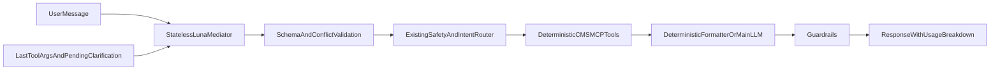

# Stateless mediator routing and cost telemetry

## Goal
Introduce a stateless request-mediator call before the existing routing chain for every eligible message. The mediator receives the raw message plus a deliberately small session snapshot and returns strict JSON intent/slot data. It does not rewrite the question, call CMS tools, calculate money, create beneficiary prose, or become a source of truth.

The existing router and deterministic tools remain authoritative for Medicare logic. The mediator's structured output is a normalized input to them, with safe fallback to the current behavior when the mediator is unavailable or invalid.

## Mediator contract and safety rules
- Add a typed `MediatedRequest` model, separate from the public `QuerySlots`, with:
  - `raw_user_message` (copied verbatim from the API request; never model-generated)
  - `intent` (closed enum covering cost estimate, remaining-year budget, comparison, insulin policy, dosage clarification, OOP, alternatives, enrollment, medical advice, off-topic, and unknown)
  - `drugs` (zero-to-many named drugs; each can include dosage/form only when explicitly stated or carried from the session)
  - `plan_keys`, `days_supply`, `ytd_oop_spend`, `pharmacy_channel`, `start_date`, `end_date`, and `requires_clarification`
  - `provided_by_user` / `carried_from_session` provenance for each inferred slot, or equivalent per-slot provenance.
- Use `gpt-5.6-luna` as a separately configurable mediator model; set its role to extraction only and require structured JSON output. Supply current date/time, the current raw message, UI filters, last successful tool arguments, and pending clarification context—not the full chat transcript.
- Validate model output with Pydantic plus deterministic validators: plan-key format, ISO dates, positive supply length, non-negative YTD spend, known pharmacy channels, maximum product count, and `start_date <= end_date`.
- Define merging precedence as: explicit current-message values → valid UI filters → session values only when the new message is clearly a follow-up → null/clarification. The raw message always remains available so the existing safety resolvers can detect contradictions.
- Never allow mediator output to bypass system safety/medical/enrollment/off-topic checks or cause invented drug/plan/date facts to be used. On malformed JSON, API/model failure, validation failure, or contradictory extraction, record the reason and fall back to today's parsing/routing behavior.

## Backend integration
- Add a mediator module (for prompt construction, structured call, schema validation, merge logic, and non-sensitive diagnostic status) alongside the agent routing modules. Invoke it at the top of `Navigator.run`, rather than the thin orchestrator wrapper, so it can receive the current session's last tool arguments and pending clarification context without introducing a second session lookup.
- Extend the LLM client with a no-tool structured-output method that captures `TokenUsage` for Luna. Use provider-native structured output where available; retain a deterministic Pydantic parse/validation boundary and use the existing structured-completion mock hook for test coverage.
- In `Navigator.run` ([src/medicare_navigator/agent/navigator.py](/Users/divyareddymanku/Projects/Medicare-drug-cost-navigator/src/medicare_navigator/agent/navigator.py)), call the mediator after session-limit handling and before early system/deterministic routes. Pass the validated normalized slots to existing resolvers without removing their current raw-message checks.
- Preserve the current route ordering for hard safety handlers. Use mediator intent/slots to improve extraction and routing decisions, not to overrule the raw-message classifiers. Ensure named insulin plus a date-range/budget intent reaches a deterministic tool path that consumes the projection result rather than only the single-fill result.
- Add deterministic date-range projection support: `start_date` must drive the remaining-fill and remaining-year amount, rather than silently using the server's current date. The tool response must expose answer-ready fields such as projected period, fill count, total low/high, and channel coverage.
- Update the insulin rendering path in [src/medicare_navigator/agent/insulin_requests.py](/Users/divyareddymanku/Projects/Medicare-drug-cost-navigator/src/medicare_navigator/agent/insulin_requests.py) to render a budget result when the validated intent is remaining-year budget. This fixes the current case where the tool returns `$175` but the formatter only reads `$35`.
- Retain the existing main agent loop for requests that need flexible tool selection/prose. For deterministic routes, keep deterministic prose initially; do not add a second LLM narration call merely because the mediator ran.

## Usage and cost model
- Keep the existing `llm_usage` field as the usage of the current/main model so existing clients remain compatible.
- Add `mediator_llm_usage` and `total_llm_usage` to `QueryResponse` in [src/medicare_navigator/models/response.py](/Users/divyareddymanku/Projects/Medicare-drug-cost-navigator/src/medicare_navigator/models/response.py). `total_llm_usage` is the arithmetic sum of mediator and main-model input tokens, output tokens, total tokens, and USD cost.
- Return mediator usage even for fully deterministic responses; return zero/null main-model usage when no main LLM call occurred. Keep mediator-fallback diagnostics server-side or in a safe non-user-facing field; do not present internal errors in beneficiary text.
- Make the mediator model/config independently visible in backend configuration and model metadata, without changing the user's selectable primary response model.
- Ensure both `/api/chat` and `/api/query` receive the same mediator behavior through their shared navigator path; keep query logging unchanged unless usage persistence is explicitly added later.

## UI telemetry
- Update [frontend/src/app.js](/Users/divyareddymanku/Projects/Medicare-drug-cost-navigator/frontend/src/app.js) to show, per assistant response:
  - `Mediator: <tokens> · <cost>`
  - `Response model: <tokens> · <cost>` when used
  - `Combined: <tokens> · <cost>`
- Update the session accumulator to track mediator, primary, and combined counters separately. Display the session combined cost as the headline total, with a compact breakdown so combined values are not double-counted.
- Apply the same behavior to both standard chat and guided chat response rendering.

## Tests and acceptance coverage
- Add unit tests for mediator schema parsing, invalid/missing outputs, conflict precedence, follow-up slot carry-forward, and fallback behavior.
- Exercise the mediator as a fresh stateless invocation each turn; session slot context is supplied explicitly from `last_tool_calls` and pending clarification state, never by keeping mediator conversation history.
- Expand navigator tests for:
  - Lantus on H0270-001 starting September 1 → a tool-backed five-fill, `$175` budget response.
  - A fresh first-turn budget question with no plan/drug → clarification, not hallucinated slots.
  - Follow-up “what about rest of year?” using prior plan/drug only through explicit session context.
  - Metformin plan query followed by dosage-only answer.
  - Multi-drug and comparison requests preserving all items and preventing unsafe route bypass.
  - Mediator failure/invalid JSON retaining current route behavior.
- Add response-contract/API tests confirming `mediator_llm_usage`, `llm_usage`, and `total_llm_usage` values sum correctly for: mediator-only deterministic route, mediator plus main agent route, and fallback route.
- Extend [tests/test_llm_client.py](/Users/divyareddymanku/Projects/Medicare-drug-cost-navigator/tests/test_llm_client.py) and [tests/test_llm_mock.py](/Users/divyareddymanku/Projects/Medicare-drug-cost-navigator/tests/test_llm_mock.py) for mediator structured-output usage accounting.
- Update [tests/test_ui.py](/Users/divyareddymanku/Projects/Medicare-drug-cost-navigator/tests/test_ui.py) and [src/medicare_navigator/ui_test/checks.py](/Users/divyareddymanku/Projects/Medicare-drug-cost-navigator/src/medicare_navigator/ui_test/checks.py) so the API/UI contract requires the three usage fields and the session display; assert per-response and session totals do not double-count.

## Rollout
- Feature-flag the mediator initially, defaulting to enabled only after test coverage is in place; retain the fallback route as the safe operational escape hatch.
- Log structured, privacy-conscious mediator outcomes (intent, supplied/carry-forward slots, validation/fallback reason, model and usage), then compare intent/slot accuracy and fallback rate against the existing routers before widening use.
