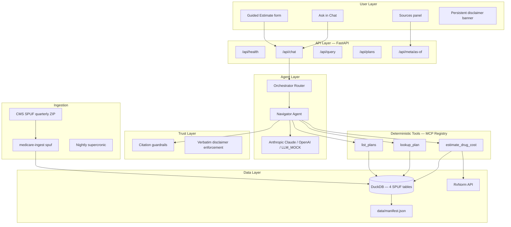
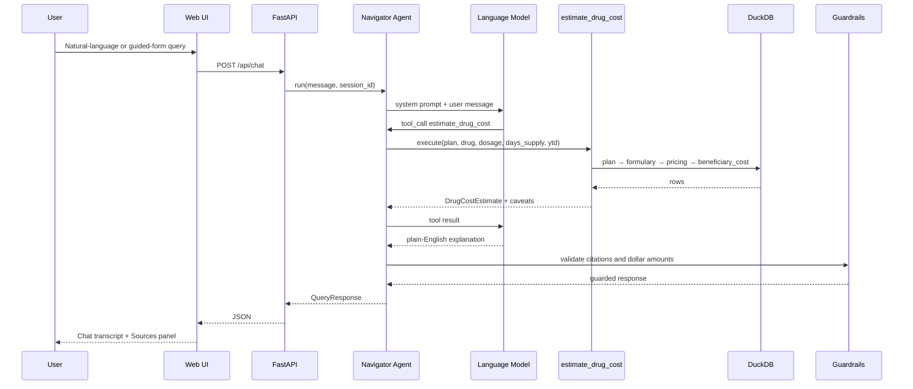
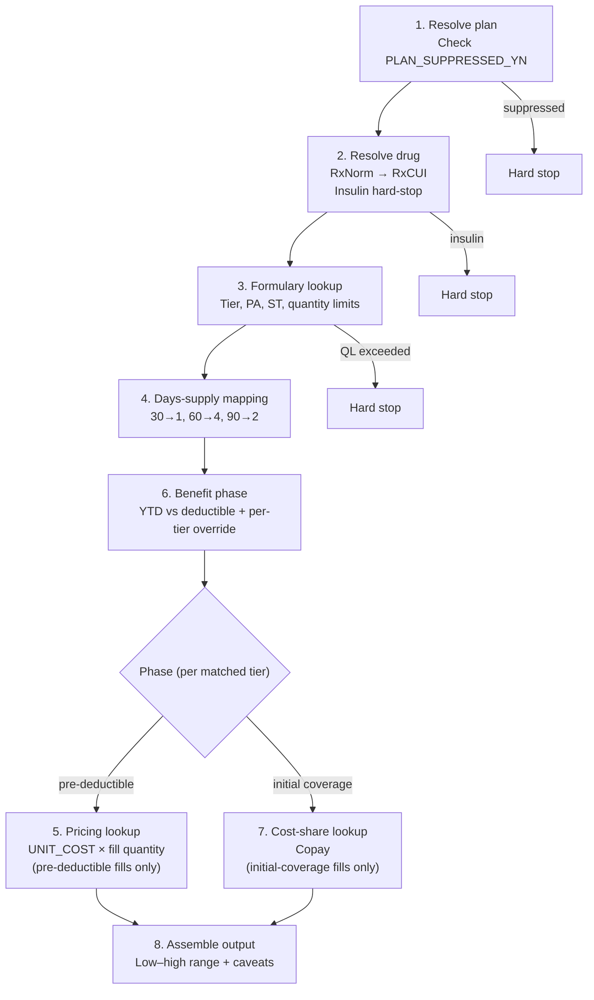
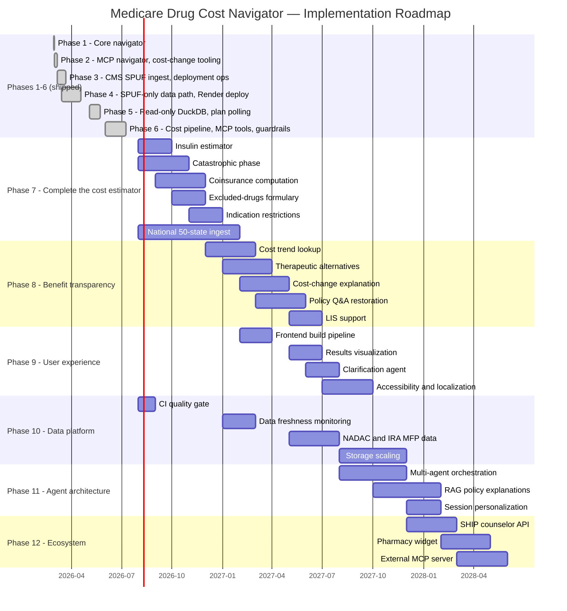

# Medicare Drug Cost & Benefit-Transparency Navigator
## Business Solution Document

---

## 1. Executive Summary

The **Medicare Drug Cost & Benefit-Transparency Navigator** is a web application that helps Medicare beneficiaries and their caregivers understand **what a specific prescription drug will cost on a specific Medicare Part D or Medicare Advantage-with-Part-D (MA-PD) plan** before they fill it at the pharmacy.

The U.S. Centers for Medicare & Medicaid Services (CMS) publishes authoritative plan-level formulary, pricing, and cost-sharing data quarterly through the **SPUF** program (Prescription Drug Plan Formulary, Pharmacy Network, and Pricing Information). That data is complete but not usable by ordinary people: it spans millions of rows, uses incompatible internal code systems, and contains structural ambiguities that produce wrong dollar figures if handled incorrectly.

This application addresses that gap by combining:

1. **Deterministic, auditable computation** — every dollar figure traces to a specific CMS record
2. **Natural-language interaction** — users ask questions in plain English without CMS expertise
3. **Mandatory citation guardrails** — no unsupported claims; safety disclaimers delivered verbatim
4. **Explicit scope boundaries** — hard stops when data cannot support a reliable estimate

The system processes only public government data, stores no Protected Health Information (PHI), and does not provide enrollment or plan-switching advice.

**Current status.** The system is a working, tested implementation running against real CMS data for one state (Florida), covering one well-defined scenario (a single oral, non-insulin drug on a plan's regular formulary, for a non-low-income-subsidy beneficiary, in the pre-deductible or initial-coverage benefit phase). This is a deliberate engineering choice, not a limitation the team was unaware of: the project treats *correctness on a narrow, real slice* as the prerequisite for expansion, rather than approximating a broad slice. Section 5 states exactly what is and is not covered today; Section 9 lays out the specific, sequenced engineering work — already scoped at the data-source and module level — to reach full insulin, catastrophic-phase, coinsurance, and all-50-state coverage. Section 12 explains why closing this gap at national scale matters beyond this one application.

---

## 2. Problem Statement

### 2.1 Scale

| Dimension | Context |
|---|---|
| Medicare enrollment | ~67 million beneficiaries |
| Part D / MA-PD drug coverage | ~50+ million with outpatient prescription benefit |
| Available Part D plans (2026, single state) | 500+ stand-alone PDPs; thousands nationally |
| CMS SPUF data volume (Florida 2026 ingest) | 572 plans; 188,841 formulary rows; 5,726,853 pricing rows; 60,314 beneficiary-cost rows |

*Row counts are exact output from `medicare-ingest spuf` against CMS's real, unmodified 2026 Q1 SPUF national file, filtered to Florida per `config/ingest_filters.yaml` — not estimates. Reproducible via `medicare-ingest spuf --download --states FL --merge-states`.*

### 2.2 Why beneficiaries cannot use CMS data directly

Actual pharmacy charge depends on:

- Formulary tier and cost-share type (copay vs. coinsurance)
- Benefit phase (deductible, initial coverage, catastrophic)
- Per-tier deductible exemption rules (`DED_APPLIES_YN`)
- Days supply (30 / 60 / 90)
- Which manufacturer NDC the pharmacy dispenses
- Quantity limits, prior authorization, step therapy
- Year-to-date out-of-pocket spend

CMS publishes all of these inputs in quarterly bulk ZIP files, but:

- `pricing.DAYS_SUPPLY` and `beneficiary_cost.DAYS_SUPPLY` use **different code systems** and cannot be joined without a translation layer
- Deductible rules are **per-tier**, not plan-wide — a beneficiary can be globally pre-deductible but pay initial-coverage copay on Tier 1 drugs
- One drug (RxCUI) can map to **multiple NDCs** with different tiers and negotiated prices
- **Coinsurance dollar amounts** cannot be reliably derived from the published CMS layout alone
- Some plans have **suppressed pharmacy data** (`PLAN_SUPPRESSED_YN=Y`) where CMS itself flags unreliability

### 2.3 Consequences

Without accessible tools, beneficiaries face surprise costs at the pharmacy, cannot budget for chronic medications across benefit phases, and depend on plan call centers. General-purpose AI chatbots are not grounded in plan-specific CMS records, so any dollar figure they produce for a specific drug on a specific plan is, by construction, a guess rather than a lookup — a well-documented failure mode (language models produce fluent, plausible-sounding text regardless of whether the underlying facts are correct) that is especially consequential when the audience is older adults making decisions about medications they depend on.

---

## 3. Solution Definition

### 3.1 Core value proposition

> Given a drug name, dosage, Medicare plan ID, fill size, and optional year-to-date out-of-pocket spend, the Navigator returns a traceable out-of-pocket cost estimate — or an honest explanation of why no estimate is possible — grounded entirely in official CMS quarterly data.

### 3.2 What the user receives

| User provides | System returns |
|---|---|
| Drug + dosage (e.g., "lovastatin 40mg") | Normalized RxNorm identifier (RxCUI) |
| Plan ID (e.g., "S5921-383") | Plan name, deductible, formulary tier |
| Days supply (30 / 60 / 90) | Cost range for that fill |
| YTD OOP spend (optional) | Benefit phase with per-tier override applied |
| Natural-language question | Plain-English explanation with mandatory caveats |
| Any query | **Sources panel**: dataset citations and "Data as of [date]" |

### 3.3 Verified example

**Input:** Lovastatin 40mg · Plan S5921-383 (AARP Medicare Rx Preferred from UHC, Florida 2026) · 30-day supply · $0 YTD

**Output:** $5.00 copay. Tier 1 drug exempt from deductible (`DED_APPLIES_YN=N`) despite beneficiary being in pre-deductible phase overall ($130 plan deductible, $0 spent). System attaches a per-tier deductible exemption caveat and cites CMS SPUF as the source.

**Verification methodology:** re-run directly against a fresh ingest of CMS's real, unmodified Florida 2026 SPUF data (not the offline test fixture) immediately before this revision. The pipeline resolved plan `S5921-383` to "AARP Medicare Rx Preferred from UHC (PDP)" with `deductible=$130.00`, resolved "lovastatin 40mg" to RxCUI `197905` via the live RxNorm API, matched it to a single Tier-1 formulary NDC, and returned `cost_low=cost_high=$5.00` with the Bug 2 caveat attached — reproducing this example's figures exactly, field for field.

---

## 4. Target Users

| User | Need addressed |
|---|---|
| **Medicare Part D / MA-PD enrollee** | Pre-fill cost visibility before visiting the pharmacy |
| **Family caregiver** | Manage multiple medications on a parent's plan without calling the insurer |
| **Community health worker / SHIP counselor** | Quick, citable reference during counseling sessions |
| **Pharmacist** | Cross-check plan-published cost-share against CMS source records |
| **Health policy researcher** | Reproducible cost computation from public data |

---

## 5. Current Capabilities (v1 — Phase 6)

### 5.1 In scope

| Capability | Detail |
|---|---|
| Plan types | Stand-alone PDP (S*) and local MA-PD (H*) plans |
| Geographic coverage | Florida (572 plans in FL 2026 ingest) |
| Drug types | Oral generic/brand on regular formulary |
| Beneficiary type | Non-LIS (no Low-Income Subsidy) |
| Benefit phases | Pre-deductible and initial coverage (user supplies YTD OOP) |
| Fill sizes | 30, 60, 90-day supply |
| Cost-share | Full negotiated price pre-deductible, or copay once the deductible is met/exempted (dollar estimate returned either way) |
| Restrictions | Prior auth and step therapy surfaced as soft caveats; quantity limits as hard stops |

### 5.2 Out of scope (honest limitations)

| Exclusion | System behavior |
|---|---|
| Insulin | Hard stop — separate $35/month statutory cap, different CMS file |
| Catastrophic phase | Not computed — TrOOP threshold not in SPUF |
| Coinsurance | Dollar amount never computed — explicit insurer contact notice |
| LIS / Extra Help | Not supported |
| Medicaid | Not supported |
| Excluded-drug formulary | Not supported |
| Real-time pharmacy pricing | CMS quarterly reference data only |
| Plan switching / enrollment advice | Never provided |

---

## 6. System Architecture

### 6.1 Query flow

---

## 7. Component Specification

### 7.1 User interface (`frontend/src/`)

| Component | Business function |
|---|---|
| **Disclaimer banner** | Always-visible notice: informational only; not medical, financial, or enrollment advice |
| **Ask in Chat tab** | Free-form natural language with session follow-ups (max 5 turns) |
| **Guided Estimate tab** | Structured form: drug, dosage, plan, contract year, days supply, YTD OOP |
| **Prompt chips** | Example queries using the seeded demo plan `S9999-001`, so they resolve out of the box against the demo-seeded database without requiring a full state ingest first |
| **Plan polling** | Auto-refreshes plan list every 20s during CMS data ingest |
| **Sources panel** | Citations, data-as-of badge, tool status footer |
| **Error handling** | Parses 502/503 API errors into user-visible messages |

Dollar figures appear in the chat transcript. The Sources panel provides auditability, not a separate guarantee card.

### 7.2 API layer (`src/medicare_navigator/api/`)

| Endpoint | Purpose |
|---|---|
| `GET /api/health` | Service health, `data_fresh` flag, LLM configuration status |
| `POST /api/chat` | Conversational turn with estimate and citations |
| `POST /api/query` | Structured query (same backend pipeline) |
| `GET /api/plans` | Plan list for guided form |
| `GET /api/meta/as-of` | Data freshness manifest |
| `GET /api/disclaimer` | Canonical disclaimer text |

### 7.3 Navigator agent (`src/medicare_navigator/agent/`)

| Component | Role |
|---|---|
| `navigator.py` | LLM tool-calling loop; invokes MCP tools; extracts `DrugCostEstimate` |
| `prompts.py` | Enforces scope, verbatim caveats, no plan-switching advice |
| LLM client | Anthropic Claude (default) or OpenAI; `LLM_MOCK=1` for offline use |

**Constraint:** The language model never computes dollar amounts. It relays only `cost_low` / `cost_high` from `estimate_drug_cost`.

### 7.4 Deterministic tools

#### `estimate_drug_cost` — eight-step pipeline

Steps 5 and 7 are mutually exclusive per matched tier, not sequential — during the deductible phase the beneficiary owes the plan's full negotiated price (step 5); once the deductible is met, or for a tier the plan exempts from the deductible, the plan's copay applies instead (step 7). Step 6 runs first specifically to decide which one applies; the two lookups are never combined or summed for a single fill.

| CMS correctness rule | Problem | System behavior |
|---|---|---|
| Days-supply code mismatch | Pricing and beneficiary_cost use different codes | Named lookup table; never direct join |
| Per-tier deductible | Deductible exemption varies by tier | Determines pricing-vs-cost-share branch per tier; attaches caveat |
| Unit cost vs. fill cost | `UNIT_COST` is per pill, not per fill | `ceil(days_supply / doses_per_day) × unit_cost` |
| Coinsurance base unknown | CMS layout does not confirm dollar base | Never computes dollar amount; returns insurer contact notice |
| Multiple NDCs per drug | Different manufacturers, tiers, prices | Independent computation per NDC; low–high range |
| Quantity limits | Requested fill may exceed plan limit | Hard stop with maximum allowed fill size |
| Suppressed plan data | CMS flags unreliable records | Hard stop before any pricing lookup |

#### `lookup_plan` and `list_plans`

Resolve plan by contract-plan ID or search text; return ingested plan list for dropdowns and disambiguation.

#### Internal: `normalize_drug`

Maps free-text drug names to RxCUI via RxNorm REST API (NLM), with local DuckDB cache and insulin detection hard-stop.

### 7.5 Data storage

| Table | CMS source | Key fields | Use |
|---|---|---|---|
| `plans` | `plan_information` | `plan_key`, `deductible`, `plan_suppressed`, `formulary_id` | Plan resolution, suppression check |
| `basic_drugs_formulary` | `basic_drugs_formulary` | `ndc`, `rxcui`, `tier`, `quantity_limit_*`, `prior_authorization_yn`, `step_therapy_yn` | Coverage and restrictions |
| `pricing` | `pricing` | `plan_key`, `ndc`, `days_supply`, `unit_cost` | Ingredient cost |
| `beneficiary_cost` | `beneficiary_cost` | `tier`, `coverage_level`, `days_supply_code`, `copay`, `coinsurance_pct`, `ded_applies_yn` | Cost-share rules |

**Ingestion:** `medicare-ingest spuf` downloads CMS quarterly ZIP, filters by state, writes to DuckDB, updates `manifest.json`. Nightly supercronic refresh on Render. Schema migrations support persistent disks across deploys.

### 7.6 Guardrails (`src/medicare_navigator/guardrails/`)

| Mechanism | Protection |
|---|---|
| Citation builder | Every factual claim links to CMS SPUF source |
| Dollar-amount validation | Retries LLM response if untraceable `$` figures appear |
| Verbatim caveat enforcement | Force-appends safety disclaimers if LLM paraphrases |
| Hard-stop statuses | No cost figures for suppressed, insulin, or quantity-limit blocks |
| Lookup-failure citations | `not_found` and `not_covered` still show which dataset was queried |

### 7.7 Quality assurance

| Asset | Coverage |
|---|---|
| 12-case eval suite | Cost estimates, not-found, not-covered, insulin, suppressed, quantity-limit |
| 91 unit/integration tests | Pipeline rules, ingest schema, guardrails, API health, UI contract |
| 2 live-API integration tests | Real RxNorm and CMS catalog API calls (excluded from default run; opt-in via `pytest -m integration`) |
| UI test harness | Guided form, mode switching, smoke messages |

Current result: 12/12 eval cases passing; 91/91 default-suite tests passing; 2/2 live-API integration tests passing.

---

## 8. Compliance and Risk Mitigation

| Risk | Mitigation |
|---|---|
| Hallucinated prices | LLM cannot compute dollars; guardrail retry on untraceable amounts |
| Medical advice liability | Persistent disclaimer; no diagnosis or treatment recommendations |
| Insurance solicitation | No plan-switching recommendations |
| PHI exposure | No health records stored; session-scoped only |
| Stale data | Manifest-driven "Data as of" on every response |
| Unreliable CMS data | Hard stop on suppressed plans |
| Coinsurance misrepresentation | Dollar amount never shown when base is unconfirmed |

---

## 9. Future Implementation Roadmap

The current release (Phase 6) intentionally ships a **verifiable, auditable slice**: one drug, one plan, one fill, with six CMS correctness rules handled explicitly. The long-term product vision is defined in `build-requirements.md`. The roadmap below describes the planned expansion in detail.

---

### Phase 7 — Complete the cost estimator

Phase 7 extends the `estimate_drug_cost` pipeline to cover benefit phases and drug categories that v1 deliberately excludes. Each item is a separate deterministic module with its own hard-stop or caveat contract, following the same pattern as Bugs 1–6.

#### 7.1 Insulin cost estimator

| Item | Detail |
|---|---|
| **Problem** | Insulin has a separate $35/month statutory cap under the Inflation Reduction Act. It does not follow standard deductible or benefit-phase logic. CMS publishes insulin pricing in a different SPUF file than the regular formulary pipeline uses. |
| **Data source** | CMS insulin-specific SPUF supplement file (to be identified and ingested separately from `basic_drugs_formulary`) |
| **New module** | `tools/insulin_cost.py` — replaces the current hard-stop in `insulin.py` with a dedicated estimator |
| **Logic** | Flat $35/month cap regardless of benefit phase; separate from `DED_APPLIES_YN` and YTD logic |
| **Integration** | `estimate_drug_cost` routes insulin drugs to the new module instead of returning `insulin_out_of_scope` |
| **Output** | `DrugCostEstimate` with `benefit_phase: "insulin_cap"` and statutory cap caveat |
| **Tests** | Unit tests for cap amount, multi-fill scenarios (30/60/90 day), and fallback when insulin file is stale |

#### 7.2 Catastrophic-phase computation

| Item | Detail |
|---|---|
| **Problem** | After a beneficiary reaches the annual TrOOP (True Out-of-Pocket) threshold, cost-sharing drops to near-zero for the rest of the year. SPUF does not include the TrOOP threshold — it must come from CMS annual benefit parameters. |
| **Data source** | CMS annual Part D redesign program instructions → `config/benefit_params.yaml` (deductible, initial coverage limit, catastrophic threshold, OOP cap per contract year) |
| **New logic in Step 6** | Compare YTD OOP to catastrophic threshold; set `benefit_phase: "catastrophic"` and use `COVERAGE_LEVEL=3` cost-share rows |
| **User input** | YTD OOP becomes required (not optional) when catastrophic phase is in scope |
| **Caveat** | TrOOP calculation may differ from plan-reported spend; attach caveat to confirm with plan |
| **Tests** | Fixtures for beneficiary at $0, mid-year, and post-catastrophic YTD levels |

#### 7.3 Coinsurance dollar computation

| Item | Detail |
|---|---|
| **Problem** | v1 returns a verbatim "COINSURANCE NOT CALCULATED" notice (Bug 4) because the CMS record layout does not confirm the dollar base for coinsurance percentage. |
| **Prerequisite** | Confirm authoritative coinsurance base against CMS methodology documentation or plan-level examples |
| **New logic in Step 7** | When `COST_TYPE=2` (coinsurance), compute `base × coinsurance_pct` using confirmed base (likely negotiated price or ingredient cost from `pricing`) |
| **Fallback** | If base cannot be confirmed for a specific plan/tier, retain Bug 4 disclaimer for that NDC only |
| **Output** | Extend `cost_low` / `cost_high` to include coinsurance-computed NDCs; attach base-source citation |
| **Tests** | Side-by-side comparison against known plan examples before removing Bug 4 disclaimer globally |

#### 7.4 Excluded-drugs formulary

| Item | Detail |
|---|---|
| **Problem** | Some plans cover certain drugs only on an "excluded drugs" or enhanced/supplemental formulary, not the regular `basic_drugs_formulary`. v1 only queries the regular formulary. |
| **Data source** | CMS SPUF `excluded drugs formulary` file (separate from `basic_drugs_formulary`) |
| **New table** | `excluded_drugs_formulary` in DuckDB with same schema shape as `basic_drugs_formulary` |
| **Pipeline change** | Step 3: if drug not found on regular formulary, query excluded formulary; attach "enhanced coverage only" caveat |
| **Scope note** | Only applies to plans that offer enhanced/supplemental benefit; not all PDPs |

#### 7.5 Indication-based coverage restrictions

| Item | Detail |
|---|---|
| **Problem** | Some formulary entries cover a drug only for specific FDA-approved indications (e.g., a cancer drug approved for multiple conditions but covered for only one on a given plan). |
| **Data source** | CMS SPUF indication fields on formulary rows; FDA drug label data for approved indications |
| **Logic** | Surface indication restriction as a hard caveat; do not compute cost unless user confirms matching indication |
| **UI change** | Guided form adds optional "condition / indication" field when plan data requires it |
| **Tests** | Fixture drugs with single-indication and multi-indication formulary entries |

#### 7.6 National multi-state ingest

| Item | Detail |
|---|---|
| **Current state** | Florida ingested; 572 plans |
| **Target** | All 50 states + DC via automated `--merge-states` pipeline |
| **Implementation** | Expand `config/ingest_filters.yaml` with all state codes and PDP region mappings; orchestrate sequential state merges to stay within Render Starter memory limits |
| **Ops** | Nightly cron ingests changed states only (delta detection via manifest version comparison) |
| **UI** | Plan dropdown filters by user's state; `/api/plans?state=CA` query parameter |
| **Storage** | Estimate disk sizing: ~50 states × ~500 plans × ~200K formulary rows ≈ multi-GB DuckDB; may require Render disk upgrade or partitioned storage |

---

### Phase 8 — Benefit transparency beyond single-fill cost

Phase 8 restores capabilities from the original product vision (`build-requirements.md` Sections 2–3) that were removed in the Phase 6 scope pivot. These are separate deterministic tools invoked by the Navigator agent, each with the structured failure contract.

#### 8.1 Multi-year cost and spending trends

| Item | Detail |
|---|---|
| **Functional requirement** | FR2 — historical spending or price trend for a given drug across available years |
| **Data source** | CMS Medicare Part D drug spending datasets (program-level, by drug); bulk CSV from data.cms.gov |
| **New table** | `cost_trends` in DuckDB, keyed by RxCUI or program drug name |
| **New tool** | `cost_trend_lookup(drug_name, dosage)` → multi-year trend series |
| **UI** | Sources panel adds trend sparkline or year-over-year bar chart when trend data exists |
| **Agent behavior** | Navigator calls `cost_trend_lookup` when user asks "how has the price changed" or "what did this cost last year" |
| **Citations** | Each trend data point cites CMS spending dataset and year |
| **Failure contract** | `no_match` when drug has no spending history; `stale` when latest year not yet published |

#### 8.2 Therapeutic alternatives finder

| Item | Detail |
|---|---|
| **Functional requirement** | FR3 — surface therapeutically equivalent alternatives where they exist |
| **Data source** | FDA Orange Book (Approved Drug Products with Therapeutic Equivalence Evaluations) |
| **New table** | `alternatives` in DuckDB — equivalence code, active ingredient, dosage form mappings |
| **New tool** | `alternatives_finder(drug_name, dosage, plan_key)` → list of equivalent drugs with formulary tier and estimated cost on the same plan |
| **Pipeline** | For each alternative RxCUI, run abbreviated `estimate_drug_cost` to show comparative cost |
| **UI** | Chat response lists alternatives with tier and cost range; Sources panel cites Orange Book |
| **Constraint** | Never recommends switching drugs — presents alternatives as informational only |
| **Failure contract** | `no_match` when no therapeutic equivalent exists in Orange Book |

#### 8.3 Cost-change explanation

| Item | Detail |
|---|---|
| **Functional requirement** | FR4 — explain cost changes in plain language (price change, tier change, benefit-phase transition, IRA negotiated-price effective date) |
| **Data sources** | Multi-year SPUF (tier changes across plan years); CMS IRA selected-drug / Maximum Fair Price publications; benefit parameter year-over-year diffs |
| **New tool** | `explain_cost_change(drug_name, plan_key, year_from, year_to)` → structured change factors |
| **Logic** | Compare formulary tier, cost-share, and pricing rows across two contract years; detect tier movement, copay changes, and IRA MFP effective dates |
| **Agent behavior** | Synthesis combines `explain_cost_change` output with `cost_trend_lookup` for narrative |
| **Example output** | "Lovastatin moved from Tier 2 ($15 copay) to Tier 1 ($5 copay) on plan S5921-383 between 2025 and 2026." |

#### 8.4 Policy and program Q&A (restored)

| Item | Detail |
|---|---|
| **Original capability** | Phases 1–5 included a Chroma-backed RAG corpus over CMS policy documents; removed in Phase 6 pivot |
| **Data sources** | CMS Part D redesign fact sheets, SPUF methodology PDFs, IRA Medicare Drug Price Negotiation program docs, Medicare.gov cost explainer pages |
| **New tool** | `policy_retrieval(query)` → relevant passages from policy corpus |
| **Storage** | Vector store (Chroma or equivalent) under `data/chroma/` |
| **Agent** | Dedicated policy explanation agent interprets retrieved passages; synthesis agent combines with tool outputs |
| **Guardrails** | Same citation requirements — every policy claim must cite source document |
| **Scope** | Explains program rules (deductible, OOP cap, IRA negotiation timeline); does not advise on individual enrollment decisions |

#### 8.5 Low-Income Subsidy (LIS) support

| Item | Detail |
|---|---|
| **Problem** | ~12 million Part D enrollees receive Extra Help (LIS), which changes copay amounts to fixed low values regardless of plan cost-share tables |
| **Data source** | CMS LIS copay amounts by subsidy level (full, partial, none) per contract year |
| **Logic** | User indicates LIS level in guided form; `estimate_drug_cost` overrides plan copay with LIS copay schedule |
| **Caveat** | LIS level must be self-reported; system does not verify eligibility |

---

### Phase 9 — User experience and interface expansion

#### 9.1 Frontend build pipeline

| Item | Detail |
|---|---|
| **Current** | Static HTML/CSS/JS copied from `frontend/src/` to `frontend/dist/` via `scripts/build-frontend.sh` |
| **Target** | npm-based build with minification, tree-shaking, and content-hash cache busting |
| **Benefit** | Faster load times, smaller bundle, reliable cache invalidation on deploy |

#### 9.2 Dedicated results visualization

| Item | Detail |
|---|---|
| **Current** | Dollar figures and caveats appear in chat transcript; Sources panel shows citations only |
| **Target** | Structured results card alongside chat: cost range badge, tier indicator, benefit phase label, caveat list, trend chart (when Phase 8 data available) |
| **Layout** | Restore three-column layout (filters · chat · results) from Phase 5, adapted for Phase 6+ data model |

#### 9.3 Multi-turn clarification agent

| Item | Detail |
|---|---|
| **Problem** | When drug name or plan is ambiguous, the Navigator asks the user to pick from candidates — but has no dedicated clarification flow |
| **Restored agent** | Clarification agent (removed in Phase 6) re-implemented with structured disambiguation: present numbered options, wait for user selection, resume pipeline |
| **Session** | Extend beyond 5 turns when clarification is in progress |

#### 9.4 Accessibility and localization

| Item | Detail |
|---|---|
| **Accessibility** | WCAG 2.1 AA compliance audit; screen reader testing for chat and guided form |
| **Localization** | Spanish-language UI strings and system prompt; CMS data remains English (source language) |
| **Mobile** | Responsive layout optimization for phone-first beneficiaries |

#### 9.5 Print and share

| Item | Detail |
|---|---|
| **Print view** | Formatted estimate with citations suitable for pharmacy or prescriber visit |
| **Share link** | Session-scoped URL that replays a specific estimate (no PHI — only drug, plan, and parameters) |

---

### Phase 10 — Data platform and operations

#### 10.1 Automated CI quality gate

| Item | Detail |
|---|---|
| **GitHub Actions workflow** | Run `pytest` (91+ tests) and `medicare-eval` (12+ cases) on every pull request |
| **Eval threshold** | Block merge if citation-groundedness rate drops below defined threshold |
| **Ingest smoke test** | Verify SPUF ingest produces expected row counts for fixture zip |

#### 10.2 Data freshness monitoring

| Item | Detail |
|---|---|
| **Health endpoint** | `/api/health` already returns `data_fresh`; extend with per-dataset freshness |
| **Alerting** | Notify ops when CMS publishes new quarterly SPUF and ingest has not run |
| **Stale data UX** | UI banner when any dataset exceeds configured TTL |

#### 10.3 NADAC pharmacy acquisition cost reference

| Item | Detail |
|---|---|
| **Data source** | CMS NADAC (National Average Drug Acquisition Cost) — weekly bulk files from data.medicaid.gov |
| **Table** | `nadac` in DuckDB keyed by NDC |
| **Use** | Context for synthesis agent when explaining why pharmacy charge may differ from plan copay; not used for beneficiary cost estimate |

#### 10.4 IRA Maximum Fair Price integration

| Item | Detail |
|---|---|
| **Data source** | CMS selected-drug / MFP publications per negotiation cycle |
| **Table** | `ira_negotiated_prices` keyed by drug and effective year |
| **Use** | `explain_cost_change` tool cites MFP effective date when drug is on IRA negotiation list |
| **UI** | Badge on estimate when drug has an active MFP |

#### 10.5 Storage scaling

| Item | Detail |
|---|---|
| **Current** | Single DuckDB file on 5GB Render persistent disk |
| **National scale** | Evaluate partitioned DuckDB (per-state files) or migration to PostgreSQL for multi-GB datasets |
| **Read replicas** | Separate read-only connection pool for API vs. write connection for ingest |

---

### Phase 11 — Advanced agent architecture

#### 11.1 Multi-agent orchestration (restored)

| Item | Detail |
|---|---|
| **Current** | Single Navigator agent with tool-calling loop |
| **Target** | Restore multi-agent pipeline from Phases 1–5: intake agent (NLU), policy agent, synthesis agent, clarification agent |
| **Orchestrator** | Conditional routing — skip alternatives tool if query is cost-only; skip policy retrieval if query is estimate-only |
| **Framework** | Evaluate LangGraph for multi-turn checkpointing if clarification flows become complex |

#### 11.2 Retrieval-augmented generation for explanations

| Item | Detail |
|---|---|
| **Corpus** | CMS policy documents, SPUF methodology, Medicare.gov explainers |
| **Integration** | Policy agent retrieves relevant passages; synthesis agent combines tool outputs with retrieved context |
| **Evaluation** | Measure citation-groundedness rate against baseline (synthesis without retrieval) |

#### 11.3 Conversation memory and personalization (non-PHI)

| Item | Detail |
|---|---|
| **Scope** | Remember drug and plan selections within session; optional browser localStorage for repeat visitors |
| **Constraint** | No PHI — only drug names, plan IDs, and self-reported YTD spend |
| **Benefit** | Returning users skip re-entering plan and common medications |

---

### Phase 12 — Ecosystem integration

#### 12.1 SHIP counselor API mode

| Item | Detail |
|---|---|
| **Audience** | State Health Insurance Assistance Program counselors |
| **Feature** | API key authentication; batch estimate endpoint for multiple drugs on one plan |
| **Output** | Structured JSON suitable for counseling session notes |

#### 12.2 Pharmacy point-of-reference widget

| Item | Detail |
|---|---|
| **Embed** | iframe or JS widget pharmacists can embed to cross-check CMS-published cost-share |
| **Scope** | Read-only; no patient data input |

#### 12.3 Open API and MCP server exposure

| Item | Detail |
|---|---|
| **Current** | MCP tools used internally by Navigator agent |
| **Target** | Expose MCP server externally so third-party tools (EHR plugins, benefits apps) can call `estimate_drug_cost` directly |
| **Auth** | Rate-limited API keys; no PHI in requests |

---

## 10. Roadmap Summary

Phases 1–6 were built and verified against real CMS data over 2026-02-28 to 2026-07-09 (see repository commit history). Phase 7 onward are planned, not-yet-started engineering phases; dates are sequencing estimates, not commitments.

| Phase | Theme | Key deliverables |
|---|---|---|
| **6 (current)** | Verifiable single-fill cost estimate | 8-step pipeline, 6 CMS correctness rules, FL data, chat + guided UI |
| **7** | Complete the cost estimator | Insulin, catastrophic phase, coinsurance, excluded formulary, indications, 50-state ingest |
| **8** | Benefit transparency | Cost trends, alternatives, cost-change explanation, policy Q&A, LIS |
| **9** | User experience | Build pipeline, results cards, clarification agent, accessibility, print/share |
| **10** | Data platform | CI gate, freshness monitoring, NADAC, IRA MFP, storage scaling |
| **11** | Agent architecture | Multi-agent orchestration, RAG explanations, session memory |
| **12** | Ecosystem | SHIP API, pharmacy widget, external MCP server |

---

## 11. Long-Term Product Vision

The full product vision — as specified in `build-requirements.md` — is a system that, given a drug and optionally a plan, explains **what a beneficiary is charged, why, how it has changed, and what alternatives exist** — with every claim citation-grounded and every dollar traceable to a government source.

Phase 6 proves the hardest part first: **correct single-fill cost computation from real CMS data**. Each subsequent phase adds a layer — more benefit phases, more drug categories, more geographic coverage, more explanatory context — without compromising the deterministic accuracy and citation discipline established in v1.

The application will never recommend switching plans, provide medical advice, or claim real-time pharmacy pricing accuracy. Those boundaries are permanent design constraints, not temporary limitations.
