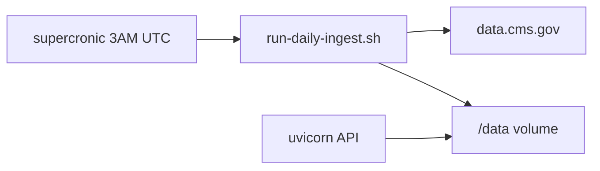

# Deployment: data ingestion and scheduling

Production uses **scheduled SPUF refresh** (not in-app startup hooks) to load CMS data. The API only reads DuckDB.

## Render (recommended)

Single Docker web service with persistent disk at `/data` and in-container supercronic (Render cron jobs cannot mount disks).

| File | Purpose |
|------|---------|
| [`render.yaml`](../render.yaml) | Blueprint: web service, disk, env |
| [`Dockerfile`](../Dockerfile) | Multi-stage image: builds `frontend/dist` from `frontend/src`, then uvicorn + supercronic |
| [`config/deploy.yaml`](../config/deploy.yaml) | **Cron schedule** (`ingest.cron`, UTC) |
| [`scripts/docker-start.sh`](../scripts/docker-start.sh) | Starts supercronic + uvicorn |
| [`scripts/run-daily-ingest.sh`](../scripts/run-daily-ingest.sh) | Nightly: `spuf --download --preserve-other` |

### First deploy on Render

1. Connect GitHub → **New Blueprint** → apply `render.yaml`.
2. Set dashboard secrets: `ANTHROPIC_API_KEY`, `CORS_ORIGINS=https://<your-app>.onrender.com`.
3. After deploy, **Shell** on the web service:

```bash
medicare-ingest spuf --download
```

4. Check `GET /api/health` → `data_fresh: true`.

**Low-memory first load (Starter):** ingest Florida only (default in `config/ingest_filters.yaml`):

```bash
medicare-ingest spuf --download --states FL --merge-states
```

Each run replaces only that state's plans in DuckDB; the CMS zip is still downloaded/read each time. If a run exits with `Killed`, upgrade the Render plan or ingest fewer states.

### Change cron schedule or instance size

- **Schedule:** edit `ingest.cron` in [`config/deploy.yaml`](../config/deploy.yaml) (UTC), push to GitHub.
- **Resources:** edit `plan` and `disk.sizeGB` in [`render.yaml`](../render.yaml).

## Architecture



## Commands

| Command | When |
|---|---|
| `medicare-ingest spuf --download` | Production first load + nightly refresh |
| `medicare-ingest spuf --source path` | Offline fixture or local zip |
| `medicare-ingest fetch` | Download CMS zip to `data/raw/` only |
| `scripts/run-daily-ingest.sh` | Cron entrypoint (`--preserve-other`) |

## Daily schedule

Default: `0 3 * * *` UTC in `config/deploy.yaml`. Equivalent manual run:

```bash
medicare-ingest spuf --download --preserve-other
```

### Other platforms

| Platform | Example |
|---|---|
| **Kubernetes** | [`deploy/k8s/cronjob-spuf-ingest.yaml`](../deploy/k8s/cronjob-spuf-ingest.yaml) |
| **AWS** | [`deploy/aws/eventbridge-ecs-ingest.md`](../deploy/aws/eventbridge-ecs-ingest.md) |
| **Docker Compose** | Use `Dockerfile` + shared volume (see `scripts/docker-start.sh`) |

## Shared volume

| Path | Purpose |
|---|---|
| `navigator.duckdb` | Formulary, plans, pricing |
| `manifest.json` | Source IDs, `seeded_at`, dataset versions |
| `raw/` | CMS zip cache (reused when filename unchanged) |
| `chroma/` | Policy vectors (optional; empty until corpus loader exists) |

```bash
DATA_DIR=/data
DUCKDB_PATH=/data/navigator.duckdb
CHROMA_PATH=/data/chroma
```

## Caching and cron behavior

| Layer | Cleared on nightly ingest? |
|-------|----------------------------|
| CMS zip files in `data/raw/` | **No** (reused unless `--force-download`) |
| SPUF tables (plans, formulary, pricing, beneficiary_cost) | **Replaced** each run |
| Other DuckDB tables | **Kept** when using `--preserve-other` (default in `run-daily-ingest.sh`) |
| Chroma | **Not touched** by SPUF ingest |

## Monitoring

`GET /api/health` fields: `seeded_at`, `data_fresh`, `spuf_source_id`, `spuf_as_of`, `spuf_version`.

Alert when `data_fresh` is `false` for more than one check cycle.

## Data scope

- SPUF ingest filters to **FL** (`config/ingest_filters.yaml`).
- Cost trends, alternatives, and policy retrieval return `no_match` until real loaders are added.

## Local development

```bash
medicare-ingest spuf --source tests/fixtures/spuf
uvicorn medicare_navigator.api.app:app --reload --port 8000
```

Or download real CMS data:

```bash
medicare-ingest spuf --download
```
