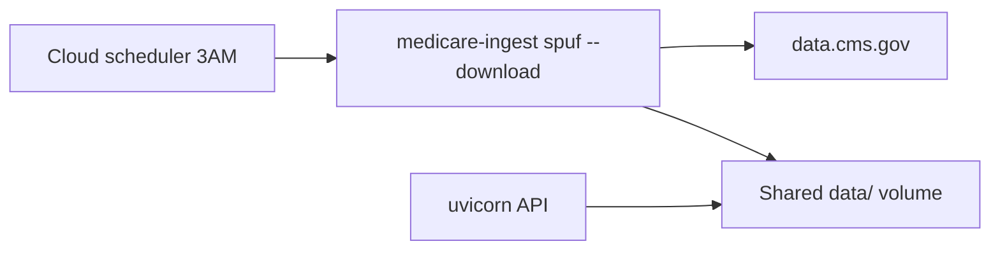

# Deployment: data ingestion and scheduling

Production uses **external scheduled jobs** (not in-app startup hooks) to refresh CMS SPUF data. The API only reads DuckDB; ingestion runs as a separate task.

## Architecture



## Commands

| Command | When |
|---|---|
| `medicare-ingest` | Local dev only — seeds **demo** data |
| `medicare-ingest spuf --download` | Production — downloads latest CMS zip and loads filtered SPUF into DuckDB |
| `scripts/run-daily-ingest.sh` | Wrapper for schedulers (sets `DATA_DIR`, runs `spuf --download`) |

**Do not** schedule bare `medicare-ingest` in production; it overwrites real data with demo seed.

## First deploy

Before starting the API in production:

```bash
medicare-ingest spuf --download
```

This loads real CMS data (filtered to FL + TX per `config/ingest_filters.yaml`) into `data/navigator.duckdb`.

## Daily schedule (3:00 AM)

Configure your cloud scheduler to run once per day when API traffic is low:

```bash
scripts/run-daily-ingest.sh
```

Equivalent:

```bash
medicare-ingest spuf --download
```

### Platform examples

| Platform | Example |
|---|---|
| **Kubernetes** | [`deploy/k8s/cronjob-spuf-ingest.yaml`](../deploy/k8s/cronjob-spuf-ingest.yaml) — `CronJob` at `0 3 * * *` |
| **AWS** | [`deploy/aws/eventbridge-ecs-ingest.md`](../deploy/aws/eventbridge-ecs-ingest.md) — EventBridge → ECS Fargate task |
| **GCP** | Cloud Scheduler → Cloud Run Job with the same command |
| **Generic cron** | `0 3 * * * cd /app && ./scripts/run-daily-ingest.sh >> /var/log/medicare-ingest.log 2>&1` |

Adjust cron expressions for your timezone (Kubernetes and Linux cron use the host/cluster timezone unless you set `timeZone` on the CronJob).

## Shared volume

The API and ingest job **must share the same `DATA_DIR`**:

| Path | Purpose |
|---|---|
| `navigator.duckdb` | Formulary, plans, pricing |
| `manifest.json` | Source IDs, `seeded_at`, dataset versions |
| `raw/` | Cached CMS zip files (skipped re-download when filename unchanged) |
| `chroma/` | Policy corpus (unchanged by SPUF ingest unless you re-seed) |

Environment variables:

```bash
DATA_DIR=/data
DUCKDB_PATH=/data/navigator.duckdb
```

## Ordering and concurrency

1. Run ingest at **3:00 AM** (or other low-traffic window).
2. Avoid concurrent DuckDB writes — do not run ingest while another ingest is in progress (`concurrencyPolicy: Forbid` on K8s CronJob).
3. The API can serve reads during ingest in many setups, but simultaneous write + read against DuckDB can fail; scheduling at 3AM minimizes overlap.

## Monitoring

`GET /api/health` includes data freshness fields:

| Field | Meaning |
|---|---|
| `seeded_at` | Last manifest update date (`YYYY-MM-DD`) |
| `data_fresh` | `true` if `seeded_at` is today or yesterday |
| `spuf_source_id` | e.g. `cms_spuf_2026_q1` or `cms_spuf_2026_q1_demo` |
| `spuf_as_of` | CMS dataset as-of date |
| `spuf_version` | CMS file version label |

Alert when `data_fresh` is `false` for more than one check cycle (likely 3AM job failure).

Full dataset metadata: `GET /api/meta/as-of`.

## Data scope caveats

- Real SPUF ingest filters to **FL + TX** (`config/ingest_filters.yaml`), not the 12 demo plans in `config/demo_plans.yaml`.
- `ingest_spuf()` replaces formulary/plan tables. Cost trends and alternatives remain **demo** unless you add separate real loaders.
- Pass `--preserve-other` to `medicare-ingest spuf` if you need to keep non-SPUF tables when reloading.

## Local development

Keep using demo data — no scheduler required:

```bash
medicare-ingest
uvicorn medicare_navigator.api.app:app --reload --port 8000
```
