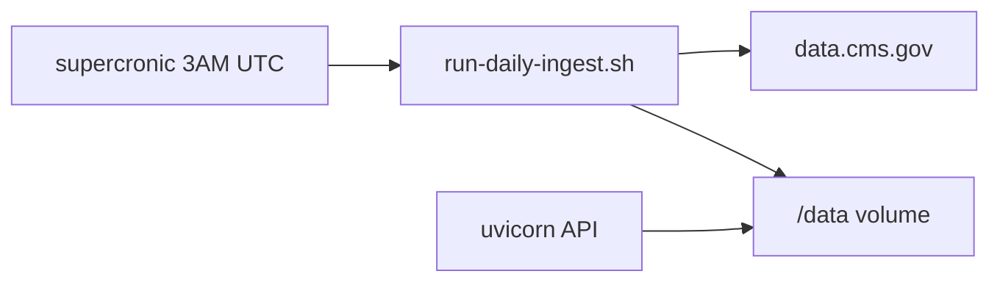

# Deployment: data ingestion and scheduling

Production uses **scheduled SPUF refresh** (not in-app startup hooks) to load CMS data. The API only reads DuckDB.

## Render (recommended)

Single Docker web service with persistent disk at `/data` and in-container supercronic (Render cron jobs cannot mount disks).

| File | Purpose |
|------|---------|
| [`render.yaml`](../render.yaml) | Blueprint: web service, disk, env |
| [`Dockerfile`](../Dockerfile) | Multi-stage image: builds `frontend/dist` from `frontend/src`, then uvicorn + supercronic |
| [`config/deploy.yaml`](../config/deploy.yaml) | **Cron schedule** (`ingest.cron`, UTC) |
| [`scripts/docker-start.sh`](../scripts/docker-start.sh) | Starts supercronic + uvicorn |
| [`scripts/run-daily-ingest.sh`](../scripts/run-daily-ingest.sh) | Nightly: `spuf --download --preserve-other` |

### First deploy on Render

1. Connect GitHub → **New Blueprint** → apply `render.yaml`.
2. Set dashboard secrets: `ANTHROPIC_API_KEY`, `CORS_ORIGINS=https://<your-app>.onrender.com`.
3. After deploy, **Shell** on the web service:

```bash
medicare-ingest spuf --download
```

4. Check `GET /api/health` → `data_fresh: true`.

**Low-memory first load (Starter):** ingest one state at a time, e.g. Arkansas (smaller than Texas):

```bash
medicare-ingest spuf --download --states AR --merge-states
```

Each run replaces only that state's plans in DuckDB; the CMS zip is still downloaded/read each time. If a run exits with `Killed`, upgrade the Render plan or ingest fewer states.

### Change cron schedule, active states, or instance size

- **Schedule:** edit `ingest.cron` in [`config/deploy.yaml`](../config/deploy.yaml) (UTC), push to GitHub.
- **Active states (no redeploy):** set `INGEST_STATES` on the Render service (e.g. `AR,TX,CA`). The nightly cron ingests only states that appear in both `INGEST_STATES` and the `pdp_region_codes` catalog in [`config/ingest_filters.yaml`](../config/ingest_filters.yaml). Restart the service after changing env vars.
- **Resources:** edit `plan` and `disk.sizeGB` in [`render.yaml`](../render.yaml).

## Architecture


```mermaid
flowchart LR
    Scheduler["supercronic 3AM UTC"]
    Ingest["run-daily-ingest.sh"]
    CMS[data.cms.gov]
    DataVol["/data volume"]
    API[uvicorn API]

    Scheduler --> Ingest
    Ingest --> CMS
    Ingest --> DataVol
    API --> DataVol
```

## Commands

| Command | When |
|---|---|
| `medicare-ingest spuf --download` | Production first load + nightly refresh |
| `medicare-ingest spuf --source path` | Offline fixture or local zip |
| `medicare-ingest fetch` | Download CMS zip to `data/raw/` only |
| `scripts/run-daily-ingest.sh` | Cron entrypoint (`--preserve-other`) |

## Daily schedule

Default: `0 3 * * *` UTC in `config/deploy.yaml`. Equivalent manual run:

```bash
medicare-ingest spuf --download --preserve-other
```

### Other platforms

| Platform | Example |
|---|---|
| **Kubernetes** | [`deploy/k8s/cronjob-spuf-ingest.yaml`](../deploy/k8s/cronjob-spuf-ingest.yaml) |
| **AWS** | [`deploy/aws/eventbridge-ecs-ingest.md`](../deploy/aws/eventbridge-ecs-ingest.md) |
| **Docker Compose** | Use `Dockerfile` + shared volume (see `scripts/docker-start.sh`) |

## Shared volume

| Path | Purpose |
|---|---|
| `navigator.duckdb` | Formulary, plans, pricing |
| `manifest.json` | Source IDs, `seeded_at`, dataset versions |
| `raw/` | CMS zip cache (reused when filename unchanged) |
| `chroma/` | Policy vectors (optional; empty until corpus loader exists) |

```bash
DATA_DIR=/data
DUCKDB_PATH=/data/navigator.duckdb
CHROMA_PATH=/data/chroma
```

## Caching and cron behavior

| Layer | Cleared on nightly ingest? |
|-------|----------------------------|
| CMS zip files in `data/raw/` | **No** (reused unless `--force-download`) |
| SPUF tables (plans, formulary, pricing, beneficiary_cost, insulin_beneficiary_cost) | **Replaced** each run |
| Other DuckDB tables | **Kept** when using `--preserve-other` (default in `run-daily-ingest.sh`) |
| Chroma | **Not touched** by SPUF ingest |

## Monitoring

`GET /api/health` fields: `seeded_at`, `data_fresh`, `spuf_source_id`, `spuf_as_of`, `spuf_version`.

Alert when `data_fresh` is `false` for more than one check cycle.

### Insulin cost-share data

CMS ships insulin's capped pricing in its own file within the same quarterly SPUF ZIP (the **Insulin Beneficiary Cost File**) — `medicare-ingest spuf` discovers and loads it automatically alongside the other SPUF tables, no separate ingest step. Ingestion tolerates an older cached zip that lacks this file: `insulin_beneficiary_cost` simply stays empty for the affected plans, and insulin requests return the narrow `insulin_out_of_scope` data-gap message rather than failing. After any real (non-fixture) ingest, run the post-ingest validator to re-confirm the statutory-cap assumptions documented in [insulin-cost-estimation.md](./insulin-cost-estimation.md):

```bash
python scripts/validate_insulin_cost_data.py --db /data/navigator.duckdb
```

## Inspecting and managing loaded data (Render Shell)

On Render, open **Shell** on the web service. Paths below assume the default disk layout (`DUCKDB_PATH=/data/navigator.duckdb`). For local dev, use `./data/navigator.duckdb` instead.

### Which states are loaded?

**Manifest** (written after each ingest):

```bash
cat /data/manifest.json
```

Look for `spuf.states` (e.g. `["AR", "TX"]`).

**DuckDB** (authoritative — what the API actually queries):

```bash
python -c "
import duckdb
print(duckdb.connect('/data/navigator.duckdb').execute(
    'SELECT DISTINCT upper(state) AS state FROM plans ORDER BY 1'
).fetchall())
"
```

**List plans** (optional):

```bash
python -c "
import duckdb
for row in duckdb.connect('/data/navigator.duckdb').execute(
    'SELECT plan_key, plan_name, state FROM plans ORDER BY state, plan_name'
).fetchall():
    print(row)
"
```

Or hit the API: `GET /api/plans?state=AR`.

### Add plans (re-ingest from CMS)

Plans are not inserted manually. Add or refresh plans by re-running SPUF ingest for the target state(s). Use `--merge-states` to load a state without wiping other states already on disk.

**Add or refresh one state** (keeps other states):

```bash
medicare-ingest spuf --download --states AR --merge-states
```

**Add another state** (already in `pdp_region_codes` catalog — set `INGEST_STATES` on Render or run manually):

```bash
medicare-ingest spuf --download --states CA --merge-states
```

**Reload active states** (nightly cron equivalent — uses `INGEST_STATES` env or yaml `states` default):

```bash
medicare-ingest spuf --download --preserve-other
```

After ingest, confirm with the DuckDB state query above or `cat /data/manifest.json`.

### Remove plans

**Remove all plans for a state** (preferred — uses the same purge logic as ingest):

```bash
python -c "
from medicare_navigator.ingestion.schema import create_indexes
from medicare_navigator.ingestion.spuf import _purge_states
from medicare_navigator.storage.connection import DuckDBConnection

states = ['AR']  # state code(s) to remove
conn = DuckDBConnection().connect()
removed = _purge_states(conn, states)
create_indexes(conn)
conn.close()
print(f'Removed {removed} plan(s) for {states}')
"
```

**Remove a single plan** by `plan_key` (`CONTRACT_ID-PLAN_ID`, e.g. `S5678-012`):

```bash
python -c "
from medicare_navigator.ingestion.schema import create_indexes, drop_spuf_indexes
from medicare_navigator.storage.connection import DuckDBConnection

plan_key = 'S5678-012'  # change me
conn = DuckDBConnection().connect()
drop_spuf_indexes(conn)
conn.execute('DELETE FROM beneficiary_cost WHERE plan_key = ?', [plan_key])
conn.execute('DELETE FROM insulin_beneficiary_cost WHERE plan_key = ?', [plan_key])
conn.execute('DELETE FROM pricing WHERE plan_key = ?', [plan_key])
conn.execute('DELETE FROM plans WHERE plan_key = ?', [plan_key])
create_indexes(conn)
conn.close()
print(f'Removed plan {plan_key}')
"
```

Do **not** delete `basic_drugs_formulary` rows for a single plan unless you know the `formulary_id` is unused by other plans (formularies are shared across plans).

DuckDB can fail bulk `DELETE` on indexed tables; the snippets above drop and recreate SPUF indexes first (same pattern as `_purge_states` in ingest).

**If purge fails with `No space left on device`:** the `/data` disk is full (default 5 GB). DuckDB needs free space for `navigator.duckdb.wal` during writes. Free space first, then retry:

```bash
# 1. See what is using the disk
df -h /data
du -sh /data/* 2>/dev/null | sort -rh
ls -lah /data/navigator.duckdb*

# 2. Quick win — remove cached CMS zip(s) (safe; re-downloaded on next ingest)
rm -f /data/raw/*.zip

# 3. Optional — remove unused Chroma data if you are not using policy retrieval
# rm -rf /data/chroma/*

# 4. Retry the purge (or re-ingest)
```

After a successful purge, reclaim DuckDB file space:

```bash
python -c "
import duckdb
conn = duckdb.connect('/data/navigator.duckdb')
conn.execute('CHECKPOINT')
conn.execute('VACUUM')
conn.close()
print('Checkpoint + VACUUM complete')
"
```

If the disk stays tight, increase `disk.sizeGB` in [`render.yaml`](../render.yaml) (and `disk_size_gb` in [`config/deploy.yaml`](../config/deploy.yaml)), push, and apply the Blueprint change in the Render dashboard.

## Data scope

- **Catalog:** all state PDP region codes in `config/ingest_filters.yaml` (`pdp_region_codes`).
- **Active ingest:** `INGEST_STATES` on Render (e.g. `AR,TX,CA`) intersected with that catalog; yaml `states` is the default when env is unset.
- Cost trends, alternatives, and policy retrieval return `no_match` until real loaders are added.

## Local development

```bash
medicare-ingest spuf --source tests/fixtures/spuf
uvicorn medicare_navigator.api.app:app --reload --port 8000
```

Or download real CMS data:

```bash
medicare-ingest spuf --download
```
