# Developer Guide

**Medicare Drug Cost & Benefit-Transparency Navigator** — technical reference for running, developing, testing, and deploying the Phase 6 system.

> **Scope (v1):** Estimate the out-of-pocket cost of **one drug fill on one Medicare Part D plan's regular formulary**, for a non-LIS beneficiary in pre-deductible or initial-coverage phase. See [navigator-implementation-spec.md](./navigator-implementation-spec.md) for the full product contract.

---

## Table of contents

1. [System overview](#1-system-overview)
2. [Technology stack](#2-technology-stack)
3. [Architecture](#3-architecture)
4. [Repository layout](#4-repository-layout)
5. [Data layer](#5-data-layer)
6. [Cost estimation pipeline](#6-cost-estimation-pipeline)
7. [LLM agent layer](#7-llm-agent-layer)
8. [MCP tools](#8-mcp-tools)
9. [Guardrails and citations](#9-guardrails-and-citations)
10. [HTTP API](#10-http-api)
11. [Frontend](#11-frontend)
12. [Configuration](#12-configuration)
13. [Local development](#13-local-development)
14. [Testing](#14-testing)
15. [Evaluation suite](#15-evaluation-suite)
16. [Deployment](#16-deployment)
17. [CLI reference](#17-cli-reference)
18. [Troubleshooting](#18-troubleshooting)
19. [Product boundaries](#19-product-boundaries)
20. [Further reading](#20-further-reading)

---

## 1. System overview

The navigator is a **chat-first web application** that answers questions like *"What will lovastatin 40mg cost on plan S5921-383 with a 30-day supply?"*

Core design principles:

| Principle | Implementation |
|---|---|
| **Deterministic dollars** | All cost figures come from an 8-step Python pipeline (`estimate_drug_cost`), not from LLM arithmetic |
| **LLM for language only** | A single Navigator agent calls MCP tools and explains results in plain English |
| **CMS SPUF as source of truth** | Formulary, pricing, and cost-share data loaded from CMS quarterly files into DuckDB |
| **Explicit hard stops** | Insulin, suppressed plans, quantity-limit violations, and coinsurance are handled in code with verbatim caveats |
| **Read-only API at runtime** | Data refresh is a **scheduled batch job**, not an in-request ingest |

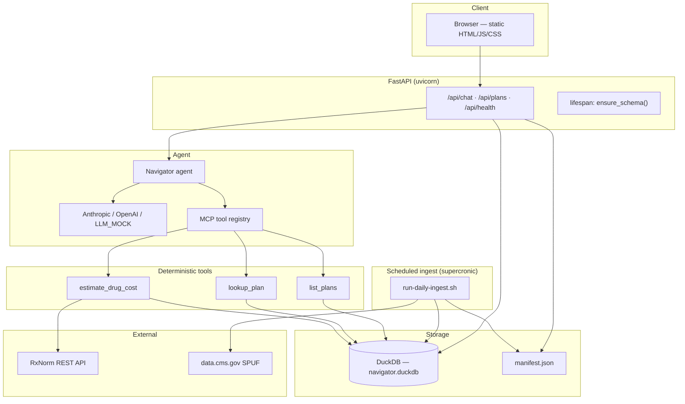

---

## 2. Technology stack

Every layer used in production and local development.

### 2.1 Runtime and language

| Component | Version / choice | Role |
|---|---|---|
| **Python** | ≥ 3.11 (`pyproject.toml`) | Backend, ingestion, tests, CLI entrypoints |
| **Package manager** | `pip` + `hatchling` | Editable install: `pip install -e ".[dev]"` |

### 2.2 Web framework and server

| Component | Package | Role |
|---|---|---|
| **FastAPI** | `fastapi>=0.115` | HTTP API, Pydantic request/response models, lifespan hooks |
| **Uvicorn** | `uvicorn[standard]>=0.32` | ASGI server; binds `0.0.0.0:$PORT` in Docker/Render |
| **Starlette** | (via FastAPI) | CORS middleware, static file serving, custom no-cache middleware |
| **python-multipart** | `python-multipart` | Form parsing (if needed by future endpoints) |

**Entry point:** `medicare_navigator.api.app:app`

### 2.3 Data storage

| Component | Package | Role |
|---|---|---|
| **DuckDB** | `duckdb>=1.1` | Embedded OLAP database for SPUF tables, drug cache, query log |
| **File manifest** | JSON on disk | `data/manifest.json` — dataset versions, `seeded_at`, freshness |

No PostgreSQL, Redis, or vector store in Phase 6. Chroma and policy RAG were removed in the Phase 6 pivot.

### 2.4 LLM providers

| Component | Package | Role |
|---|---|---|
| **Anthropic** | `anthropic>=0.39` | Default provider (`LLM_PROVIDER=anthropic`, model `claude-sonnet-4-6`) |
| **OpenAI** | `openai>=1.54` | Alternate provider (`LLM_PROVIDER=openai`) |
| **Mock mode** | In-repo `llm/mock.py` | Offline deterministic agent when `LLM_MOCK=1` |

The `mcp` package (`mcp>=1.2`) is installed for schema/tool patterns; tool dispatch is implemented in `mcp/registry.py` (not a separate MCP server process).

### 2.5 HTTP client and config

| Component | Package | Role |
|---|---|---|
| **httpx** | `httpx>=0.27` | RxNorm API calls in `normalize_drug` |
| **Pydantic v2** | `pydantic>=2.9` | Models, validation |
| **pydantic-settings** | `pydantic-settings>=2.6` | `.env` loading in `config.py` |
| **PyYAML** | `pyyaml>=6` | `config/ingest_filters.yaml`, `config/deploy.yaml` |

### 2.6 Frontend

| Component | Choice | Role |
|---|---|---|
| **Build** | None (copy-only) | `scripts/build-frontend.sh` copies `frontend/src/` → `frontend/dist/` |
| **Framework** | Vanilla JS | No React/Vue/npm bundler |
| **Styling** | Plain CSS | `frontend/src/styles.css` |
| **Serving** | FastAPI `StaticFiles` | Root `/` serves `frontend/dist/index.html` |

### 2.7 Container and scheduling

| Component | Role |
|---|---|
| **Docker** | Multi-stage `Dockerfile` (Alpine copy frontend → Python slim runtime) |
| **supercronic** | In-container cron (Render cron jobs cannot mount persistent disks) |
| **Render Blueprint** | `render.yaml` — web service + 5 GB disk at `/data` |

### 2.8 Development and quality

| Component | Package | Role |
|---|---|---|
| **pytest** | `pytest>=8.3` | Unit and integration tests (`tests/`) |
| **pytest-asyncio** | `pytest-asyncio>=0.24` | Async tests (`asyncio_mode = auto`) |
| **ruff** | `ruff>=0.7` | Linting (`line-length = 100`, `py311`) |

### 2.9 External data APIs (runtime)

| API | Auth | Used by |
|---|---|---|
| **RxNorm REST** (`rxnav.nlm.nih.gov`) | None | `tools/normalize_drug.py` — drug name → RxCUI |
| **CMS data.cms.gov** | None | `ingestion/cms_download.py` — SPUF zip download (ingest only) |

### 2.10 Stack diagram (dependency layers)

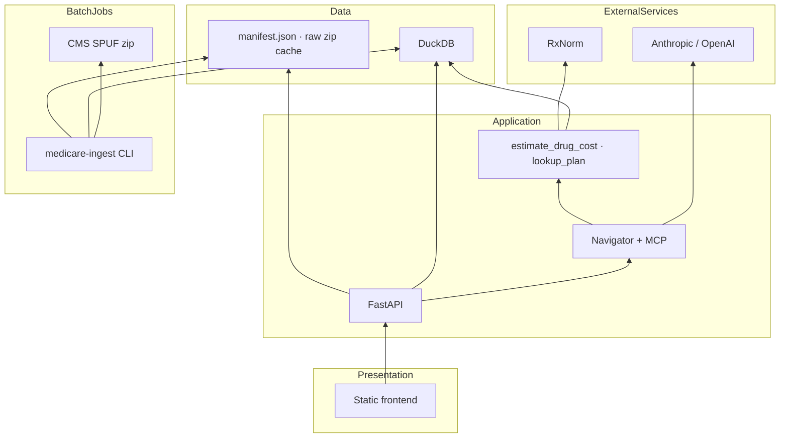

---

## 3. Architecture

### 3.1 Request lifecycle

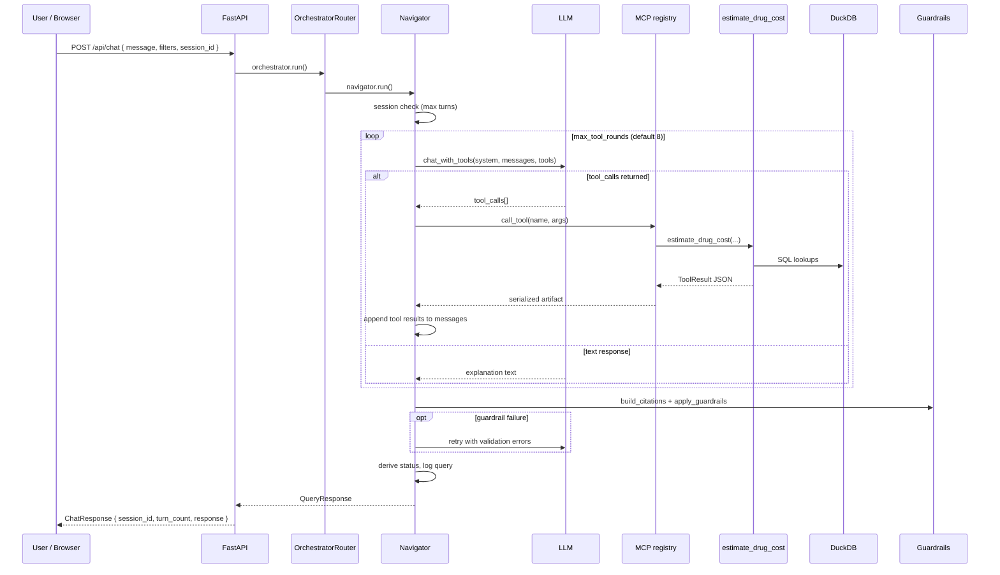

### 3.2 Orchestration

Phase 6 has **no multi-agent pipeline**. `orchestrator/router.py` delegates directly to `Navigator`:

```python
return await navigator.run(message, filter_slots=filter_slots, session_id=session_id)
```

### 3.3 Session model

Sessions are **in-memory** (not persisted to DuckDB). See `session/manager.py`.

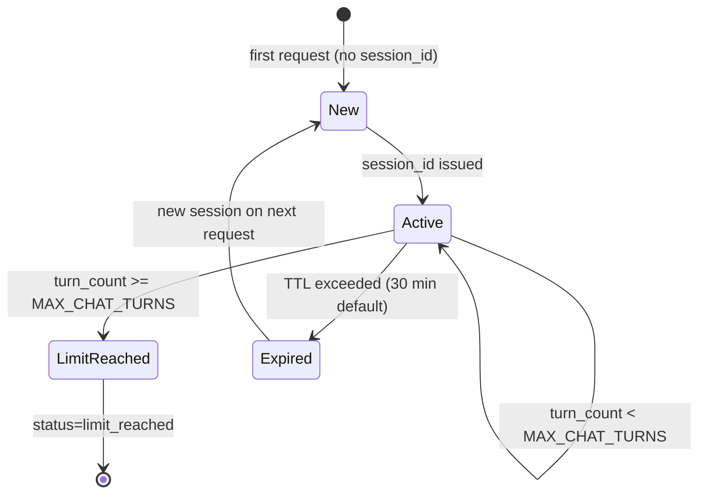

| Setting | Default | Env var |
|---|---|---|
| Max turns per session | 5 | `MAX_CHAT_TURNS` |
| Session TTL | 30 minutes | `SESSION_TTL_MINUTES` |
| History kept in prompt | Last 3 turns | Hardcoded in `navigator.py` |

### 3.4 Production deployment topology

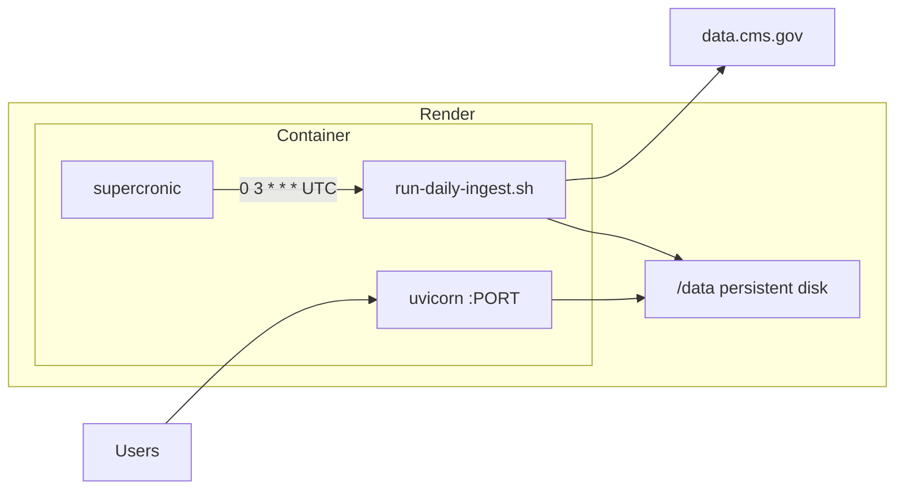

| Path on disk | Contents |
|---|---|
| `/data/navigator.duckdb` | SPUF tables |
| `/data/manifest.json` | Ingest metadata, freshness |
| `/data/raw/` | Cached CMS zip files |

---

## 4. Repository layout

```
Medicare-drug-cost-navigator/
├── config/
│   ├── deploy.yaml           # Cron schedule (UTC), Render plan hints
│   ├── disclaimer.txt        # Fixed disclaimer banner text
│   └── ingest_filters.yaml   # States (FL), contract year, plan prefixes
├── deploy/
│   ├── aws/                  # EventBridge + ECS ingest notes
│   └── k8s/                  # CronJob manifest for SPUF ingest
├── docs/                     # Documentation (this guide + specs)
├── frontend/
│   ├── src/                  # Source: index.html, app.js, styles.css
│   └── dist/                 # Built output (gitignored; copy via build script)
├── scripts/
│   ├── build-frontend.sh     # cp src → dist
│   ├── docker-start.sh       # ensure_schema + supercronic + uvicorn
│   ├── generate-crontab.py   # Renders crontab from deploy.yaml
│   └── run-daily-ingest.sh   # Nightly medicare-ingest spuf --download
├── src/medicare_navigator/
│   ├── agent/                # Navigator + system prompt
│   ├── api/                  # FastAPI app
│   ├── eval/                 # Offline eval suite (queries.jsonl)
│   ├── guardrails/           # Citation enforcement
│   ├── ingestion/            # SPUF ingest, schema, CMS download
│   ├── llm/                  # Provider adapter + mock
│   ├── mcp/                  # Tool schemas + registry
│   ├── models/               # Pydantic types (QueryResponse, DrugCostEstimate)
│   ├── orchestrator/         # Thin router
│   ├── qa/                   # Chat QA CLI
│   ├── session/              # In-memory sessions
│   ├── storage/              # DuckDB connection + repositories
│   ├── tools/                # estimate_drug_cost, normalize_drug, etc.
│   └── ui_test/              # UI contract smoke tests
├── tests/                    # pytest suite + SPUF fixtures
├── Dockerfile
├── pyproject.toml
├── render.yaml
└── .env.example
```

### Installed console scripts

| Command | Module | Purpose |
|---|---|---|
| `medicare-ingest` | `ingestion/cli.py` | Load CMS SPUF into DuckDB |
| `medicare-eval` | `eval/run_eval.py` | Run acceptance queries |
| `medicare-chat-invoke` | `qa/cli.py` | Manual chat testing |
| `medicare-ui-test` | `ui_test/cli.py` | Frontend contract checks |

---

## 5. Data layer

### 5.1 Entity-relationship diagram

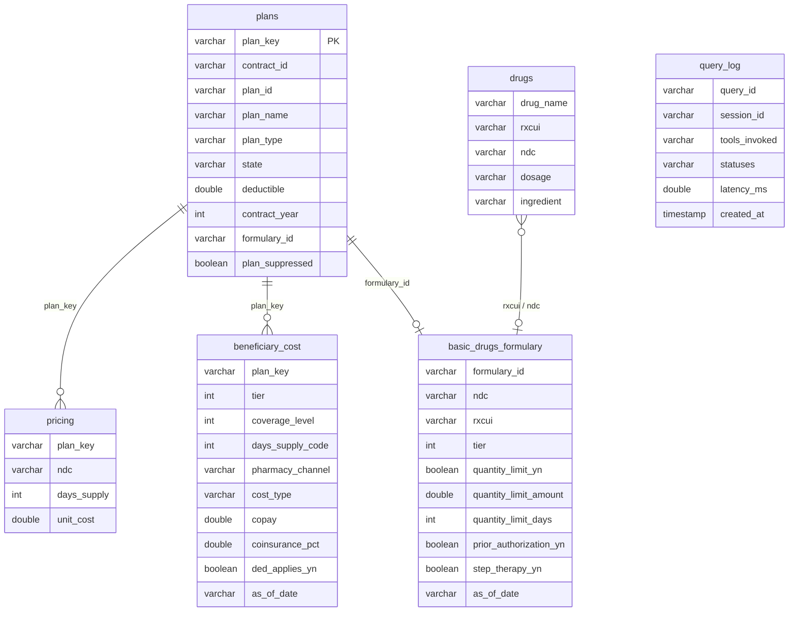

### 5.2 Table purposes

| Table | Source file (CMS SPUF) | Purpose |
|---|---|---|
| `plans` | `plan information` | Plan metadata, deductible, `formulary_id`, `plan_suppressed` |
| `basic_drugs_formulary` | `basic drugs formulary` | Tier, NDC, RxCUI, QL/PA/ST flags |
| `pricing` | `pricing` | `unit_cost` per plan + NDC + days supply |
| `beneficiary_cost` | `beneficiary cost` | Copay/coinsurance by tier, coverage level, days-supply **code** |
| `drugs` | Runtime (RxNorm cache) | Cached normalization results |
| `query_log` | Runtime | Optional analytics (failures swallowed) |

### 5.3 Schema migrations

Persistent Render disks survive deploys. `CREATE TABLE IF NOT EXISTS` does **not** add new columns. Use `migrate_schema()` in `ingestion/schema.py`:

```python
SCHEMA_MIGRATIONS = (
    ("plans", "plan_suppressed", "BOOLEAN DEFAULT FALSE"),
    ("beneficiary_cost", "ded_applies_yn", "BOOLEAN"),
)
```

`ensure_schema()` runs on:
- FastAPI lifespan startup
- `scripts/docker-start.sh` before uvicorn

### 5.4 Indexes

| Index | Columns | Purpose |
|---|---|---|
| `idx_basic_drugs_formulary` | `(formulary_id, rxcui)` | Formulary lookup |
| `idx_plans_state_year` | `(state, contract_year)` | Plan listing |
| `idx_beneficiary_cost_lookup` | `(plan_key, tier, coverage_level, days_supply_code, pharmacy_channel)` | Cost-share lookup |
| `idx_pricing_plan_ndc` | `(plan_key, ndc, days_supply)` | Pricing lookup |

Indexes are dropped before bulk SPUF delete/reload (DuckDB ART index delete bug) and recreated after ingest.

### 5.5 Read-only API connections

`DuckDBConnection.fetchone` / `fetchall` use `read_only=True` so concurrent API reads do not block ingest writes. Missing tables return `None` / `[]` instead of raising.

### 5.6 Manifest and freshness

After ingest, `data/manifest.json` records:

```json
{
  "spuf": {
    "version": "SPUF.2026.20260408",
    "as_of": "2026-04-08",
    "source_id": "cms_spuf_2026_q2",
    "states": ["FL"]
  },
  "seeded_at": "2026-04-08T12:00:00Z"
}
```

`GET /api/health` exposes `data_fresh`, `seeded_at`, `spuf_as_of`, `spuf_version`.

### 5.7 Ingest filters

`config/ingest_filters.yaml`:

| Field | Value (default) | Notes |
|---|---|---|
| `contract_year` | 2026 | Filter CMS files |
| `states` | FL | MA-PD uses `STATE`; PDP uses `PDP_REGION_CODE` |
| `pdp_region_codes` | FL→11 | Required for stand-alone PDP plans |
| `plan_type_prefixes` | S, H | S=PDP, H=local MA-PD |

### 5.8 Typical data volumes (2026 FL-only ingest)

| Table | Approximate rows |
|---|---|
| `plans` | 572 |
| `basic_drugs_formulary` | 188,841 |
| `pricing` | 5,726,853 |
| `beneficiary_cost` | 60,314 |

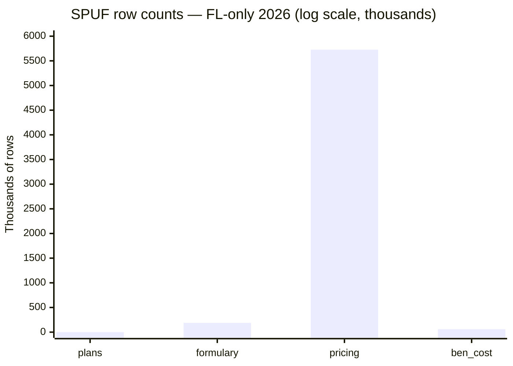

Use `--merge-states` on low-memory hosts when ingesting additional states.

---

## 6. Cost estimation pipeline

Implemented in `tools/estimate_drug_cost.py` as **one consolidated function** so hard-stop ordering cannot be skipped by LLM tool-call sequencing.

### 6.1 Eight-step flow

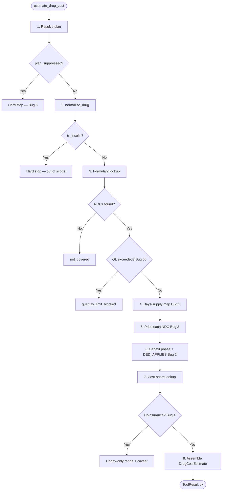

### 6.2 Days-supply code mapping (Bug 1)

`pricing.DAYS_SUPPLY` (day count) ≠ `beneficiary_cost.DAYS_SUPPLY` (CMS code). Mapping in `tools/days_supply.py`:

| Requested days | Pricing field | Beneficiary cost code |
|---|---|---|
| 30 | 30 | 1 |
| 60 | 60 | 4 |
| 90 | 90 | 2 |
| Other | varies | `None` — no beneficiary_cost lookup is attempted (CMS code 3/"other" exists in the file but v1 does not map to it) |

A day count outside {30, 60, 90} never joins to `beneficiary_cost`. Whether a dollar figure still comes back depends on benefit phase: pre-deductible fills price from `pricing.UNIT_COST` directly (keyed on the raw day count, not the CODE) and can still return an ingredient-cost-only estimate; initial-coverage fills have no such fallback, so the tool returns `cost_low`/`cost_high` as `null` with a caveat explaining that no cost-sharing data could be found for that fill size — never a silent `ok` with blank numbers and no explanation.

### 6.3 Coverage level codes (verified on 2026 FL data)

| `COVERAGE_LEVEL` | Phase | Used in v1? |
|---|---|---|
| **0** | Deductible | Yes — when YTD &lt; deductible and tier has `DED_APPLIES_YN=Y` |
| **1** | Initial coverage | Yes — default after deductible met, or tier exempt (Bug 2) |
| **2** | — | **Never observed** in 2026 FL beneficiary_cost rows |
| **3** | Catastrophic | Present in data; **not computed** in v1 (out of scope) |

> Pre-pivot assumptions (1=deductible, 2=initial) were incorrect and would have returned wrong copays (e.g. $0 catastrophic instead of Bug 4 coinsurance disclaimer).

### 6.4 CMS bugs handled in v1

| Bug | Issue | v1 behavior |
|---|---|---|
| **1** | Days-supply representation mismatch | `DAYS_SUPPLY_CODE_MAP` before any join |
| **2** | Per-tier `DED_APPLIES_YN` overrides global phase | Recompute effective phase per tier; append verbatim caveat |
| **3** | `UNIT_COST` is per unit, not per fill | `ceil(days_supply / doses_per_day) * unit_cost` |
| **4** | Coinsurance dollar base unconfirmed | Exclude coinsurance NDCs from range; verbatim disclaimer |
| **5** | Multiple NDCs per RxCUI | Independent computation; report low–high range |
| **5b** | Quantity limits | Hard stop if requested supply exceeds plan limit |
| **6** | Suppressed plans (`PLAN_SUPPRESSED_YN=Y`) | Hard stop; plans **persisted** at ingest (not filtered out) |

Full verbatim messages live in `tools/disclaimers.py`.

### 6.5 `DrugCostEstimate` response shape

```python
class DrugCostEstimate(BaseModel):
    plan_key: str
    plan_name: str
    drug_name: str
    rxcui: str | None
    tiers_matched: list[int]
    matched_ndc_count: int
    same_tier: bool
    days_supply: int
    benefit_phase: str | None      # "pre_deductible" | "initial_coverage"
    cost_low: float | None
    cost_high: float | None
    caveats: list[str]
    quantity_limit_blocked: bool
    max_allowed_days_supply: int | None
    covered: bool
```

---

## 7. LLM agent layer

### 7.1 Navigator (`agent/navigator.py`)

| Responsibility | Detail |
|---|---|
| Tool-calling loop | Up to `MAX_TOOL_ROUNDS` (default 8) iterations |
| Provider abstraction | OpenAI function calling vs Anthropic tool_use blocks |
| Filter injection | Guided-form slots appended to user message context |
| Status derivation | `ok`, `needs_clarification`, `not_found`, `limit_reached` |
| Guardrail retry | One rewrite attempt if dollar amounts or caveats fail validation |
| Query logging | Best-effort insert into `query_log` |

### 7.2 System prompt

`agent/prompts.py` — `NAVIGATOR_SYSTEM_PROMPT` encodes v1 scope boundaries (no enrollment advice, no insulin estimates, cite tool outputs only).

### 7.3 LLM client (`llm/client.py`)

| Mode | When | Behavior |
|---|---|---|
| **Live** | API key set for `LLM_PROVIDER` | Async calls with timeout + exponential retry |
| **Mock** | `LLM_MOCK=1` | `mock_chat_with_tools` — pattern-matches messages to tool calls |
| **Unconfigured** | No key and no mock | `LLMNotConfiguredError` → HTTP 503 |

| Setting | Default | Env |
|---|---|---|
| Timeout | 60s | `LLM_TIMEOUT_SECONDS` |
| Retries | 2 | `LLM_MAX_RETRIES` |
| Model | `claude-sonnet-4-6` | `LLM_MODEL` |

### 7.4 Health check behavior

`GET /api/health` returns **503 degraded** when LLM is not configured. Data endpoints (`/api/plans`) still work; chat returns 503.

---

## 8. MCP tools

Three tools registered in `mcp/schemas.py` and dispatched in `mcp/registry.py`.

| Tool | Type | Description |
|---|---|---|
| `estimate_drug_cost` | Async | Full 8-step pipeline; includes internal `normalize_drug` |
| `lookup_plan` | Sync | Resolve by `plan_key` or fuzzy `search_text` |
| `list_plans` | Sync | Filter by `state`, `plan_type`, `contract_year` |

`normalize_drug` is **not** LLM-visible — it runs inside `estimate_drug_cost` so insulin routing cannot be skipped.

### Tool result envelope

```json
{
  "status": "ok",
  "source_id": "cms_spuf_2026_q1",
  "as_of_date": "2026-01-15",
  "message": "",
  "data": { }
}
```

`ToolStatus` values include: `ok`, `not_found`, `not_covered`, `no_match`, `suppressed`, `insulin_out_of_scope`, `quantity_limit_blocked`.

---

## 9. Guardrails and citations

`guardrails/citations.py`:

1. **`build_citations_from_artifacts`** — Maps tool results to `Citation` objects for the Sources panel (including lookup failures).
2. **`apply_guardrails`** — Force-appends verbatim caveats from tools if the LLM paraphrased or omitted them; validates dollar amounts trace to `cost_low`/`cost_high`.

Enforced hard-stop statuses: `suppressed`, `insulin_out_of_scope`, `quantity_limit_blocked`.

---

## 10. HTTP API

Base URL: `http://localhost:8000` (local) or your Render hostname.

### Endpoints

| Method | Path | Auth | Description |
|---|---|---|---|
| `GET` | `/api/health` | None | Service health, LLM config, data freshness |
| `GET` | `/api/disclaimer` | None | Canonical disclaimer text |
| `GET` | `/api/meta/as-of` | None | Raw `manifest.json` |
| `GET` | `/api/plans` | None | Plan list; query params: `plan_type`, `state`, `year` |
| `POST` | `/api/query` | None | Structured query (legacy-compatible) |
| `POST` | `/api/chat` | None | Conversational turn with optional filters |
| `GET` | `/` | None | SPA shell (`frontend/dist/index.html`) |

### `POST /api/chat` request

```json
{
  "session_id": "optional-uuid",
  "message": "What does lovastatin 40mg cost on plan S5921-383?",
  "filters": {
    "drug": "lovastatin",
    "dosage": "40mg",
    "plan_id": "S5921-383",
    "contract_year": 2026,
    "days_supply": 30,
    "ytd_oop_spend": 0
  }
}
```

### `POST /api/chat` response

```json
{
  "session_id": "uuid",
  "turn_count": 1,
  "response": {
    "query_id": "uuid",
    "status": "ok",
    "drug_name": "lovastatin",
    "rxcui": "5640",
    "estimate": { "cost_low": 5.0, "cost_high": 5.0, "..." : "..." },
    "explanation": "Natural language answer with dollar figures...",
    "citations": [{ "source_id": "...", "label": "...", "url": "..." }],
    "disclaimer": "...",
    "data_as_of": { "estimate": "2026-01-15" },
    "tools_invoked": ["estimate_drug_cost"],
    "tool_statuses": { "estimate_drug_cost": "ok" },
    "response_source": "anthropic/claude-sonnet-4-6"
  }
}
```

### Error codes

| HTTP | Cause |
|---|---|
| 503 | LLM not configured (`LLMNotConfiguredError`) |
| 502 | LLM request failed after retries (`LLMRequestError`) |
| 422 | Pydantic validation error on request body |

---

## 11. Frontend

### 11.1 Layout

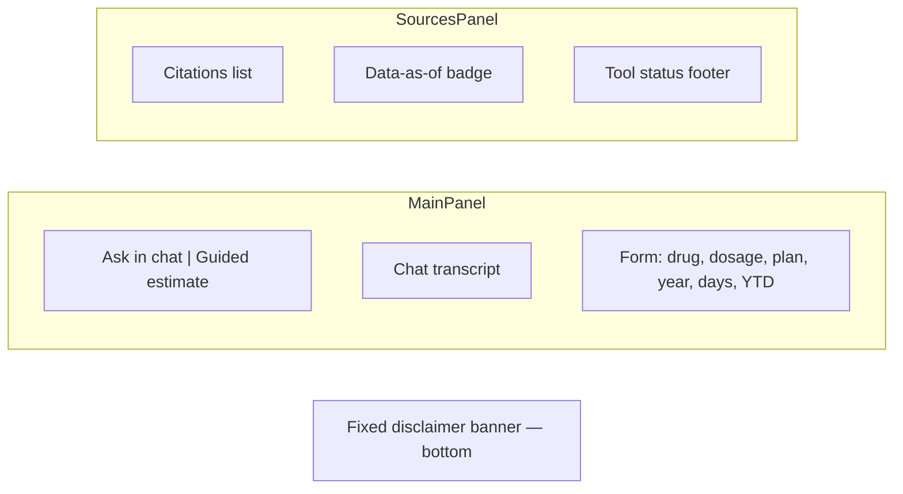

- **Cost figures appear in chat text**, not a dedicated results card.
- **Sources panel** shows citations and freshness only.

### 11.2 Key behaviors (`frontend/src/app.js`)

| Feature | Implementation |
|---|---|
| Plan loading | `GET /api/plans` on startup |
| Empty DB polling | Every 20s, max 30 attempts, while plan count = 0 |
| Guided estimate | Composes NL prompt → `POST /api/chat` → switches to chat tab |
| Error display | `chatErrorMessage()` parses FastAPI `detail` (JSON, text, validation arrays) |
| Session | Stores `session_id` from first response; sends on subsequent turns |
| Cache busting | `?v=` query params on assets; server `Cache-Control: no-cache` |

### 11.3 Build

```bash
scripts/build-frontend.sh   # copies src → dist
```

Docker and pytest `conftest.py` auto-build if `frontend/dist/index.html` is missing.

---

## 12. Configuration

### 12.1 Environment variables

| Variable | Required | Default | Description |
|---|---|---|---|
| `LLM_PROVIDER` | No | `anthropic` | `anthropic` or `openai` |
| `ANTHROPIC_API_KEY` | Prod yes* | — | Claude API key |
| `OPENAI_API_KEY` | Prod yes* | — | OpenAI key (if provider=openai) |
| `LLM_MODEL` | No | `claude-sonnet-4-6` | Model identifier |
| `LLM_MOCK` | No | `0` | Set `1` for offline mock LLM |
| `DATA_DIR` | No | `./data` | Data root |
| `DUCKDB_PATH` | No | `./data/navigator.duckdb` | DuckDB file |
| `PROJECT_ROOT` | Docker | auto | Repo root for config resolution |
| `PORT` / `API_PORT` | No | `8000` | Uvicorn port (`PORT` wins on Render) |
| `CORS_ORIGINS` | Prod | localhost | Comma-separated allowed origins |
| `MAX_CHAT_TURNS` | No | `5` | Session turn limit |
| `SESSION_TTL_MINUTES` | No | `30` | In-memory session expiry |
| `MAX_TOOL_ROUNDS` | No | `8` | Agent tool loop cap |
| `LLM_TIMEOUT_SECONDS` | No | `60` | Per-request timeout |
| `LLM_MAX_RETRIES` | No | `2` | Retry count on LLM failure |

\*Production requires a real API key **or** intentional mock mode for demos only.

### 12.2 Committed config files

| File | Purpose |
|---|---|
| `config/ingest_filters.yaml` | Which states/years to load from SPUF |
| `config/deploy.yaml` | Ingest cron (`0 3 * * *` UTC) |
| `config/disclaimer.txt` | UI disclaimer banner |

---

## 13. Local development

### 13.1 Prerequisites

- Python 3.11+
- Git
- (Optional) Docker
- (Optional) Anthropic or OpenAI API key for live LLM responses

### 13.2 First-time setup

```bash
cd Medicare-drug-cost-navigator
python -m venv .venv
source .venv/bin/activate          # Windows: .venv\Scripts\activate
pip install -e ".[dev]"
cp .env.example .env
# Edit .env: add API key OR set LLM_MOCK=1
```

### 13.3 Load data

**Option A — Offline fixture (fastest, used by tests):**

```bash
medicare-ingest spuf --source tests/fixtures/spuf
```

**Option B — Download real CMS data:**

```bash
medicare-ingest spuf --download
# Or limit memory:
medicare-ingest spuf --download --states FL --merge-states
```

**Option C — Use cached zip:**

```bash
medicare-ingest spuf --source data/raw/SPUF_2026_20260408.zip --states FL
```

### 13.4 Build frontend and run server

```bash
scripts/build-frontend.sh
LLM_MOCK=1 uvicorn medicare_navigator.api.app:app --reload --host 0.0.0.0 --port 8000
```

Open http://localhost:8000

### 13.5 Verify

```bash
curl -s http://localhost:8000/api/health | python -m json.tool
curl -s http://localhost:8000/api/plans | python -m json.tool | head
```

### 13.6 Docker (optional)

```bash
docker build -t medicare-navigator .
docker run -p 8000:8000 -v medicare-data:/data \
  -e ANTHROPIC_API_KEY=sk-... \
  -e LLM_MOCK=0 \
  medicare-navigator

# Shell into container for first ingest:
docker exec -it <container> medicare-ingest spuf --download --states FL --merge-states
```

### 13.7 Development workflow diagram

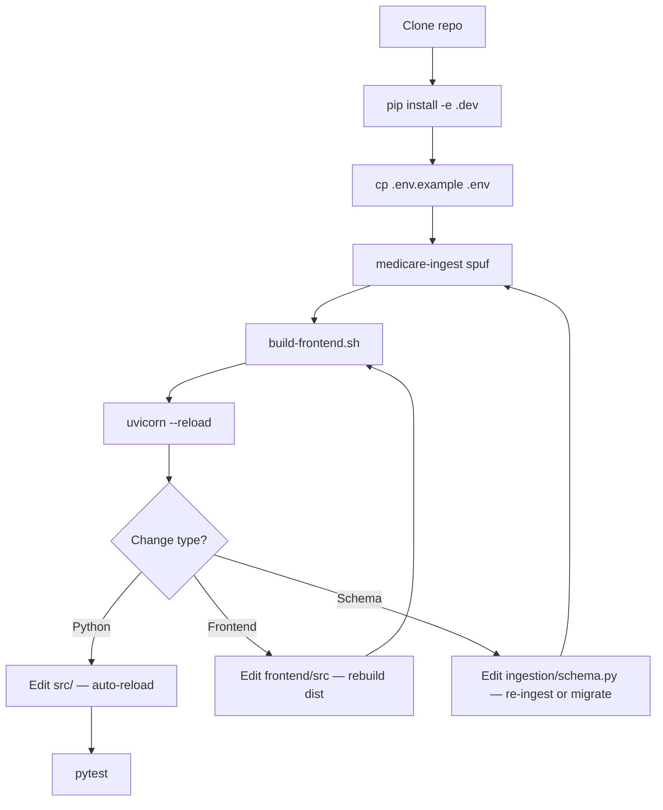

---

## 14. Testing

### 14.1 Run all tests

```bash
pytest tests/ -v
```

Default: **integration tests deselected** (`-m 'not integration'` in `pyproject.toml`).

```bash
# Include live RxNorm / external API tests:
pytest tests/ -v -m integration
```

Current suite: **91 tests** run by default, plus 2 `integration`-marked tests (deselected by default; call live RxNorm/CMS APIs) — 93 total. Run `pytest --collect-only -q` to confirm the current count.

### 14.2 Test categories

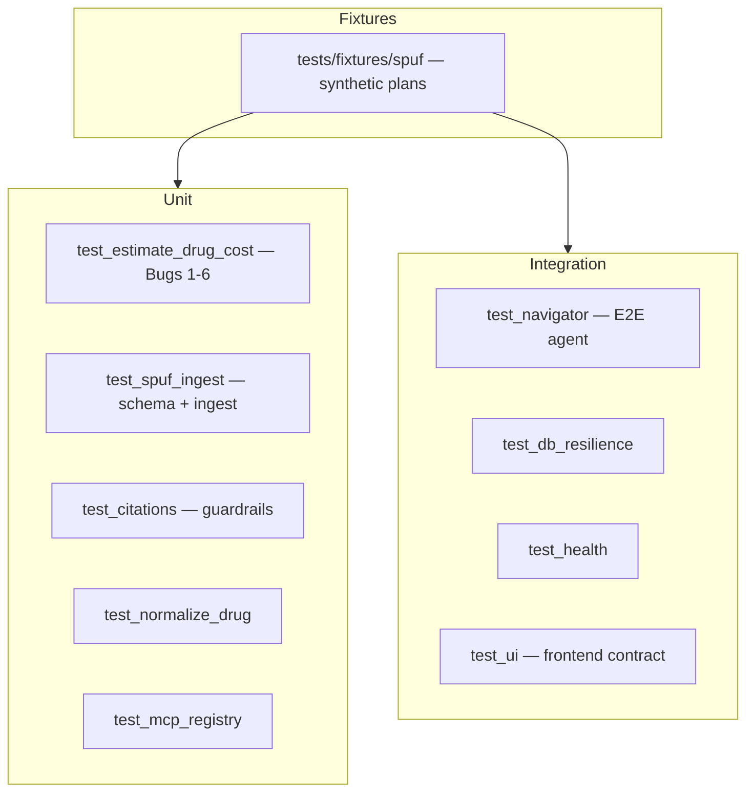

### 14.3 Key fixtures (`tests/conftest.py`)

| Fixture | Scope | Behavior |
|---|---|---|
| `ensure_frontend_dist` | session | Auto-runs `build-frontend.sh` if needed |
| `use_mock_llm` | autouse | Forces `LLM_MOCK` for all tests |
| `spuf_db` | function | Temp DuckDB with offline SPUF fixture |

### 14.4 Synthetic test plans

Fixture-only plans (not real CMS):

| Plan key | Purpose |
|---|---|
| `H8888-001` | MA-PD test plan |
| `S9999-001` | PDP test plan |

Prompt chips in `frontend/src/index.html` use the seeded demo plan `S9999-001` so they resolve out of the box against the fixture/demo database without requiring a full state ingest first. `S5921-383` (AARP Medicare Rx Preferred from UHC, FL 2026) is a real plan used as a worked example in [business-solution.md](./business-solution.md#33-verified-example); it requires a real CMS FL ingest to resolve.

### 14.5 UI contract tests

```bash
medicare-ui-test run --offline
```

Checks DOM IDs, guided-estimate flow, and smoke messages against a running or mocked API.

### 14.6 Linting

```bash
ruff check src tests
ruff format --check src tests
```

---

## 15. Evaluation suite

Offline acceptance tests driven by `src/medicare_navigator/eval/queries.jsonl`.

```bash
# Ensures fixture ingest + runs 12 cases with LLM_MOCK
LLM_MOCK=1 medicare-eval
```

Each case asserts on: `status`, `expected_tier`, `expected_cost`, `expected_phase`, `expected_tool_status`, substring in `explanation`.

Results written to `src/medicare_navigator/eval/results.json`.

---

## 16. Deployment

See [deployment.md](./deployment.md) for full detail. Summary:

### 16.1 Render (recommended)

1. Connect GitHub → **New Blueprint** → `render.yaml`
2. Set secrets: `ANTHROPIC_API_KEY`, `CORS_ORIGINS=https://<app>.onrender.com`
3. After deploy, Shell: `medicare-ingest spuf --download --states FL --merge-states`
4. Verify: `GET /api/health` → `data_fresh: true`, `llm_configured: true`

### 16.2 Nightly ingest

- Schedule: `config/deploy.yaml` → `ingest.cron: "0 3 * * *"` UTC
- Entrypoint: `scripts/run-daily-ingest.sh` → `medicare-ingest spuf --download --preserve-other`
- Runs inside container via supercronic (not Render Cron Jobs — disks cannot mount there)

### 16.3 Other platforms

| Platform | Artifact |
|---|---|
| Kubernetes | `deploy/k8s/cronjob-spuf-ingest.yaml` |
| AWS | `deploy/aws/eventbridge-ecs-ingest.md` |

### 16.4 Monitoring checklist

| Signal | Action |
|---|---|
| `data_fresh: false` | Run or debug ingest; check disk space |
| `llm_configured: false` | Set API key in dashboard |
| HTTP 502 on chat | LLM timeout/rate limit — check logs |
| Empty `/api/plans` | Ingest not run or still in progress |

---

## 17. CLI reference

### `medicare-ingest spuf`

```bash
medicare-ingest spuf --source tests/fixtures/spuf
medicare-ingest spuf --download
medicare-ingest spuf --download --states FL --merge-states
medicare-ingest spuf --download --preserve-other
medicare-ingest spuf --source path/to.zip --states FL
```

| Flag | Description |
|---|---|
| `--download` | Fetch latest zip from data.cms.gov |
| `--source PATH` | Local zip or extracted fixture directory |
| `--states FL` | Override `ingest_filters.yaml` states |
| `--merge-states` | Replace only listed states (keep others in DB) |
| `--preserve-other` | Keep non-SPUF tables (e.g. `query_log`) |
| `--force-download` | Ignore cached zip in `data/raw/` |
| `--monthly` | Use monthly PUF instead of quarterly SPUF |

### `medicare-ingest fetch`

Download CMS zip to `data/raw/` without loading DuckDB.

### `medicare-chat-invoke`

Manual CLI for sending chat messages (see `qa/cli.py`).

---

## 18. Troubleshooting

| Symptom | Likely cause | Fix |
|---|---|---|
| `503` on `/api/chat` | No LLM key and `LLM_MOCK` unset | Set `ANTHROPIC_API_KEY` or `LLM_MOCK=1` |
| Empty plan dropdown | No ingest yet | Run `medicare-ingest spuf ...` |
| `not_found` for real plan | State not ingested | Ingest that state; check `config/ingest_filters.yaml` |
| Frontend 404 at `/` | Missing `frontend/dist` | Run `scripts/build-frontend.sh` |
| Stale UI after edit | Browser cache | Hard refresh; dist rebuild; no-cache middleware active |
| Ingest `Killed` on Render | OOM on Starter plan | `--merge-states`, fewer states, or upgrade plan |
| Wrong copay amount | Days-supply or coverage_level mismatch | Verify `DAYS_SUPPLY_CODE_MAP` and COVERAGE_LEVEL 0/1/3 |
| `CatalogException` on startup | Corrupt or missing DB | Delete duckdb file and re-ingest; `ensure_schema()` on boot |
| RxNorm failures in tests | Network blocked | Use offline fixture; mock normalize in unit tests |

### Debug logging

```bash
# Verbose ingest
medicare-ingest spuf --source tests/fixtures/spuf 2>&1 | tee ingest.log

# Single test with output
pytest tests/test_estimate_drug_cost.py -v -s -k "bug_2"
```

---

## 19. Product boundaries

### In scope (v1)

- Medicare Part D / MA-PD with Part D benefit
- Ingested states (FL verified with real data)
- Non-insulin oral drugs on regular formulary
- Non-LIS beneficiaries
- Pre-deductible or initial-coverage (user supplies YTD OOP)
- 30 / 60 / 90-day fills
- Copay cost-sharing (with Bug 2 tier override)
- PA/ST as soft caveats (cost still computed)

### Out of scope (hard stops or deferred)

| Topic | Behavior |
|---|---|
| Insulin | Hard stop |
| Suppressed plans | Hard stop (Bug 6) |
| Quantity limit exceeded | Hard stop (Bug 5b) |
| Coinsurance dollar amount | Not computed — caveat only (Bug 4) |
| Catastrophic phase | Not computed |
| LIS / Medicaid | Not supported |
| Excluded-drug formulary | Not supported |
| Policy Q&A, alternatives, trends | Removed in Phase 6 |

---

## 20. Further reading

| Document | When to read |
|---|---|
| [navigator-implementation-spec.md](./navigator-implementation-spec.md) | Implementing or changing cost logic |
| [phase-6-implementation-plan.md](./phase-6-implementation-plan.md) | Understanding the Phase 6 pivot |
| [deployment.md](./deployment.md) | Ops, cron, Render disk |
| [data-sources.md](./data-sources.md) | CMS/RxNorm URLs (note stale Chroma sections) |
| [build-requirements.md](../build-requirements.md) | Long-term product vision |

---

*Last updated for Phase 6 (Navigator pivot). For doc issues, update this file alongside code changes.*
