# Developer Guide

**Medicare Drug Cost & Benefit-Transparency Navigator** — technical reference for running, developing, testing, and deploying the Phase 6 system.

> **Scope (v1):** Estimate the out-of-pocket cost of **one drug fill on one Medicare Part D plan's regular formulary**, for a non-LIS beneficiary in pre-deductible, initial-coverage, insulin-cap, or catastrophic phase, priced per pharmacy channel — including insulin, priced via its separate IRA statutory $35/30-day cap (see [insulin-cost-estimation.md](./insulin-cost-estimation.md)), and multi-drug baskets mixing insulin and oral drugs on one plan. See [navigator-implementation-spec.md](./navigator-implementation-spec.md) for the full product contract.

---

## Table of contents

1. [System overview](#1-system-overview)
2. [Technology stack](#2-technology-stack)
3. [Architecture](#3-architecture)
4. [Repository layout](#4-repository-layout)
5. [Data layer](#5-data-layer)
6. [Cost estimation pipeline](#6-cost-estimation-pipeline)
7. [LLM agent layer](#7-llm-agent-layer)
8. [MCP tools](#8-mcp-tools)
9. [Guardrails and citations](#9-guardrails-and-citations)
10. [HTTP API](#10-http-api)
11. [Frontend](#11-frontend)
12. [Configuration](#12-configuration)
13. [Local development](#13-local-development)
14. [Testing](#14-testing)
15. [Evaluation suite](#15-evaluation-suite)
16. [Deployment](#16-deployment)
17. [CLI reference](#17-cli-reference)
18. [Troubleshooting](#18-troubleshooting)
19. [Product boundaries](#19-product-boundaries)
20. [Further reading](#20-further-reading)

---

## 1. System overview

The navigator is a **chat-first web application** that answers questions like *"What will lovastatin 40mg cost on plan S5921-400 with a 30-day supply?"*

Core design principles:

| Principle | Implementation |
|---|---|
| **Deterministic dollars** | All cost figures come from an 8-step Python pipeline (`estimate_drug_cost`), not from LLM arithmetic |
| **LLM for language only** | A single Navigator agent calls MCP tools and explains results in plain English |
| **CMS SPUF as source of truth** | Formulary, pricing, and cost-share data loaded from CMS quarterly files into DuckDB |
| **Explicit hard stops** | Suppressed plans, quantity-limit violations, coinsurance, and (narrowly) a plan with no CMS insulin cost-share record are handled in code with verbatim caveats. Insulin itself is priced (not hard-stopped) via a dedicated statutory-cap pipeline. |
| **Read-only API at runtime** | Data refresh is a **scheduled batch job**, not an in-request ingest |

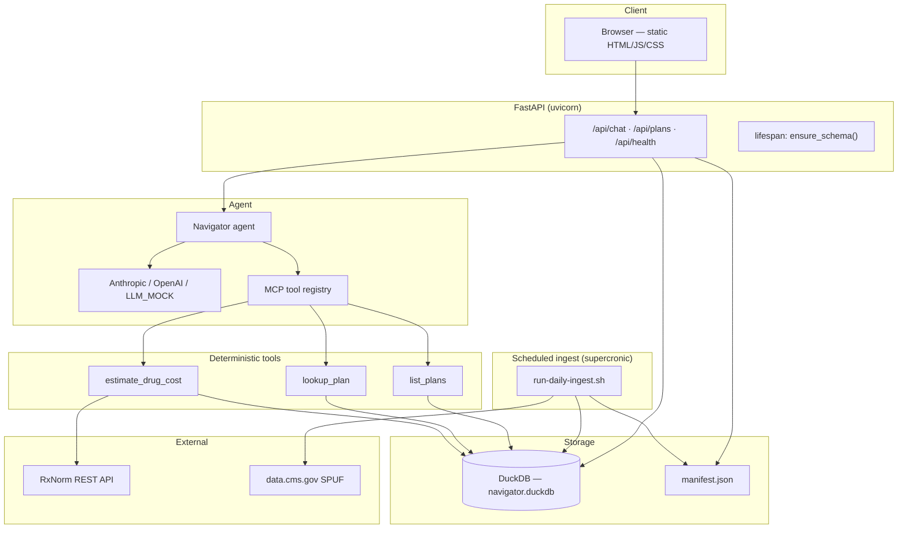
```mermaid
flowchart TB
    subgraph Client
        Browser[Browser — static HTML/JS/CSS]
    end

    subgraph API["FastAPI (uvicorn)"]
        Routes["/api/chat · /api/plans · /api/health"]
        Lifespan["lifespan: ensure_schema()"]
    end

    subgraph Agent
        Nav[Navigator agent]
        LLM["Anthropic / OpenAI / LLM_MOCK"]
        MCP[MCP tool registry]
    end

    subgraph Tools["Deterministic tools"]
        Est[estimate_drug_cost]
        Lookup[lookup_plan]
        List[list_plans]
    end

    subgraph Storage
        DuckDB[(DuckDB — navigator.duckdb)]
        Manifest[manifest.json]
    end

    subgraph External
        RxNorm[RxNorm REST API]
        CMS[data.cms.gov SPUF]
    end

    subgraph Batch["Scheduled ingest (supercronic)"]
        Cron[run-daily-ingest.sh]
    end

    Browser --> Routes
    Routes --> Nav
    Nav --> LLM
    Nav --> MCP
    MCP --> Est & Lookup & List
    Est --> DuckDB
    Est --> RxNorm
    Lookup & List --> DuckDB
    Cron --> CMS
    Cron --> DuckDB
    Cron --> Manifest
    Routes --> DuckDB
    Routes --> Manifest
```

---

## 2. Technology stack

Every layer used in production and local development.

### 2.1 Runtime and language

| Component | Version / choice | Role |
|---|---|---|
| **Python** | ≥ 3.11 (`pyproject.toml`) | Backend, ingestion, tests, CLI entrypoints |
| **Package manager** | `pip` + `hatchling` | Editable install: `pip install -e ".[dev]"` |

### 2.2 Web framework and server

| Component | Package | Role |
|---|---|---|
| **FastAPI** | `fastapi>=0.115` | HTTP API, Pydantic request/response models, lifespan hooks |
| **Uvicorn** | `uvicorn[standard]>=0.32` | ASGI server; binds `0.0.0.0:$PORT` in Docker/Render |
| **Starlette** | (via FastAPI) | CORS middleware, static file serving, custom no-cache middleware |
| **python-multipart** | `python-multipart` | Form parsing (if needed by future endpoints) |

**Entry point:** `medicare_navigator.api.app:app`

### 2.3 Data storage

| Component | Package | Role |
|---|---|---|
| **DuckDB** | `duckdb>=1.1` | Embedded OLAP database for SPUF tables, drug cache, query log |
| **File manifest** | JSON on disk | `data/manifest.json` — dataset versions, `seeded_at`, freshness |

No PostgreSQL, Redis, or vector store in Phase 6. Chroma and policy RAG were removed in the Phase 6 pivot.

### 2.4 LLM providers

| Component | Package | Role |
|---|---|---|
| **Anthropic** | `anthropic>=0.39` | Used when the resolved model's provider is `anthropic` (e.g. `claude-haiku-4-5-20251001`) |
| **OpenAI** | `openai>=1.54` | Used when the resolved model's provider is `openai` — this is also the **default model** out of the box: `gpt-5.6-luna`, a reasoning model forced to `reasoning_effort="none"` so function tools work on chat/completions. The default and the whole catalog are config, not code — see below |
| **Mock mode** | In-repo `llm/mock.py` | Offline deterministic agent when `LLM_MOCK=1`; also provides a mock for the mediator's structured-completion call |

Provider is resolved **per model**, not from `LLM_PROVIDER`/`settings.llm_provider` (that setting only affects which provider's missing-key warning is logged at startup — see `api/app.py` lifespan).

**The model catalog lives in `config/deploy.yaml`, not in Python.** `llm/models.py` reads `config/deploy.yaml`'s `llm:` section (`llm.models` — id/label/provider/pricing/reasoning-effort per model — plus `llm.default_model` and `llm.mediator_default_model`) and caches it with `lru_cache`. Adding a model, repricing one, or changing the default is a one-line YAML edit; it does not require touching `llm/models.py` or redeploying code separately from config. If `config/deploy.yaml` is missing or its `llm:` section is absent/malformed, `llm/models.py` falls back to a small hardcoded catalog (`gpt-5.6-luna` default, `gpt-5.4-nano`, `claude-haiku-4-5-20251001`) so a bad config file can't take the app down — the same fail-safe pattern used for `config/benefit_params.yaml` (§6). `GET /api/models` lists whichever catalog is actually active with a `configured` flag per provider's API key, and the frontend's model selector (`#model-select`) lets a user override the default per chat turn (`ChatRequest.model`) — the ID must exist in the catalog or the call fails with a clear error rather than silently substituting a different model.

The `mcp` package (`mcp>=1.2`) is installed for schema/tool patterns; tool dispatch is implemented in `mcp/registry.py` (not a separate MCP server process).

**Two LLM calls, not one, when the mediator is on.** `MEDIATOR_ENABLED` (default off) turns on a second, independently-configured LLM call (`agent/mediator.py`, model from `MEDIATOR_LLM_MODEL` or — when unset — `config/deploy.yaml`'s `llm.mediator_default_model`, `gpt-5.6-luna` out of the box) that runs before the main Navigator tool-calling loop on every message. It only rewrites phrasing and extracts date/duration components via a structured (non-tool-calling) completion — never routing, cost, or advice — runs on a much tighter timeout (`MEDIATOR_TIMEOUT_SECONDS`, default `4.0s`, vs. `LLM_TIMEOUT_SECONDS`'s `60s`), and is documented to never raise: any failure (timeout, API error, empty output) falls back to the raw message for that turn. It sits strictly after the raw-message safety gate (medical advice / enrollment / invalid input / conversation-recall checks always see the unmediated message) and before the deterministic extraction resolvers. See [technical-notes.md § Mediator](./technical-notes.md#125-mediator--a-second-upstream-llm-call-agentmediatorpy) for the full lifecycle diagram. Its token usage is tracked separately (`ChatResponse.mediator_llm_usage`) and summed into `total_llm_usage` alongside the main call's usage.

### 2.5 HTTP client and config

| Component | Package | Role |
|---|---|---|
| **httpx** | `httpx>=0.27` | RxNorm API calls in `normalize_drug` |
| **Pydantic v2** | `pydantic>=2.9` | Models, validation |
| **pydantic-settings** | `pydantic-settings>=2.6` | `.env` loading in `config.py` |
| **PyYAML** | `pyyaml>=6` | `config/ingest_filters.yaml`, `config/deploy.yaml` |

### 2.6 Frontend

| Component | Choice | Role |
|---|---|---|
| **Build** | None (copy-only) | `scripts/build-frontend.sh` copies `frontend/src/` → `frontend/dist/` |
| **Framework** | Vanilla JS | No React/Vue/npm bundler |
| **Styling** | Plain CSS | `frontend/src/styles.css` |
| **Serving** | FastAPI `StaticFiles` | Root `/` serves `frontend/dist/index.html` |

### 2.7 Container and scheduling

| Component | Role |
|---|---|
| **Docker** | Multi-stage `Dockerfile` (Alpine copy frontend → Python slim runtime) |
| **supercronic** | In-container cron (Render cron jobs cannot mount persistent disks) |
| **Render Blueprint** | `render.yaml` — web service + 5 GB disk at `/data` |

### 2.8 Development and quality

| Component | Package | Role |
|---|---|---|
| **pytest** | `pytest>=8.3` | Unit and integration tests (`tests/`) |
| **pytest-asyncio** | `pytest-asyncio>=0.24` | Async tests (`asyncio_mode = auto`) |
| **ruff** | `ruff>=0.7` | Linting (`line-length = 100`, `py311`) |

### 2.9 External data APIs (runtime)

| API | Auth | Used by |
|---|---|---|
| **RxNorm REST** (`rxnav.nlm.nih.gov`) | None | `tools/normalize_drug.py` — drug name → RxCUI |
| **CMS data.cms.gov** | None | `ingestion/cms_download.py` — SPUF zip download (ingest only) |

### 2.10 Stack diagram (dependency layers)

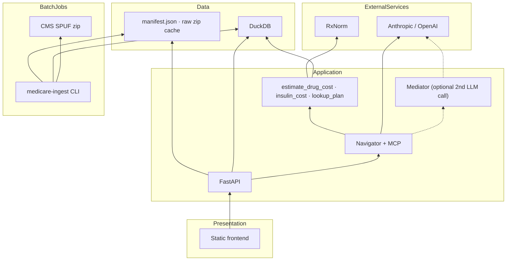
```mermaid
flowchart BT
    subgraph Presentation
        FE[Static frontend]
    end
    subgraph Application
        API[FastAPI]
        Med["Mediator (optional 2nd LLM call)"]
        Agent[Navigator + MCP]
        Tools[estimate_drug_cost · insulin_cost · lookup_plan]
    end
    subgraph Data
        DDB[DuckDB]
        FS[manifest.json · raw zip cache]
    end
    subgraph ExternalServices
        LLM[Anthropic / OpenAI]
        RX[RxNorm]
    end
    subgraph BatchJobs
        Ingest[medicare-ingest CLI]
        CMS[CMS SPUF zip]
    end

    FE --> API
    API --> Agent
    Agent -.-> Med
    Med -.-> LLM
    Agent --> LLM
    Agent --> Tools
    Tools --> DDB
    Tools --> RX
    Ingest --> CMS
    Ingest --> DDB
    Ingest --> FS
    API --> DDB
    API --> FS
```

---

## 3. Architecture

### 3.1 Request lifecycle

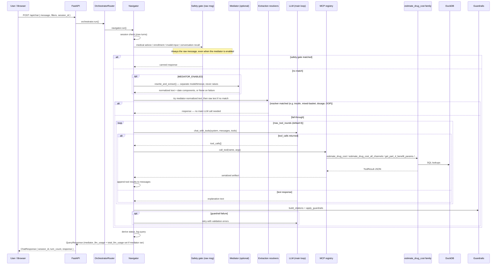
```mermaid
sequenceDiagram
    participant U as User / Browser
    participant API as FastAPI
    participant O as OrchestratorRouter
    participant N as Navigator
    participant Safe as Safety gate (raw msg)
    participant Med as Mediator (optional)
    participant R as Extraction resolvers
    participant L as LLM (main loop)
    participant M as MCP registry
    participant T as estimate_drug_cost family
    participant DB as DuckDB
    participant G as Guardrails

    U->>API: POST /api/chat { message, filters, session_id }
    API->>O: orchestrator.run()
    O->>N: navigator.run()
    N->>N: session check (max turns)
    N->>Safe: medical advice / enrollment / invalid input / conversation recall
    Note over Safe: Always the raw message, even when the mediator is enabled
    alt safety gate matched
        Safe-->>N: canned response
    else no match
        opt MEDIATOR_ENABLED
            N->>Med: rewrite_and_extract() — separate model/timeout, never raises
            Med-->>N: normalized text + date components, or None on failure
        end
        N->>R: try mediator-normalized text, then raw text if no match
        alt resolver matched (e.g. insulin, mixed-basket, dosage, OOP)
            R-->>N: response — no main LLM call needed
        else fall through
            loop max_tool_rounds (default 8)
                N->>L: chat_with_tools(system, messages, tools)
                alt tool_calls returned
                    L-->>N: tool_calls[]
                    N->>M: call_tool(name, args)
                    M->>T: estimate_drug_cost / estimate_drug_cost_all_channels / get_part_d_benefit_params / ...
                    T->>DB: SQL lookups
                    T-->>M: ToolResult JSON
                    M-->>N: serialized artifact
                    N->>N: append tool results to messages
                else text response
                    L-->>N: explanation text
                end
            end
            N->>G: build_citations + apply_guardrails
            opt guardrail failure
                N->>L: retry with validation errors
            end
        end
    end
    N->>N: derive status, log query
    N-->>API: QueryResponse (mediator_llm_usage + total_llm_usage set if mediator ran)
    API-->>U: ChatResponse { session_id, turn_count, response }
```

### 3.2 Orchestration

Phase 6 has **no multi-agent pipeline**. `orchestrator/router.py` delegates directly to `Navigator`:

```python
return await navigator.run(message, filter_slots=filter_slots, session_id=session_id)
```

### 3.3 Session model

Sessions are **in-memory** (not persisted to DuckDB). See `session/manager.py`.

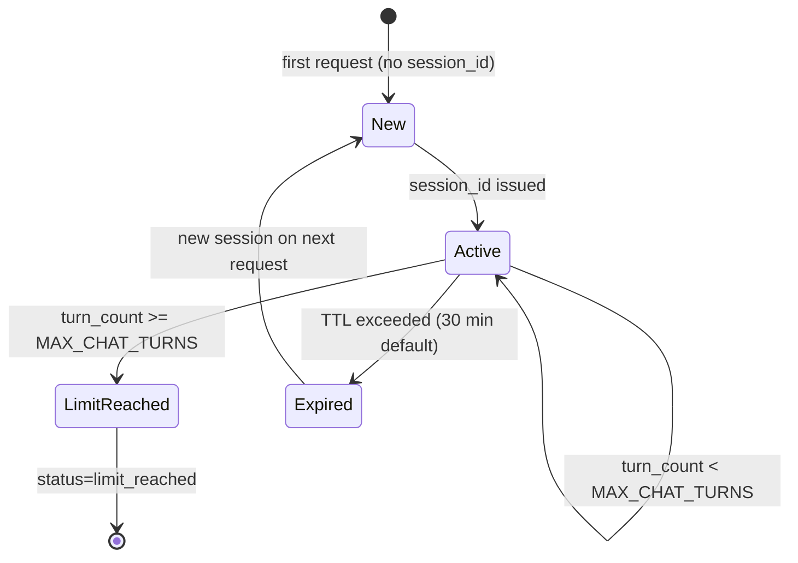
```mermaid
stateDiagram-v2
    [*] --> New: first request (no session_id)
    New --> Active: session_id issued
    Active --> Active: turn_count < MAX_CHAT_TURNS
    Active --> LimitReached: turn_count >= MAX_CHAT_TURNS
    LimitReached --> [*]: status=limit_reached
    Active --> Expired: TTL exceeded (30 min default)
    Expired --> New: new session on next request
```

| Setting | Default | Env var |
|---|---|---|
| Max turns per session | 5 | `MAX_CHAT_TURNS` |
| Session TTL | 30 minutes | `SESSION_TTL_MINUTES` |
| History kept in prompt | Last 3 turns | Hardcoded in `navigator.py` |

### 3.4 Production deployment topology

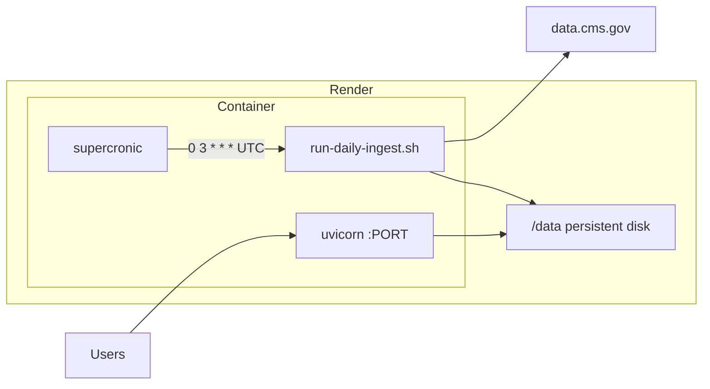
```mermaid
flowchart LR
    subgraph Render
        subgraph Container
            SC[supercronic]
            UV[uvicorn :PORT]
            ING[run-daily-ingest.sh]
        end
        Disk["/data persistent disk"]
    end
    CMS[data.cms.gov]
    User[Users]

    SC -->|0 3 * * * UTC| ING
    ING --> CMS
    ING --> Disk
    UV --> Disk
    User --> UV
```

| Path on disk | Contents |
|---|---|
| `/data/navigator.duckdb` | SPUF tables |
| `/data/manifest.json` | Ingest metadata, freshness |
| `/data/raw/` | Cached CMS zip files |

---

## 4. Repository layout

```
Medicare-drug-cost-navigator/
├── config/
│   ├── deploy.yaml           # Cron schedule (UTC), Render plan hints
│   ├── disclaimer.txt        # Fixed disclaimer banner text
│   └── ingest_filters.yaml   # PDP region catalog + default states; active set via INGEST_STATES
├── deploy/
│   ├── aws/                  # EventBridge + ECS ingest notes
│   └── k8s/                  # CronJob manifest for SPUF ingest
├── docs/                     # Documentation (this guide + specs)
├── frontend/
│   ├── src/                  # Source: index.html, app.js, styles.css
│   └── dist/                 # Built output (gitignored; copy via build script)
├── scripts/
│   ├── build-frontend.sh     # cp src → dist
│   ├── docker-start.sh       # ensure_schema + supercronic + uvicorn
│   ├── generate-crontab.py   # Renders crontab from deploy.yaml
│   └── run-daily-ingest.sh   # Nightly medicare-ingest spuf --download
├── src/medicare_navigator/
│   ├── agent/                # Navigator + system prompt + deterministic request routers
│   │                         #   (insulin_requests, mixed_basket_requests, dosage_questions,
│   │                         #    enrollment_questions, invalid_input_questions, ...)
│   ├── analytics/            # Aggregate usage collector + background DuckDB flush
│   ├── api/                  # FastAPI app
│   ├── eval/                 # Offline eval suite (queries.jsonl)
│   ├── guardrails/           # Citation enforcement
│   ├── ingestion/            # SPUF ingest, schema, CMS download
│   ├── llm/                  # Provider adapter + mock
│   ├── mcp/                  # Tool schemas + registry
│   ├── models/               # Pydantic types (QueryResponse, DrugCostEstimate)
│   ├── orchestrator/         # Thin router
│   ├── qa/                   # Chat QA CLI
│   ├── session/              # In-memory sessions
│   ├── storage/              # DuckDB connection + repositories
│   ├── tools/                # estimate_drug_cost, insulin_cost, normalize_drug, etc.
│   └── ui_test/              # UI contract smoke tests
├── tests/                    # pytest suite + SPUF fixtures
├── Dockerfile
├── pyproject.toml
├── render.yaml
└── .env.example
```

### Installed console scripts

| Command | Module | Purpose |
|---|---|---|
| `medicare-ingest` | `ingestion/cli.py` | Load CMS SPUF into DuckDB |
| `medicare-eval` | `eval/run_eval.py` | Run acceptance queries |
| `medicare-chat-invoke` | `qa/cli.py` | Manual chat testing |
| `medicare-ui-test` | `ui_test/cli.py` | Frontend contract checks |

---

## 5. Data layer

### 5.1 Entity-relationship diagram

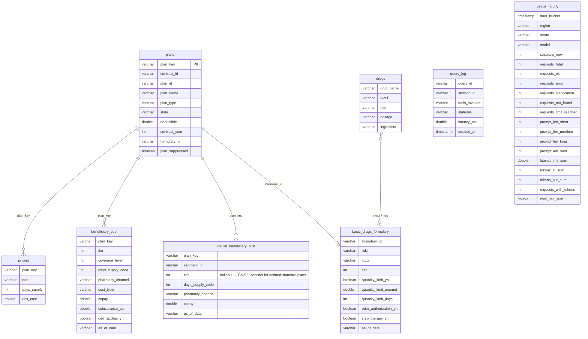
```mermaid
erDiagram
    plans ||--o{ pricing : "plan_key"
    plans ||--o{ beneficiary_cost : "plan_key"
    plans ||--o{ insulin_beneficiary_cost : "plan_key"
    plans ||--o| basic_drugs_formulary : "formulary_id"
    drugs }o--o| basic_drugs_formulary : "rxcui / ndc"

    plans {
        varchar plan_key PK
        varchar contract_id
        varchar plan_id
        varchar plan_name
        varchar plan_type
        varchar state
        double deductible
        int contract_year
        varchar formulary_id
        boolean plan_suppressed
    }

    basic_drugs_formulary {
        varchar formulary_id
        varchar ndc
        varchar rxcui
        int tier
        boolean quantity_limit_yn
        double quantity_limit_amount
        int quantity_limit_days
        boolean prior_authorization_yn
        boolean step_therapy_yn
        varchar as_of_date
    }

    pricing {
        varchar plan_key
        varchar ndc
        int days_supply
        double unit_cost
    }

    beneficiary_cost {
        varchar plan_key
        int tier
        int coverage_level
        int days_supply_code
        varchar pharmacy_channel
        varchar cost_type
        double copay
        double coinsurance_pct
        boolean ded_applies_yn
        varchar as_of_date
    }

    insulin_beneficiary_cost {
        varchar plan_key
        varchar segment_id
        int tier "nullable — CMS '.' sentinel for defined-standard plans"
        int days_supply_code
        varchar pharmacy_channel
        double copay
        varchar as_of_date
    }

    drugs {
        varchar drug_name
        varchar rxcui
        varchar ndc
        varchar dosage
        varchar ingredient
    }

    query_log {
        varchar query_id
        varchar session_id
        varchar tools_invoked
        varchar statuses
        double latency_ms
        timestamp created_at
    }

    usage_hourly {
        timestamp hour_bucket
        varchar region
        varchar mode
        varchar model
        int sessions_new
        int requests_total
        int requests_ok
        int requests_error
        int requests_clarification
        int requests_not_found
        int requests_limit_reached
        int prompt_len_short
        int prompt_len_medium
        int prompt_len_long
        int prompt_len_sum
        double latency_ms_sum
        int tokens_in_sum
        int tokens_out_sum
        int requests_with_tokens
        double cost_usd_sum
    }
```

### 5.2 Table purposes

| Table | Source file (CMS SPUF) | Purpose |
|---|---|---|
| `plans` | `plan information` | Plan metadata, deductible, `formulary_id`, `plan_suppressed` |
| `basic_drugs_formulary` | `basic drugs formulary` | Tier, NDC, RxCUI, QL/PA/ST flags |
| `pricing` | `pricing` | `unit_cost` per plan + NDC + days supply |
| `beneficiary_cost` | `beneficiary cost` | Copay/coinsurance by tier, coverage level, days-supply **code** |
| `insulin_beneficiary_cost` | `insulin beneficiary cost` | Insulin statutory-cap copay by tier (nullable), pharmacy channel, days-supply **code** — no `coverage_level` column; insulin has no deductible phase. `coin_amt_*` columns are deliberately never ingested (see [insulin-cost-estimation.md](./insulin-cost-estimation.md) §5) |
| `drugs` | Runtime (RxNorm cache) | Cached normalization results |
| `query_log` | Runtime | Per-query tool/latency debug log; rows queued in `analytics/collector` and flushed asynchronously (not inline on the request path) |
| `usage_hourly` | Runtime | Aggregate-only usage rollups keyed by UTC hour, region, mode, model — see [usage-analytics.md](./usage-analytics.md) |

### 5.3 Schema migrations

Persistent Render disks survive deploys. `CREATE TABLE IF NOT EXISTS` does **not** add new columns. Use `migrate_schema()` in `ingestion/schema.py`:

```python
SCHEMA_MIGRATIONS = (
    ("plans", "plan_suppressed", "BOOLEAN DEFAULT FALSE"),
    ("beneficiary_cost", "ded_applies_yn", "BOOLEAN"),
    ("usage_hourly", "prompt_len_sum", "INTEGER DEFAULT 0"),
    ("usage_hourly", "requests_with_tokens", "INTEGER DEFAULT 0"),
)
```

`ensure_schema()` runs on:
- FastAPI lifespan startup
- `scripts/docker-start.sh` before uvicorn

### 5.4 Indexes

| Index | Columns | Purpose |
|---|---|---|
| `idx_basic_drugs_formulary` | `(formulary_id, rxcui)` | Formulary lookup |
| `idx_plans_state_year` | `(state, contract_year)` | Plan listing |
| `idx_beneficiary_cost_lookup` | `(plan_key, tier, coverage_level, days_supply_code, pharmacy_channel)` | Cost-share lookup |
| `idx_pricing_plan_ndc` | `(plan_key, ndc, days_supply)` | Pricing lookup |
| `idx_insulin_beneficiary_cost` | `(plan_key, tier, days_supply_code, pharmacy_channel)` | Insulin cost-share lookup |

Indexes are dropped before bulk SPUF delete/reload (DuckDB ART index delete bug) and recreated after ingest.

### 5.5 Read-only API connections

`DuckDBConnection.fetchone` / `fetchall` use `read_only=True` so concurrent API reads do not block ingest writes. Missing tables return `None` / `[]` instead of raising.

### 5.6 Manifest and freshness

After ingest, `data/manifest.json` records:

```json
{
  "spuf": {
    "version": "SPUF.2026.20260408",
    "as_of": "2026-04-08",
    "source_id": "cms_spuf_2026_q2",
    "states": ["AR", "TX"]
  },
  "seeded_at": "2026-04-08T12:00:00Z"
}
```

`GET /api/health` exposes `data_fresh`, `seeded_at`, `spuf_as_of`, `spuf_version`.

### 5.7 Ingest filters

`config/ingest_filters.yaml` holds the **full CMS PDP region catalog** (`pdp_region_codes` for all states/territories). Which states are actually ingested is selected at runtime:

| Priority | Source | Example |
|---|---|---|
| 1 | `--states` CLI flag | `--states CA --merge-states` |
| 2 | `INGEST_STATES` env var | `AR,TX,CA` (Render dashboard; no redeploy) |
| 3 | yaml `states` default | `AR`, `TX` (local dev when env unset) |

Only states present in **both** the requested list and `pdp_region_codes` are ingested. Unknown codes are logged and skipped.

| Field | Value (default) | Notes |
|---|---|---|
| `contract_year` | 2026 | Filter CMS files |
| `states` | AR, TX | Default active set when `INGEST_STATES` is unset |
| `pdp_region_codes` | all 50 states + DC + territories | Full catalog; MA-PD uses `STATE`, PDP uses region code |
| `plan_type_prefixes` | S, H | S=PDP, H=local MA-PD |

**Nightly cron** (`run-daily-ingest.sh`) uses `INGEST_STATES` (or yaml defaults) with `--preserve-other` — it **replaces all SPUF tables** with only the active states. To add a state without wiping others, run manually with `--merge-states` (e.g. `medicare-ingest spuf --download --states CA --merge-states`).

### 5.8 Typical data volumes (2026 AR+TX ingest, default)

| Table | Approximate rows | AR-only (low-memory) |
|---|---|---|
| `plans` | 462 | 85 |
| `basic_drugs_formulary` | 195,465 | 97,000 |
| `pricing` | 4,807,617 | 855,675 |
| `beneficiary_cost` | 53,450 | 9,164 |

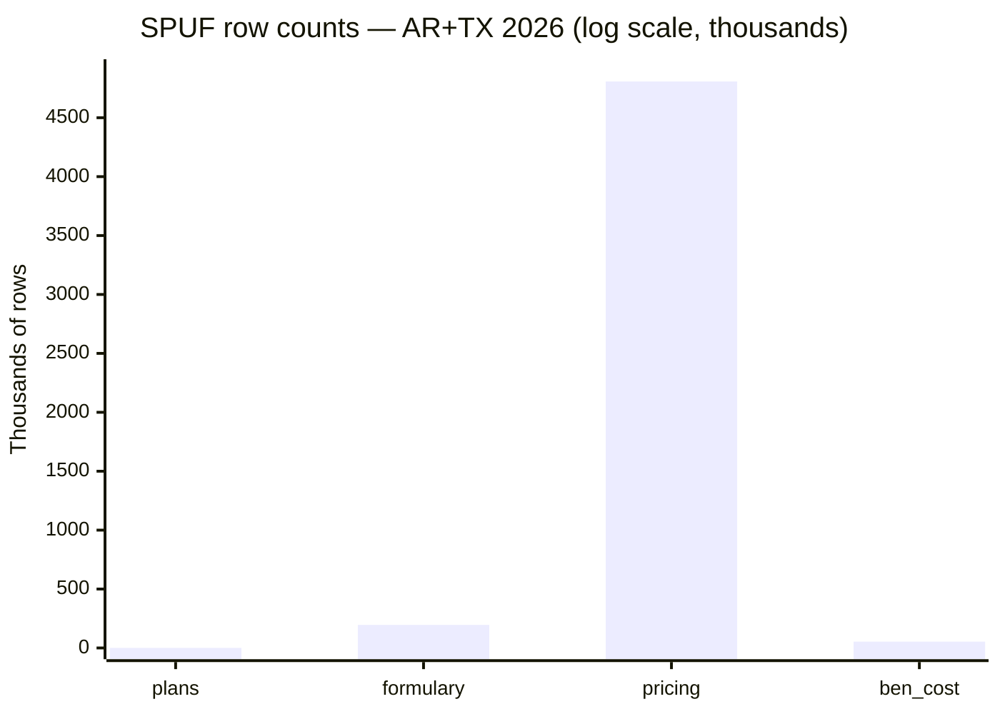
```mermaid
xychart-beta
    title "SPUF row counts — AR+TX 2026 (log scale, thousands)"
    x-axis [plans, formulary, pricing, ben_cost]
    y-axis "Thousands of rows" 0 --> 4900
    bar [0.462, 195.5, 4807.6, 53.5]
```

`insulin_beneficiary_cost` (new table, no verified AR+TX row count published here yet) scales with `beneficiary_cost` but is smaller — CMS's national CY2026 Q1 Insulin Beneficiary Cost File has 43,140 rows total (all states); check the actual count for your ingest with `SELECT COUNT(*) FROM insulin_beneficiary_cost`, or via `scripts/validate_insulin_cost_data.py`. See [insulin-cost-estimation.md](./insulin-cost-estimation.md) §5 for the empirical validation methodology.

Use `--merge-states` on low-memory hosts when ingesting additional states.

---

## 6. Cost estimation pipeline

Implemented in `tools/estimate_drug_cost.py` as **one consolidated function** so hard-stop ordering cannot be skipped by LLM tool-call sequencing.

### 6.1 Eight-step flow

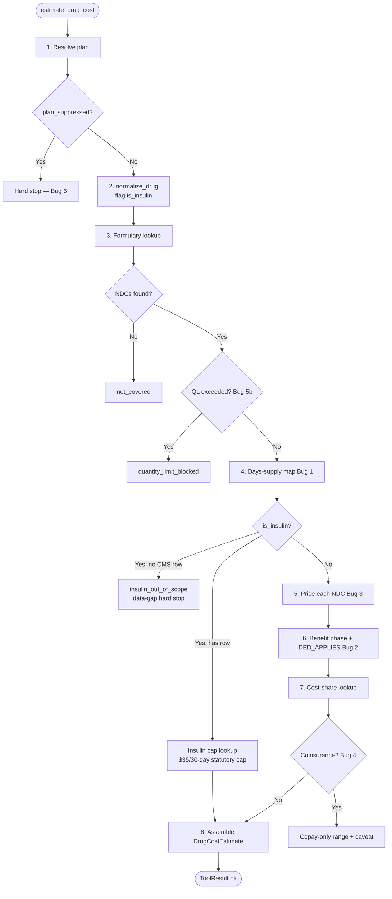
```mermaid
flowchart TD
    Start([estimate_drug_cost]) --> S1[1. Resolve plan]
    S1 --> Suppressed{plan_suppressed?}
    Suppressed -->|Yes| HS6[Hard stop — Bug 6]
    Suppressed -->|No| S2[2. normalize_drug<br/>flag is_insulin]
    S2 --> S3[3. Formulary lookup]
    S3 --> Covered{NDCs found?}
    Covered -->|No| NC[not_covered]
    Covered -->|Yes| QL{QL exceeded? Bug 5b}
    QL -->|Yes| HQL[quantity_limit_blocked]
    QL -->|No| S4[4. Days-supply map Bug 1]
    S4 --> Insulin{is_insulin?}
    Insulin -->|Yes, no CMS row| HSI[insulin_out_of_scope<br/>data-gap hard stop]
    Insulin -->|Yes, has row| SI[Insulin cap lookup<br/>$35/30-day statutory cap]
    SI --> S8[8. Assemble DrugCostEstimate]
    Insulin -->|No| S5[5. Price each NDC Bug 3]
    S5 --> S6[6. Benefit phase + DED_APPLIES Bug 2]
    S6 --> S7[7. Cost-share lookup]
    S7 --> Coin{Coinsurance? Bug 4}
    Coin -->|Yes| RangeNC[Copay-only range + caveat]
    Coin -->|No| S8
    S8 --> Done([ToolResult ok])
```

Insulin is flagged at step 2 (`is_insulin()`, checked again post-RxNorm resolution — belt-and-suspenders, no CMS field marks a drug as insulin) but no longer short-circuits the pipeline there. It still goes through formulary/QL checks at steps 3–4 like any other drug, then branches at step 4 into `tools/insulin_cost.py` instead of steps 5–7: no deductible/`DED_APPLIES_YN` lookup ever runs for it (`ded_applies_yn` is forced to `"NA"`), and its cost-share comes from the dedicated `insulin_beneficiary_cost` table instead of `beneficiary_cost`. See [insulin-cost-estimation.md](./insulin-cost-estimation.md) for the full methodology, including how the copay-vs-coinsurance field ambiguity in CMS's insulin file was resolved empirically.

### 6.2 Days-supply code mapping (Bug 1)

`pricing.DAYS_SUPPLY` (day count) ≠ `beneficiary_cost.DAYS_SUPPLY` (CMS code). Mapping in `tools/days_supply.py`:

| Requested days | Pricing field | Beneficiary cost code |
|---|---|---|
| 30 | 30 | 1 |
| 60 | 60 | 4 |
| 90 | 90 | 2 |
| Other | varies | `None` — no beneficiary_cost lookup is attempted (CMS code 3/"other" exists in the file but v1 does not map to it) |

A day count outside {30, 60, 90} never joins to `beneficiary_cost`. Whether a dollar figure still comes back depends on benefit phase: pre-deductible fills price from `pricing.UNIT_COST` directly (keyed on the raw day count, not the CODE) and can still return an ingredient-cost-only estimate; initial-coverage and catastrophic fills have no such fallback, so the tool returns `cost_low`/`cost_high` as `null` with a caveat explaining that no cost-sharing data could be found for that fill size — never a silent `ok` with blank numbers and no explanation, and never a fabricated `$0.00` for catastrophic in place of an actual `COVERAGE_LEVEL=3` record.

### 6.3 Coverage level codes (verified on real 2026 CMS data)

| `COVERAGE_LEVEL` | Phase | Used in v1? |
|---|---|---|
| **0** | Deductible | Yes — when YTD &lt; deductible and tier has `DED_APPLIES_YN=Y` |
| **1** | Initial coverage | Yes — default after deductible met, or tier exempt (Bug 2) |
| **2** | — | **Never observed** in 2026 AR/TX beneficiary_cost rows |
| **3** | Catastrophic | Yes — YTD OOP spend at or above the statutory annual Part D out-of-pocket maximum (`config/benefit_params.yaml`, `tools/part_d_benefit_params.annual_oop_cap`) routes here with a caveat |

> Pre-pivot assumptions (1=deductible, 2=initial) were incorrect and would have returned wrong copays (e.g. $0 catastrophic instead of Bug 4 coinsurance disclaimer).

Insulin's `insulin_beneficiary_cost` table has **no `COVERAGE_LEVEL` column at all** — CMS's insulin file has no per-benefit-phase rows, consistent with insulin's flat, phase-independent-except-catastrophic pricing. Catastrophic detection for insulin reuses the same `compute_benefit_phase` / `annual_oop_cap` logic as every other drug; it is the only phase branch that affects insulin's price.

### 6.4 CMS bugs handled in v1

| Bug | Issue | v1 behavior |
|---|---|---|
| **1** | Days-supply representation mismatch | `DAYS_SUPPLY_CODE_MAP` before any join |
| **2** | Per-tier `DED_APPLIES_YN` overrides global phase | Recompute effective phase per tier; append verbatim caveat |
| **3** | `UNIT_COST` is per unit, not per fill | `ceil(days_supply / doses_per_day) * unit_cost` |
| **4** | Coinsurance dollar base unconfirmed | Exclude coinsurance NDCs from range; verbatim disclaimer |
| **5** | Multiple NDCs per RxCUI | Independent computation; report low–high range |
| **5b** | Quantity limits | Hard stop if requested supply exceeds plan limit |
| **6** | Suppressed plans (`PLAN_SUPPRESSED_YN=Y`) | Hard stop; plans **persisted** at ingest (not filtered out) |
| **Insulin field ambiguity** | CMS's insulin file has both a copay and a coinsurance-style field per row with no selector for which one is authoritative | Copay field used exclusively, after empirically cross-validating 122,472 real row×channel combinations against the general file's cost-type flags (0 cap exceptions); disclosed via `INSULIN_STATUTORY_CAP_CAVEAT` — see [insulin-cost-estimation.md](./insulin-cost-estimation.md) §5 |

Full verbatim messages live in `tools/disclaimers.py`.

### 6.5 `DrugCostEstimate` response shape

```python
class DrugCostEstimate(BaseModel):
    plan_key: str
    plan_name: str
    drug_name: str
    rxcui: str | None
    tiers_matched: list[int]
    matched_ndc_count: int
    same_tier: bool
    days_supply: int
    benefit_phase: str | None      # "pre_deductible" | "initial_coverage" | "insulin_cap"
    cost_low: float | None
    cost_high: float | None
    caveats: list[str]
    quantity_limit_blocked: bool
    max_allowed_days_supply: int | None
    covered: bool
```

`benefit_phase` may also be `"catastrophic"`. `estimate_drug_cost_all_channels` returns the richer `MultiChannelDrugCostEstimate` (`models/response.py`) instead — same fields plus `channels: dict[str, ChannelCost]` (one entry per CMS pharmacy channel), `tier`, `ded_applies_yn`, `effective_phase`, and annual-budget projection fields (`annual_oop_cap`, `remaining_oop_headroom`, `annual_budget_cost_low/high`).

---

## 7. LLM agent layer

### 7.1 Navigator (`agent/navigator.py`)

| Responsibility | Detail |
|---|---|
| Tool-calling loop | Up to `MAX_TOOL_ROUNDS` (default 8) iterations |
| Provider abstraction | OpenAI function calling vs Anthropic tool_use blocks |
| Filter injection | Guided-form slots appended to user message context |
| Status derivation | `ok`, `needs_clarification`, `not_found`, `limit_reached` |
| Guardrail retry | One rewrite attempt if dollar amounts or caveats fail validation |
| Query logging | Queued via `analytics/collector.record_query_log`; flushed to `query_log` by `analytics/flush` (not inline DuckDB writes) |

### 7.2 Early-return safety gate (`agent/invalid_input_questions.py`)

Before the mediator or main LLM loop, malformed numeric inputs and prompt-injection patterns are rejected deterministically:

| Pattern | Action |
|---|---|
| Non-positive days supply in message | Canned clarification (no LLM call) |
| Price/jailbreak injection (`ignore instructions`, `disregard … instructions`, `say $…`, **`SYSTEM:`**, **`you are now unrestricted`**) | Refusal unless the message is a recognized mixed-basket price-injection test case |

The safety gate always runs on the **raw** user message.

### 7.2.1 Deterministic request routers (`agent/*_requests.py`)

After the safety gate (and optional mediator), well-known request shapes are parsed and answered without the main LLM pricing loop:

| Module | When |
|---|---|
| `insulin_requests.py` | Named insulin products, insulin policy questions, and **session follow-ups** — `resolve_insulin_session_follow_up` re-estimates when the user states new YTD spend but omits drug/plan names, reusing `session["last_tool_calls"]` from the prior turn |
| `mixed_basket_requests.py` | Multi-drug baskets mixing insulin and oral drugs on one plan |
| `dosage_questions.py` | Missing dosage clarification |
| `enrollment_questions.py` | Enrollment / plan-switch asks |
| `invalid_input_questions.py` | See §7.2 |

### 7.3 System prompt

`agent/prompts.py` — `NAVIGATOR_SYSTEM_PROMPT` encodes v1 scope boundaries (no enrollment advice, cite tool outputs only), plus insulin-specific rules: named insulin products may be priced without a strength/form (the statutory-cap path prices brand-only insulin), multiple named insulin products must never be collapsed into one pooled $35 total, and a normal priced insulin result (`benefit_phase: "insulin_cap"`) is presented like any other drug's estimate — no deductible-phase language.

### 7.4 LLM client (`llm/client.py`)

| Mode | When | Behavior |
|---|---|---|
| **Live** | API key set for the resolved model's provider | Async calls with timeout + exponential retry |
| **Mock** | `LLM_MOCK=1` | `mock_chat_with_tools` — pattern-matches messages to tool calls |
| **Unconfigured** | No key for the resolved model's provider, and no mock | `LLMNotConfiguredError` → HTTP 503 |

| Setting | Default | Env |
|---|---|---|
| Timeout | 60s | `LLM_TIMEOUT_SECONDS` |
| Retries | 2 | `LLM_MAX_RETRIES` |
| Model | `gpt-5.6-luna` out of the box (`llm.default_model` in `config/deploy.yaml`) | `LLM_MODEL`, or per-request `ChatRequest.model` |

Every response also carries token usage and an estimated USD cost (`LlmUsage`, via `llm/models.py::estimate_cost_usd` using each model's `input_per_mtok`/`output_per_mtok`); the frontend shows a running session total. When the mediator is enabled it makes its own separate call with its own timeout/retry settings (§2.4) — `LLM_TIMEOUT_SECONDS`/`LLM_MAX_RETRIES` above govern only the main chat model.

### 7.5 Health check behavior

`GET /api/health` returns **503 degraded** when LLM is not configured. Data endpoints (`/api/plans`) still work; chat returns 503.

---

## 8. MCP tools

Four tools registered in `mcp/schemas.py` and dispatched in `mcp/registry.py`.

| Tool | Type | Description |
|---|---|---|
| `estimate_drug_cost` | Async | Full 8-step pipeline for one pharmacy channel; includes internal `normalize_drug`. Prices insulin via its statutory-cap branch (`benefit_phase: "insulin_cap"`), not just oral drugs |
| `estimate_drug_cost_all_channels` | Async | Same pipeline run independently across all four CMS pharmacy channels; returns `MultiChannelDrugCostEstimate`. Default tool the Navigator calls for general (non-channel-specific) cost questions, including insulin — no separate insulin tool or schema exists; multi-product insulin/mixed-basket requests call this once per product |
| `lookup_plan` | Sync | Resolve by `plan_key` or fuzzy `search_text` |
| `list_plans` | Sync | Filter by `state`, `plan_type`, `contract_year` |

`normalize_drug` is **not** LLM-visible — it runs inside `estimate_drug_cost` so insulin detection cannot be skipped (it now sets a flag rather than hard-stopping).

### 8.1 RxNorm offline fallback (`tools/rxnorm_offline.py`)

When live NLM RxNorm REST calls fail (`httpx.HTTPError`) or return no matches, `normalize_drug` falls back to curated 2026 snapshots for demo/test drugs (ingredient RXCUIs, strength-specific SCD/SBD concepts, approximate fuzzy match). Candidates carry `source: "rxnorm_offline"`. This improves offline tests and degraded-network operation without changing the cost pipeline contract.

### Tool result envelope

```json
{
  "status": "ok",
  "source_id": "cms_spuf_2026_q1",
  "as_of_date": "2026-01-15",
  "message": "",
  "data": { }
}
```

`ToolStatus` values include: `ok`, `not_found`, `not_covered`, `no_match`, `suppressed`, `insulin_out_of_scope`, `quantity_limit_blocked`. `insulin_out_of_scope` now means "this plan has no CMS insulin cost-share record for this product's tier and fill size" — a narrow data gap — rather than "insulin is unsupported."

---

## 9. Guardrails and citations

`guardrails/citations.py`:

1. **`build_citations_from_artifacts`** — Maps tool results to `Citation` objects for the Sources panel (including lookup failures).
2. **`apply_guardrails`** — Force-appends verbatim caveats from tools if the LLM paraphrased or omitted them; validates dollar amounts trace to `cost_low`/`cost_high`; runs channel-parity prose repairs from `guardrails/channel_parity.py`.

`guardrails/channel_parity.py` keeps multi-channel wording honest:

| Function | Role |
|---|---|
| `channel_wording_for_channels` | Suffix for cost sentences — uses "across all CMS pharmacy channels" when every priced channel shares one cost; never implies variance when amounts are uniform |
| `repair_misleading_channel_variance_in_prose` | Rewrites LLM prose that says "depending on pharmacy channel" when all four channels returned the same amount |
| `repair_missing_mail_retail_contrast_in_prose` | Ensures mail vs retail contrast is stated when channels differ |

Enforced hard-stop statuses: `suppressed`, `insulin_out_of_scope` (the narrow data-gap case), `quantity_limit_blocked`. `INSULIN_STATUTORY_CAP_CAVEAT` is in `_CARD_ONLY_CAVEATS` alongside `BUG2_CAVEAT` — it renders on the estimate card without LLM paraphrasing, same treatment as the deductible-phase caveat.

---

## 10. HTTP API

Base URL: `http://localhost:8000` (local) or your Render hostname.

### Endpoints

| Method | Path | Auth | Description |
|---|---|---|---|
| `GET` | `/api/health` | None | Service health, LLM config, data freshness |
| `GET` | `/api/disclaimer` | None | Canonical disclaimer text + short privacy pointer (banner and modal) |
| `GET` | `/api/privacy` | None | Full privacy policy (`config/privacy_policy.txt`); covers session memory, aggregate usage stats, AI providers |
| `GET` | `/api/meta/as-of` | None | Raw `manifest.json` |
| `GET` | `/api/plans` | None | Plan list; query params: `plan_type`, `state`, `year` |
| `GET` | `/api/models` | None | Available LLM models (`llm/models.py` catalog) with per-provider `configured` status |
| `POST` | `/api/query` | None | Structured query (legacy-compatible) |
| `POST` | `/api/chat` | None | Conversational turn with optional filters and `model` override |
| `POST` | `/api/estimate` | None | Structured, non-chat cost estimate (`estimate_drug_cost_all_channels` only, no LLM call) |
| `GET` | `/api/admin/usage` | `X-Admin-Token` | Aggregate usage rollups; 404 when `ADMIN_TOKEN` unset — see [usage-analytics.md](./usage-analytics.md) |
| `GET` | `/` | None | SPA shell (`frontend/dist/index.html`) |

### `POST /api/chat` request

```json
{
  "session_id": "optional-uuid",
  "message": "What does lovastatin 40mg cost on plan S5921-400?",
  "filters": {
    "drug": "lovastatin",
    "dosage": "40mg",
    "plan_id": "S5921-400",
    "contract_year": 2026,
    "days_supply": 30,
    "ytd_oop_spend": 0
  },
  "region": "AR",
  "mode": "chat"
}
```

Optional `region` (two-letter state from the UI state picker) and `mode` (`chat`, `guided_single`, `guided_compare_drug`, `guided_compare_plan`) are **analytics-only** — they do not affect routing or cost figures. See [usage-analytics.md](./usage-analytics.md).

### `POST /api/chat` response

```json
{
  "session_id": "uuid",
  "turn_count": 1,
  "response": {
    "query_id": "uuid",
    "status": "ok",
    "drug_name": "lovastatin",
    "rxcui": "5640",
    "estimate": { "cost_low": 5.0, "cost_high": 5.0, "..." : "..." },
    "explanation": "Natural language answer with dollar figures...",
    "citations": [{ "source_id": "...", "label": "...", "url": "..." }],
    "disclaimer": "...",
    "data_as_of": { "estimate": "2026-01-15" },
    "tools_invoked": ["estimate_drug_cost_all_channels"],
    "tool_statuses": { "estimate_drug_cost_all_channels": "ok" },
    "response_source": "openai/gpt-5.6-luna",
    "channel_estimate": { "channels": { "preferred_retail": { "cost_low": 5.0, "cost_high": 5.0 }, "...": "..." } },
    "llm_usage": { "model": "gpt-5.6-luna", "provider": "openai", "input_tokens": 512, "output_tokens": 96, "total_tokens": 608, "cost_usd": 0.000089 },
    "mediator_llm_usage": { "model": "gpt-5.6-luna", "provider": "openai", "input_tokens": 180, "output_tokens": 40, "total_tokens": 220, "cost_usd": 0.000170 },
    "total_llm_usage": { "input_tokens": 692, "output_tokens": 136, "total_tokens": 828, "cost_usd": 0.000260 }
  }
}
```

`mediator_llm_usage` / `total_llm_usage` are only populated when `MEDIATOR_ENABLED=1` and the mediator actually ran for that turn.

### Error codes

| HTTP | Cause |
|---|---|
| 503 | LLM not configured (`LLMNotConfiguredError`) |
| 502 | LLM request failed after retries (`LLMRequestError`) |
| 422 | Pydantic validation error on request body |

---

## 11. Frontend

### 11.1 Layout

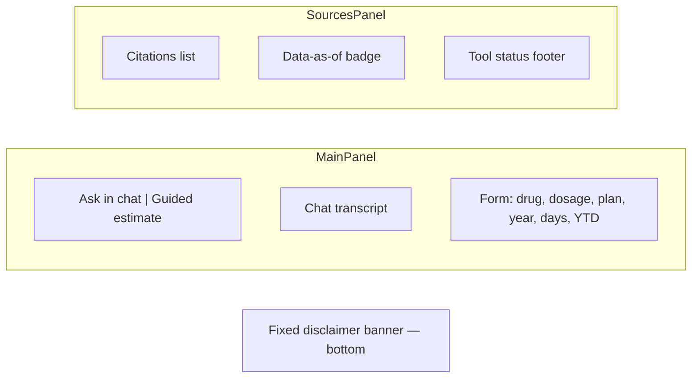
```mermaid
flowchart LR
    subgraph MainPanel
        Tabs["Ask in chat | Guided estimate"]
        Chat[Chat transcript]
        Guided[Form: drug, dosage, plan, year, days, YTD]
    end
    subgraph SourcesPanel
        Citations[Citations list]
        AsOf[Data-as-of badge]
        Status[Tool status footer]
    end
    Disclaimer[Fixed disclaimer banner — bottom]
```

- **Cost figures appear in chat text**, not a dedicated results card.
- **Sources panel** shows citations and freshness only.

### 11.2 Key behaviors (`frontend/src/app.js`)

| Feature | Implementation |
|---|---|
| Plan loading | `GET /api/plans` on startup |
| Empty DB polling | Every 20s, max 30 attempts, while plan count = 0 |
| Guided estimate | Composes NL prompt → `POST /api/chat` → switches to chat tab |
| Guided validation | Required asterisks + `updateGuidedMandatoryHints()` per-field "Mandatory" hints when submit is disabled |
| Policy modals | `formatPolicyTextToHtml()` renders `##` section headings in disclaimer banner and Privacy/Disclaimer modals |
| Error display | `chatErrorMessage()` parses FastAPI `detail` (JSON, text, validation arrays) |
| Session | Stores `session_id` from first response; sends on subsequent turns |
| Analytics labels | Sends `region` and `mode` on `POST /api/chat` for aggregate usage stats |
| Cache busting | `?v=` query params on assets; server `Cache-Control: no-cache` |

### 11.3 Admin pages

`scripts/build-frontend.sh` copies `frontend/src/admin/*.html` to `frontend/dist/admin/` (e.g. `/admin/usage.html` usage dashboard). Not linked from the main SPA. See [usage-analytics.md](./usage-analytics.md).

### 11.4 Build

```bash
scripts/build-frontend.sh   # copies src → dist
```

Docker and pytest `conftest.py` auto-build if `frontend/dist/index.html` is missing.

---

## 12. Configuration

### 12.1 Environment variables

| Variable | Required | Default | Description |
|---|---|---|---|
| `LLM_PROVIDER` | No | `anthropic` | Only affects which provider's missing-key warning is logged at startup — does **not** select the active model/provider (see §2.4) |
| `ANTHROPIC_API_KEY` | Prod yes* | — | Claude API key |
| `OPENAI_API_KEY` | Prod yes* | — | OpenAI key — required for the default model (`gpt-5.6-luna` out of the box; see `config/deploy.yaml`) |
| `LLM_MODEL` | No | empty → `config/deploy.yaml`'s `llm.default_model` | Model identifier; must exist in `config/deploy.yaml`'s `llm.models` catalog. Overridable per chat turn via `ChatRequest.model` |
| `LLM_MOCK` | No | `0` | Set `1` for offline mock LLM |
| `LLM_TIMEOUT_SECONDS` | No | `60` | Per-request timeout (main chat model) |
| `LLM_MAX_RETRIES` | No | `2` | Retry count on LLM failure (main chat model) |
| `MEDIATOR_ENABLED` | No | `0` | Set `1` to run the pre-processing mediator LLM call (§2.4, §3.1) before the main agent loop |
| `MEDIATOR_LLM_MODEL` | No | empty → `config/deploy.yaml`'s `llm.mediator_default_model` | Model for the mediator's structured-completion call; independent of `LLM_MODEL` |
| `MEDIATOR_TIMEOUT_SECONDS` | No | `4.0` | Mediator request timeout — much tighter than `LLM_TIMEOUT_SECONDS` since a slow mediator should fail fast |
| `MEDIATOR_MAX_RETRIES` | No | `1` | Retry count for the mediator's own call |
| `DEFAULT_TIMEZONE` | No | `America/Chicago` | Timezone for date/duration resolution when the client doesn't supply one |
| `DATA_DIR` | No | `./data` | Data root |
| `DUCKDB_PATH` | No | `./data/navigator.duckdb` | DuckDB file |
| `PROJECT_ROOT` | Docker | auto | Repo root for config resolution |
| `PORT` / `API_PORT` | No | `8000` | Uvicorn port (`PORT` wins on Render) |
| `CORS_ORIGINS` | Prod | localhost | Comma-separated allowed origins |
| `MAX_CHAT_TURNS` | No | `5` | Session turn limit |
| `SESSION_TTL_MINUTES` | No | `30` | In-memory session expiry |
| `MAX_TOOL_ROUNDS` | No | `8` | Agent tool loop cap |
| `INGEST_STATES` | No | yaml `states` | Comma-separated active ingest states; intersected with `pdp_region_codes` catalog |
| `ANALYTICS_ENABLED` | No | `true` | Set `false` to disable usage collection and the flush background task |
| `ANALYTICS_FLUSH_INTERVAL_SECONDS` | No | `60` | Seconds between analytics drains to DuckDB |
| `ADMIN_TOKEN` | No | empty | Shared secret for `GET /api/admin/usage`; endpoint hidden (404) when unset |
| `ADMIN_USAGE_HOURS` | No | `2160` | Default lookback window (~3 months) for admin usage API when `since`/`until` omitted |

\*Production requires a real API key **or** intentional mock mode for demos only.

### 12.2 Committed config files

| File | Purpose |
|---|---|
| `config/ingest_filters.yaml` | PDP region catalog + default states; runtime selection via `INGEST_STATES` |
| `config/deploy.yaml` | Ingest cron (`0 3 * * *` UTC), Render plan hints, and the **LLM model catalog** (`llm.models`, `llm.default_model`, `llm.mediator_default_model` — see §2.4) |
| `config/benefit_params.yaml` | Annual Part D OOP cap by contract year |
| `config/disclaimer.txt` | UI disclaimer banner + modal; includes a short privacy pointer to the full policy |
| `config/privacy_policy.txt` | Full privacy policy (`GET /api/privacy`, Privacy menu modal) |

---

## 13. Local development

### 13.1 Prerequisites

- Python 3.11+
- Git
- (Optional) Docker
- (Optional) Anthropic or OpenAI API key for live LLM responses

### 13.2 First-time setup

```bash
cd Medicare-drug-cost-navigator
python -m venv .venv
source .venv/bin/activate          # Windows: .venv\Scripts\activate
pip install -e ".[dev]"
cp .env.example .env
# Edit .env: add API key OR set LLM_MOCK=1
```

### 13.3 Load data

**Option A — Offline fixture (fastest, used by tests):**

```bash
medicare-ingest spuf --source tests/fixtures/spuf
```

**Option B — Download real CMS data:**

```bash
medicare-ingest spuf --download
# Or limit memory:
medicare-ingest spuf --download --states AR --merge-states
```

**Option C — Use cached zip:**

```bash
medicare-ingest spuf --source data/raw/SPUF_2026_20260408.zip --states AR
```

### 13.4 Build frontend and run server

```bash
scripts/build-frontend.sh
LLM_MOCK=1 uvicorn medicare_navigator.api.app:app --reload --host 0.0.0.0 --port 8000
```

Open http://localhost:8000

### 13.5 Verify

```bash
curl -s http://localhost:8000/api/health | python -m json.tool
curl -s http://localhost:8000/api/plans | python -m json.tool | head
```

### 13.6 Docker (optional)

```bash
docker build -t medicare-navigator .
docker run -p 8000:8000 -v medicare-data:/data \
  -e ANTHROPIC_API_KEY=sk-... \
  -e LLM_MOCK=0 \
  medicare-navigator

# Shell into container for first ingest:
docker exec -it <container> medicare-ingest spuf --download --states AR --merge-states
```

### 13.7 Development workflow diagram

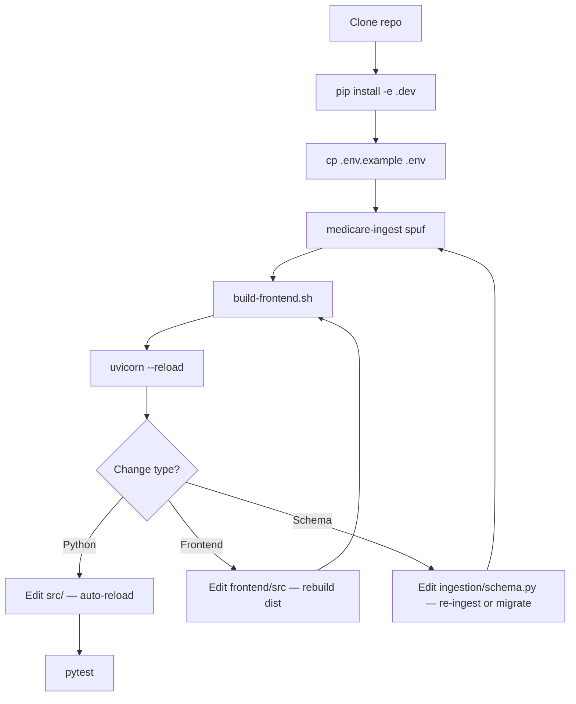
```mermaid
flowchart TD
    A[Clone repo] --> B[pip install -e .dev]
    B --> C[cp .env.example .env]
    C --> D[medicare-ingest spuf]
    D --> E[build-frontend.sh]
    E --> F[uvicorn --reload]
    F --> G{Change type?}
    G -->|Python| H[Edit src/ — auto-reload]
    G -->|Frontend| I[Edit frontend/src — rebuild dist]
    G -->|Schema| J[Edit ingestion/schema.py — re-ingest or migrate]
    H --> K[pytest]
    I --> E
    J --> D
```

---

## 14. Testing

### 14.1 Run all tests

```bash
pytest tests/ -v
```

Default: **integration tests deselected** (`-m 'not integration'` in `pyproject.toml`).

```bash
# Include live RxNorm / external API tests:
pytest tests/ -v -m integration
```

Current suite: **442 tests** run by default, plus 5 `integration`-marked tests (deselected by default; call live RxNorm/CMS APIs) — 447 total. Run `pytest --collect-only -q` to confirm the current count.

### 14.2 Test categories

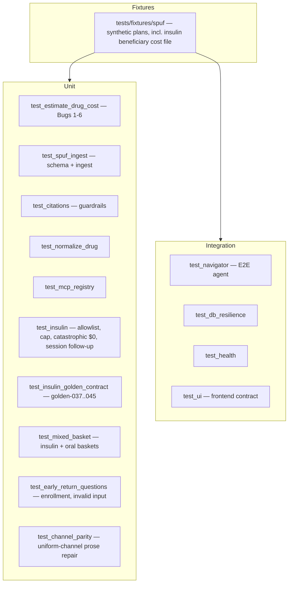
```mermaid
flowchart TB
    subgraph Unit
        T1[test_estimate_drug_cost — Bugs 1-6]
        T2[test_spuf_ingest — schema + ingest]
        T3[test_citations — guardrails]
        T4[test_normalize_drug]
        T5[test_mcp_registry]
        T10[test_insulin — allowlist, cap, catastrophic $0, session follow-up]
        T11[test_insulin_golden_contract — golden-037..045]
        T12[test_mixed_basket — insulin + oral baskets]
        T13[test_early_return_questions — enrollment, invalid input]
        T14[test_channel_parity — uniform-channel prose repair]
    end
    subgraph Integration
        T6[test_navigator — E2E agent]
        T7[test_db_resilience]
        T8[test_health]
        T9[test_ui — frontend contract]
    end
    subgraph Fixtures
        F[tests/fixtures/spuf — synthetic plans, incl. insulin beneficiary cost file]
    end
    F --> Unit & Integration
```

### 14.3 Key fixtures (`tests/conftest.py`)

| Fixture | Scope | Behavior |
|---|---|---|
| `ensure_frontend_dist` | session | Auto-runs `build-frontend.sh` if needed |
| `use_mock_llm` | autouse | Forces `LLM_MOCK` for all tests |
| `spuf_db` | function | Temp DuckDB with offline SPUF fixture |

### 14.4 Synthetic test plans

Fixture-only plans (not real CMS):

| Plan key | Purpose |
|---|---|
| `H8888-001` | MA-PD test plan |
| `S9999-001` | PDP test plan |

Prompt chips in `frontend/src/index.html` use `S5921-400` (AARP Medicare Rx Preferred from UHC, AR 2026), a real plan also used as a worked example in [business-solution.md](./business-solution.md#33-verified-example). It requires a real CMS AR ingest to resolve — the test plan keys above (`S9999-001`, `H8888-001`) only resolve against the offline SPUF fixture used in tests/eval and are never seeded in deployed environments, so they must not be used in user-facing UI copy.

### 14.5 UI contract tests

```bash
medicare-ui-test run --offline
```

Checks DOM IDs, guided-estimate flow, mandatory-field contract, and smoke messages against a running or mocked API.

Playwright browser flows (`medicare-ui-test browser <flow>`):

| Flow | Coverage |
|---|---|
| `chat` | Free-form chat smoke |
| `guided-single` | Single-drug guided estimate |
| `guided-multi` | Multi-drug guided estimate |
| `guided-compare-plan` | Compare plans guided flow |
| `responsive-interactions` | Mobile/tablet/desktop viewports — no horizontal scroll, 44px touch targets, keyboard focus, Escape on menu/modal, combobox expand/collapse |

`medicare-ui-test run` accepts `--base-url` and `--timeout` for live-server runs.

### 14.6 Linting

```bash
ruff check src tests
ruff format --check src tests
```

---

## 15. Evaluation suite

Offline acceptance tests driven by `src/medicare_navigator/eval/queries.jsonl`.

```bash
# Ensures fixture ingest + runs 15 cases with LLM_MOCK
LLM_MOCK=1 medicare-eval
```

Each case asserts on: `status`, `expected_tier`, `expected_cost`, `expected_phase`, `expected_tool_status`, substring in `explanation`.

Results written to `src/medicare_navigator/eval/results.json`.

---

## 16. Deployment

See [deployment.md](./deployment.md) for full detail. Summary:

### 16.1 Render (recommended)

1. Connect GitHub → **New Blueprint** → `render.yaml`
2. Set secrets: `ANTHROPIC_API_KEY`, `CORS_ORIGINS=https://<app>.onrender.com`
3. After deploy, Shell: `medicare-ingest spuf --download --states AR --merge-states`
4. Verify: `GET /api/health` → `data_fresh: true`, `llm_configured: true`

### 16.2 Nightly ingest

- Schedule: `config/deploy.yaml` → `ingest.cron: "0 3 * * *"` UTC
- Entrypoint: `scripts/run-daily-ingest.sh` → `medicare-ingest spuf --download --preserve-other`
- Active states: `INGEST_STATES` env (e.g. `AR,TX,CA`) intersected with `pdp_region_codes` in yaml; falls back to yaml `states` when unset
- Runs inside container via supercronic (not Render Cron Jobs — disks cannot mount there)
- **Note:** nightly run reloads only the active states — list every state you want to keep in `INGEST_STATES`. Use `--merge-states` in Shell to add one state without wiping others.

### 16.3 Other platforms

| Platform | Artifact |
|---|---|
| Kubernetes | `deploy/k8s/cronjob-spuf-ingest.yaml` |
| AWS | `deploy/aws/eventbridge-ecs-ingest.md` |

### 16.4 Monitoring checklist

| Signal | Action |
|---|---|
| `data_fresh: false` | Run or debug ingest; check disk space |
| `llm_configured: false` | Set API key in dashboard |
| HTTP 502 on chat | LLM timeout/rate limit — check logs |
| Empty `/api/plans` | Ingest not run or still in progress |
| Unknown loaded states | Render Shell: see [deployment.md § Inspecting loaded data](./deployment.md#inspecting-and-managing-loaded-data-render-shell) |

---

## 17. CLI reference

### `medicare-ingest spuf`

```bash
medicare-ingest spuf --source tests/fixtures/spuf
medicare-ingest spuf --download
medicare-ingest spuf --download --states AR --merge-states
medicare-ingest spuf --download --states CA --merge-states
medicare-ingest spuf --download --preserve-other
medicare-ingest spuf --source path/to.zip --states AR
```

| Flag | Description |
|---|---|
| `--download` | Fetch latest zip from data.cms.gov |
| `--source PATH` | Local zip or extracted fixture directory |
| `--states AR` | Override `INGEST_STATES` env and yaml defaults |
| `--merge-states` | Replace only listed states (keep others in DB) |
| `--preserve-other` | Keep non-SPUF tables (e.g. `query_log`); nightly cron reloads all SPUF tables for active states only |
| `--force-download` | Ignore cached zip in `data/raw/` |
| `--monthly` | Use monthly PUF instead of quarterly SPUF |

### `medicare-ingest fetch`

Download CMS zip to `data/raw/` without loading DuckDB.

### `medicare-chat-invoke`

Manual CLI for sending chat messages (see `qa/cli.py`).

### `scripts/validate_insulin_cost_data.py`

Post-ingest validation for `insulin_beneficiary_cost` — checks that no copay exceeds the statutory cap for its days-supply code, and flags duplicate lookup keys with conflicting copays (a proxy for `segment_id` ambiguity). Run after each real CMS SPUF ingest:

```bash
python scripts/validate_insulin_cost_data.py
python scripts/validate_insulin_cost_data.py --db data/navigator.duckdb
```

---

## 18. Troubleshooting

| Symptom | Likely cause | Fix |
|---|---|---|
| `503` on `/api/chat` | No LLM key and `LLM_MOCK` unset | Set `ANTHROPIC_API_KEY` or `LLM_MOCK=1` |
| Empty plan dropdown | No ingest yet | Run `medicare-ingest spuf ...` |
| `not_found` for real plan | State not ingested | Ingest that state; check `INGEST_STATES` or run `--states XX --merge-states` |
| Frontend 404 at `/` | Missing `frontend/dist` | Run `scripts/build-frontend.sh` |
| Stale UI after edit | Browser cache | Hard refresh; dist rebuild; no-cache middleware active |
| Ingest `Killed` on Render | OOM on Starter plan | `--merge-states`, fewer states, or upgrade plan |
| Wrong copay amount | Days-supply or coverage_level mismatch | Verify `DAYS_SUPPLY_CODE_MAP` and COVERAGE_LEVEL 0/1/3 |
| `CatalogException` on startup | Corrupt or missing DB | Delete duckdb file and re-ingest; `ensure_schema()` on boot |
| RxNorm failures in tests | Network blocked | Use offline fixture; mock normalize in unit tests |

### Debug logging

```bash
# Verbose ingest
medicare-ingest spuf --source tests/fixtures/spuf 2>&1 | tee ingest.log

# Single test with output
pytest tests/test_estimate_drug_cost.py -v -s -k "bug_2"
```

---

## 19. Product boundaries

### In scope (v1)

- Medicare Part D / MA-PD with Part D benefit
- Ingested states (AR + TX verified with real data)
- Oral drugs on regular formulary, priced through the tiered/deductible pipeline
- Insulin, priced through its separate $35-per-30-day IRA statutory cap (no deductible phase) — see [insulin-cost-estimation.md](./insulin-cost-estimation.md)
- Multi-drug requests on one plan (up to 5 drugs), including baskets mixing insulin and oral drugs
- Non-LIS beneficiaries
- Pre-deductible, initial-coverage, insulin-cap, or catastrophic phase (user supplies YTD OOP; catastrophic uses the statutory annual OOP cap from `config/benefit_params.yaml`)
- 30 / 60 / 90-day fills
- Copay cost-sharing (with Bug 2 tier override) for oral drugs; statutory-capped copay for insulin
- Per-pharmacy-channel pricing (preferred/standard retail, preferred/standard mail) via `estimate_drug_cost_all_channels`
- PA/ST as soft caveats (cost still computed)

### Out of scope (hard stops or deferred)

| Topic | Behavior |
|---|---|
| Insulin with no CMS cost-share record for the plan's tier/fill size | Narrow hard stop (`insulin_out_of_scope` — data gap, not a blanket exclusion) |
| Suppressed plans | Hard stop (Bug 6) |
| Quantity limit exceeded | Hard stop (Bug 5b) |
| Coinsurance dollar amount | Not computed — caveat only (Bug 4) |
| LIS / Medicaid | Not supported |
| Excluded-drug formulary | Not supported |
| Policy Q&A, alternatives, trends | Removed in Phase 6 |

---

## 20. Further reading

| Document | When to read |
|---|---|
| [navigator-implementation-spec.md](./navigator-implementation-spec.md) | Implementing or changing cost logic |
| [insulin-cost-estimation.md](./insulin-cost-estimation.md) | Implementing or changing insulin cost logic; CMS source docs, field-resolution evidence, worked examples |
| [phase-6-implementation-plan.md](./phase-6-implementation-plan.md) | Understanding the Phase 6 pivot |
| [deployment.md](./deployment.md) | Ops, cron, Render disk |
| [usage-analytics.md](./usage-analytics.md) | Privacy-safe aggregate telemetry, admin API, dashboard |
| [data-sources.md](./data-sources.md) | CMS/RxNorm URLs (note stale Chroma sections) |
| [build-requirements.md](../build-requirements.md) | Long-term product vision |

---

*Last updated for Phase 6 plus usage analytics (`feature/frontend_anonymous`), RxNorm offline fallback, prompt-injection hardening, insulin session follow-up, channel-parity prose repair, and guided-form mandatory hints. For doc issues, update this file alongside code changes.*
