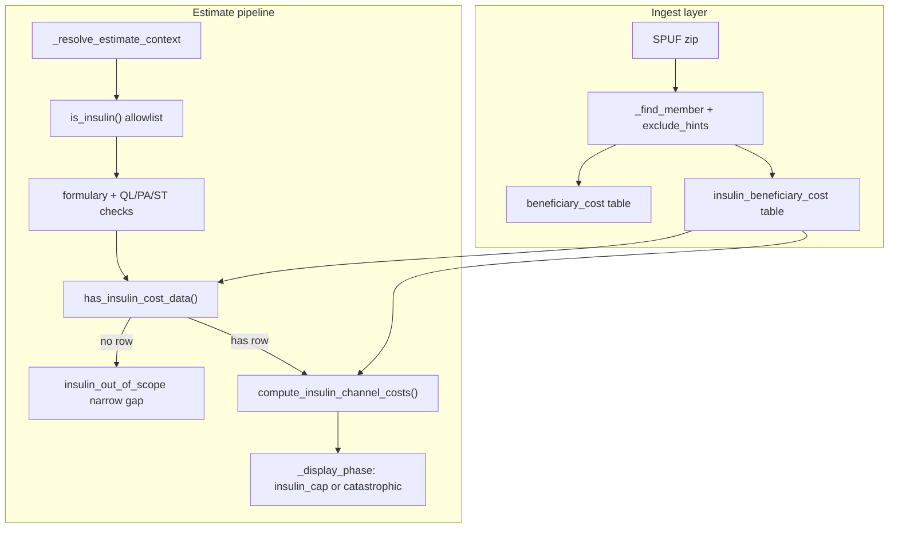

# Architecture — Insulin Cost Estimation

Cross-reference: [Insulin Cost Estimation spec](../insulin-cost-estimation.md) for CMS schema, empirical field resolution, and worked examples.

## High-level flow



Insulin uses a **parallel pipeline** from the general tiered/deductible cost-share path. It never reads `beneficiary_cost` for dollar figures and never applies `DED_APPLIES_YN` from the general file.

## Layer map

| Layer | Files | Responsibility |
|---|---|---|
| Detection | `tools/insulin.py` | Hardcoded name/ingredient allowlist — no CMS field marks insulin |
| Pricing | `tools/insulin_cost.py` | `has_insulin_cost_data()`, `compute_insulin_channel_costs()` |
| Orchestration | `tools/estimate_drug_cost.py` | Routes insulin through separate branch; sets `is_insulin` on context |
| Ingest | `ingestion/spuf.py`, `ingestion/schema.py` | Discovers, parses, loads insulin file into DuckDB |
| Storage | `storage/repository.py` | `InsulinBeneficiaryCostRepository` |
| UX / agent | `frontend/src/app.js`, `agent/prompts.py`, `tools/disclaimers.py`, `guardrails/citations.py`, `mcp/schemas.py` | Labels, caveats, prompts, tool descriptions |

## 1. Detection (`is_insulin`)

Location: `src/medicare_navigator/tools/insulin.py`

- No CMS SPUF field identifies insulin; detection is a **hardcoded allowlist** of brand names and ingredient strings (Lantus, Humalog, Lyumjev, Soliqua, Xultophy, etc.).
- Checked **twice** in `_resolve_estimate_context`:
  1. Pre-RxNorm on canonical drug name
  2. Post-RxNorm on resolved name + ingredient
- Match logic: exact set membership **or** substring match (`any(name in lowered for name in _INSULIN_NAMES)`).

**Behavior change vs v1:** insulin no longer hard-stops before formulary lookup. Quantity limits, PA/ST, and not-covered checks run first — same as any other drug.

## 2. Formulary and pre-pricing gates

Standard pipeline steps still apply before insulin pricing:

1. Suppressed-plan check (`PLAN_SUPPRESSED_YN`)
2. Drug resolution (RxNorm)
3. Formulary lookup (`basic_drugs_formulary`)
4. Quantity-limit block
5. Benefit-phase computation (`compute_benefit_phase` — still used for catastrophic override)
6. Days-supply code mapping (`map_pricing_days_supply_to_code`: 30→1, 60→4, 90→2)

## 3. Existence gate (`has_insulin_cost_data`)

Location: `src/medicare_navigator/tools/insulin_cost.py`

Before building an estimate context, when `is_insulin_drug` and `days_supply_code is not None`:

```python
if not has_insulin_cost_data(plan_key, surviving, days_supply_code):
    return ToolResult.failure(ToolStatus.insulin_out_of_scope, ...)
```

- Queries `InsulinBeneficiaryCostRepository.has_any()` for **any matched tier** and the requested fill-size code, in **any channel**.
- Failure means: drug is on formulary (`covered=True`) but CMS has no insulin cost-share row — **do not fall through** to the general `beneficiary_cost` pipeline (that would produce wrong numbers).

Partial payload on failure: `MultiChannelDrugCostEstimate` with empty channel costs and `covered=True`.

**Note:** When `days_supply_code is None` (unmapped fill size), this gate is **skipped**. See [bugs-and-risks.md](./bugs-and-risks.md).

## 4. Pricing (`compute_insulin_channel_costs`)

Location: `src/medicare_navigator/tools/insulin_cost.py`

Per matched tier and pharmacy channel:

1. `InsulinBeneficiaryCostRepository.get_cost_share(plan_key, tier, days_supply_code, pharmacy_channel)`
2. Falls back to `TIER IS NULL` when exact tier has no row (defined-standard plans use CMS `"."` sentinel → `NULL`)
3. If catastrophic phase (`raw_phase == "catastrophic"`): `applied_copay = 0`, but `plan_copay` still shows the pre-catastrophic capped figure
4. Blank/missing channel row → unpriced (`None`), never fabricated as `$0`

**Fields read:** `COPAY_AMT_*_INSLN` only. `COIN_AMT_*_INSLN` is discarded at ingest and never used (empirically unreliable — see spec §5).

**Fields not read:** `beneficiary_cost`, `pricing`, `DED_APPLIES_YN`, `COVERAGE_LEVEL`.

Module is deliberately isolated from `estimate_drug_cost.py` to avoid circular imports.

## 5. Display semantics

| Field | Insulin value | Notes |
|---|---|---|
| `benefit_phase` | `"insulin_cap"` or `"catastrophic"` | Never `pre_deductible` / `initial_coverage` |
| `effective_phase` | Same as `benefit_phase` for insulin | `_display_phase()` helper |
| `ded_applies_yn` | `"NA"` | General file's per-tier flag describes unrelated drugs at that tier |
| Caveat | `INSULIN_STATUTORY_CAP_CAVEAT` | Replaces `BUG2_CAVEAT` (deductible-phase caveat) |

Frontend: `BENEFIT_PHASE_LABELS["insulin_cap"]` = `"Insulin cap ($35/30-day)"`.

## 6. Status semantics

| Status | Meaning (after this change) |
|---|---|
| `ok` + `benefit_phase: "insulin_cap"` | Normal priced insulin estimate |
| `ok` + `benefit_phase: "catastrophic"` | YTD OOP at/above annual cap → $0 |
| `insulin_out_of_scope` | CMS insulin file has **no row** for this plan/tier/fill-size — data gap only |
| `not_covered` | Drug not on formulary (unchanged) |
| `quantity_limit_blocked` | QL blocks requested fill (unchanged; now applies to insulin) |

`insulin_out_of_scope` **no longer means** "insulin is unsupported by this tool."

## 7. Ingest architecture

### File discovery

The real CMS zip member is named `"insulin beneficiary cost file ..."`, which contains the substring `"beneficiary cost"` — the general file's discovery hint. Fix:

```python
_find_member(names, BENEFICIARY_COST_FILE_HINTS, exclude_hints=INSULIN_FILE_HINTS)
```

Without `exclude_hints`, discovery could cross-contaminate depending on zip member ordering.

### Table shape

`insulin_beneficiary_cost` — one row per `(plan_key, segment_id, tier, days_supply_code, pharmacy_channel)`:

| Column | Source |
|---|---|
| `plan_key` | `CONTRACT_ID-PLAN_ID` |
| `segment_id` | `SEGMENT_ID` (stored, not queried — see risks) |
| `tier` | `TIER` (`"."` → `NULL`) |
| `days_supply_code` | `DAYS_SUPPLY` (1/2/3/4) |
| `pharmacy_channel` | Derived from `COPAY_AMT_*_INSLN` columns |
| `copay` | Parsed float from copay column |
| `as_of_date` | Ingest version |

`coin_amt_*` columns are **omitted at ingest** — deliberate one-way door.

### Purge / merge

`insulin_beneficiary_cost` added to:

- `_purge_states()` table list (state-scoped deletes)
- `preserve_non_spuf_tables` drop list (full table rebuild on fixture ingest)

Ingest stats now include `insulin_beneficiary_cost_rows` count.

## 8. Policy alignment (external)

| Rule | Implementation alignment |
|---|---|
| IRA $35/30-day cap (scaled 60/90) | Reads CMS pre-capped copay amounts |
| No deductible for insulin | Skips deductible logic; `ded_applies_yn = "NA"` |
| Catastrophic → $0 | Uses existing `compute_benefit_phase` + override |
| Per-product cap (not pooled) | Estimator called per drug; no cross-drug aggregation |
| 2026 "lesser of" ($35, 25% negotiated, 25% MFP) | **Delegated to CMS file** — not recomputed locally. See [bugs-and-risks.md](./bugs-and-risks.md) |

## 9. Downstream consumers

No MCP tool schema or parameter changes — insulin flows through existing `estimate_drug_cost` / `estimate_drug_cost_all_channels` contracts.

Updated surfaces:

- Agent system prompt (`prompts.py`) — insulin in scope, `insulin_cap` phase guidance
- MCP tool description text (`schemas.py`)
- Citation guardrails — `INSULIN_STATUTORY_CAP_CAVEAT` in `_CARD_ONLY_CAVEATS`
- Frontend About modal and routine caveat styling (`app.js`)
- Eval queries (`eval-010` now expects priced insulin, not hard stop)
- Golden case `golden-037` (`insulin_cap` group)
