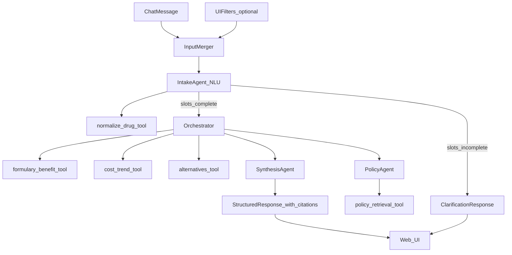
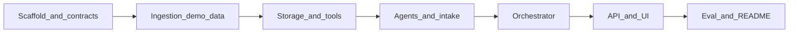

# Phase 1 Implementation Plan

**Medicare Drug Cost & Benefit-Transparency Navigator**

This document is the implementation guide for Phase 1. The functional specification lives in [build-requirements.md](../build-requirements.md). Data source URLs are maintained in [data-sources.md](./data-sources.md).

---

## 1. Overview

Build a system that, given a drug (and dosage) and optionally a Medicare Part D / MA plan, explains what a beneficiary is charged and why — grounded entirely in publicly available government data. The system combines deterministic data lookups with language-model-driven explanation and never states a claim it cannot trace to a retrieved source.

**Phase 1 scope:** demo subset of ~10–20 representative Part D/MA plans; chat-first UI with optional filters; modular monolith deployment.

---

## 2. Decisions locked for Phase 1

| Decision | Choice | Rationale |
|---|---|---|
| Plan coverage | Demo subset (~10–20 representative plans) | Keeps CMS PUF ingestion tractable while satisfying FR1/FR6 eval |
| Stack | Python 3.11+, FastAPI, React + Vite (or vanilla JS) | Strong fit for data tooling + LLM orchestration |
| Agents | Runtime LLM agents as in-repo Python modules | Per Section 5 terminology in build-requirements; not Cursor SDK agents |
| Data store | **DuckDB** (tabular) + **Chroma** (vectors) | Embedded, portable, fast analytics for cost trends |
| Orchestration | **Hand-rolled Python orchestrator** | Mostly linear pipeline; simpler to test/debug at demo scale |
| LLM | **Anthropic (Claude) and OpenAI** via `llm/client.py` adapter | `LLM_PROVIDER=anthropic\|openai`; models `claude-sonnet-4-6` / `gpt-4o` |
| UI pattern | **Chat-first with optional filters** | Chat is primary; filters pre-fill slots but are never required |
| Conversation | **Limited session-scoped follow-ups** (max 5 turns) | Clarification and scoped re-queries only |
| Deployment | **Modular monolith** | One backend process, embedded data stores, separate `frontend/` folder |

---

## 3. Architecture

### 3.1 Agentic flow (per build-requirements Section 5)



**Terminology (required):**
- **Tool** — deterministic, stateless function. No LLM involved.
- **Agent** — LLM-driven component that interprets or synthesizes; may invoke tools.
- **Orchestrator** — deterministic control flow only; never generates user-facing prose.

### 3.2 Deployment — modular monolith (not microservices)

Do **not** split every pipeline step into a separate service for Phase 1.

| Layer | Phase 1 approach |
|---|---|
| Pipeline steps (intake, tools, agents, orchestrator) | One Python process — modules, not services |
| Database (DuckDB + Chroma) | Embedded files under `data/` |
| Backend API | One FastAPI service |
| Frontend | Separate `frontend/` folder |
| Ingestion | CLI scripts in same repo |

```
┌─────────────────────────────────────────────┐
│  frontend/  (React + Vite or static)        │
└──────────────────┬──────────────────────────┘
                   │ HTTP
┌──────────────────▼──────────────────────────┐
│  backend (single FastAPI process)           │
│  ├── api/          (routes)                 │
│  ├── intake/       (InputMerger + agent)    │
│  ├── orchestrator/ (pipeline)               │
│  ├── tools/        (deterministic lookups)  │
│  ├── agents/       (LLM components)         │
│  ├── storage/      (DuckDB repositories)    │
│  ├── cache/                                 │
│  └── session/      (in-memory chat state)   │
│                                             │
│  data/navigator.duckdb  (embedded)          │
│  data/chroma/           (embedded)          │
└─────────────────────────────────────────────┘
```

Each step is a Python module with a typed interface (`ToolResult` in, structured data out) so it can be extracted into a service later without redesign.

### 3.3 Repo layout

```
medicare-drug-cost-navigator/
├── build-requirements.md
├── docs/
│   ├── phase-1-implementation-plan.md   # this file
│   └── data-sources.md
├── config/
│   ├── demo_plans.yaml
│   └── disclaimer.txt
├── pyproject.toml
├── .env.example
├── src/medicare_navigator/
│   ├── models/          # ToolResult, Query, Response, Citation
│   ├── tools/           # 5 deterministic tools
│   ├── intake/          # InputMerger + slot validation
│   ├── session/         # in-memory chat session state
│   ├── agents/          # intake, policy, synthesis
│   ├── llm/             # anthropic | openai adapter
│   ├── storage/         # DuckDB repositories
│   ├── orchestrator/    # hand-rolled pipeline
│   ├── ingestion/       # CMS/FDA/NLM load scripts
│   ├── api/             # FastAPI routes
│   ├── cache/
│   └── eval/
├── data/                # gitignored
├── frontend/
├── tests/
└── README.md
```

---

## 4. Shared contracts

All tools return a unified `ToolResult[T]` envelope (build-requirements Section 5.5):

```python
class ToolStatus(str, Enum):
    ok = "ok"
    not_found = "not_found"
    not_covered = "not_covered"
    stale = "stale"
    no_match = "no_match"

class ToolResult(BaseModel, Generic[T]):
    status: ToolStatus
    data: T | None
    source_id: str          # e.g. "cms_spuf_2026_q1_basic_formulary"
    as_of_date: date
    message: str | None
```

Agents receive only `ToolResult` objects upstream — never raw empty lists.

---

## 5. Data store — DuckDB

**Decision: DuckDB** for all tabular data. Chroma for policy retrieval vectors.

| Strength | Relevance |
|---|---|
| Embedded, no server | Single `data/navigator.duckdb` file |
| Fast analytics | Multi-year cost-trend aggregations |
| Native Parquet/CSV reads | Prototype ingestion before full load |
| Full SQL | Joins across formulary + plan + cost-share tables |
| Portable | Copy one file for local testing and eval |

All tools query through `storage/repository.py` (e.g., `FormularyRepository.get_tier(plan_id, ndc)`). No raw SQL in tool modules.

---

## 6. Tools (deterministic)

| Tool | Input | Output | Failure modes |
|---|---|---|---|
| `normalize_drug` | free-text drug + dosage | RxCUI, NDC candidates, strength | `not_found` |
| `formulary_benefit_lookup` | RxCUI/NDC + plan ID + optional YTD spend | tier, cost-share, benefit phase | `not_covered`, `not_found`, `stale` |
| `cost_trend_lookup` | drug identifier | multi-year spend/price series | `stale`, `not_found` |
| `alternatives_finder` | RxCUI or ingredient | equivalent products (TE codes) | `no_match` |
| `policy_retrieval` | query string | ranked passages + source metadata | `no_match` |

`formulary_benefit_lookup` computes benefit phase deterministically from plan deductible + YTD OOP spend against annual parameters — not via LLM.

---

## 7. Agents (LLM-driven)

Each agent lives in `agents/<name>.py` with a prompt file under `prompts/`, Pydantic output schema, and explicit tool permissions.

### 7.1 Intake agent (NLU / slot-filling)

Primary parser for flexible chat input. Extracts structured slots from free text:

> *"What's the copay for metformin 500mg on Humana H1234-045 if I've spent $400 so far?"*

→ `ParsedQuery{drug, dosage, plan_id, ytd_oop_spend, intents}`

- May call `normalize_drug` to validate drug names (deterministic, not LLM guessing)
- Fuzzy-matches plan names against `config/demo_plans.yaml`
- Returns `slots_complete` → orchestrator, or `needs_clarification` → chat reply
- Never guesses on `not_found`

### 7.2 Policy agent

Given tool outputs + question facets, calls `policy_retrieval`. Interprets passages for *why* costs change (tier moves, IRA negotiation, phase transitions). Output: claims each tagged with `source_id`.

### 7.3 Synthesis agent

Merges upstream outputs into plain-language answer:
- Every factual sentence maps to `{claim, source_id, as_of_date}`
- Refuses unsupported claims
- Appends mandatory disclaimer (see Section 9)
- Never suggests plan switching (FR6)

**Citation guard:** post-synthesis validator checks each `source_id` exists in upstream artifacts; one retry then safe degradation.

---

## 8. Flexible chat input architecture

Users type everything in the chat box — drug, dosage, plan, spend, intent — without touching filters. Filters are optional slot pre-fills; **chat wins on conflict**.

### 8.1 Dual-channel input

| Channel | Role | Example |
|---|---|---|
| **Chat message** (primary) | Intake agent extracts all slots | *"metformin 500mg tier on plan H1234-045, spent $400 YTD"* |
| **UI filters** (optional) | Pre-fill slots; sent with chat | User picks plan, types *"what's my copay for metformin 500mg?"* |

### 8.2 InputMerger (`intake/merger.py`)

Deterministic merge — no LLM:

```python
class QuerySlots(BaseModel):
    drug: str | None
    dosage: str | None
    plan_id: str | None
    contract_year: int | None
    ytd_oop_spend: float | None
    pharmacy_channel: str | None
    days_supply: int | None
    include_alternatives: bool | None
    include_cost_trend: bool | None
    raw_message: str
    intents: list[str]

# Merge priority: chat-extracted > UI filters > session carry-over > defaults
```

### 8.3 Example chat flows (no filters required)

| User message | Extracted slots | Action |
|---|---|---|
| *"metformin 500mg copay on H1234-045"* | drug, dosage, plan, intent=tier_lookup | Full pipeline |
| *"why did my lisinopril cost go up?"* | drug, intent=explain; plan=missing | Drug-level trend; ask for plan if needed |
| *"Humana plan, metformin"* | drug, plan_name; dosage=missing | Clarify strength |
| *"try 1000mg instead"* (follow-up) | dosage updated | Re-run affected lookups |
| *"what if I've spent $800?"* (follow-up) | ytd_oop_spend=800 | Re-run formulary lookup only |

**Key principle:** Intake interprets language → tools validate facts → orchestrator routes → synthesis explains.

---

## 9. Orchestrator

Hand-rolled `orchestrator/pipeline.py` with async steps and explicit state dataclass.

**Pipeline steps:**
1. `intake` → InputMerger + Intake agent (may short-circuit to clarification)
2. `route` → skip `alternatives_finder` unless requested or drug `not_covered`
3. `parallel_lookups` → formulary + cost trend (+ alternatives if routed)
4. `policy` → Policy agent (if explanation needs program context)
5. `synthesize` → Synthesis agent
6. `validate` → citation + disclaimer + as-of checks

**Logging:** `{query_id, session_id, tools_invoked, agents_invoked, statuses, latency}` per query.

**Retries:** transient HTTP failures on RxNorm wrappers only (exponential backoff, max 2).

LangGraph is a future upgrade path if multi-turn clarification needs graph checkpointing.

---

## 10. LLM provider layer

`src/medicare_navigator/llm/client.py`:

```bash
LLM_PROVIDER=anthropic          # anthropic | openai
ANTHROPIC_API_KEY=
OPENAI_API_KEY=
LLM_MODEL=claude-sonnet-4-6     # or gpt-4o
```

All agents call through this adapter. Structured output via `instructor` + Pydantic schemas.

---

## 11. API

| Endpoint | Purpose |
|---|---|
| `POST /api/query` | Structured query: `{drug, dosage?, plan_id?, ytd_oop_spend?, filters?, message?}` |
| `POST /api/chat` | Conversational turn: `{session_id, message}` |
| `GET /api/meta/as-of` | Data vintages per dataset |
| `GET /api/plans` | Demo plan list (filterable by type, state, year) |
| `GET /api/health` | Health check |

---

## 12. UI design

### 12.1 Layout — three-zone desktop

```
┌──────────────────────────────────────────────────────────────┐
│  FIXED DISCLAIMER BANNER (always visible)                     │
├──────────────┬───────────────────────────┬─────────────────┤
│  Filters     │  Chat panel               │  Results panel    │
│  (collapsible│  - message history        │  - structured     │
│   sidebar,   │  - input box              │    data cards     │
│   optional)  │  - example prompt chips   │  - trend chart    │
│              │  - turn counter (n/5)     │  - citations      │
│              │                           │  - data-as-of     │
└──────────────┴───────────────────────────┴─────────────────┘
```

**Mobile:** single column — disclaimer → chat → results; filters in bottom sheet.

### 12.2 Persistent disclaimer (always on screen)

Visible at all times — not dismissible, not buried in fine print. Satisfies build-requirements Sections 7.2 and 8.

**Placement:** `position: fixed` or `sticky` at top of viewport; remains visible while scrolling.

**Canonical text** (store in `config/disclaimer.txt` and `frontend/constants` at implementation):

> **Disclaimer:** This tool is for informational purposes only. The model can make mistakes. This is not medical advice, financial advice, or insurance enrollment guidance. Costs shown are based on publicly available government data, not real-time pharmacy pricing. Confirm any information with your doctor, pharmacist, or Medicare plan before making decisions.

**Implementation:**
- `<DisclaimerBanner>` mounted at app root — outside scroll areas
- Never behind collapse, modal, or dismiss button
- Repeated in every synthesized assistant message (backend second layer)
- Eval checks disclaimer in DOM on page load

### 12.3 UI element recommendations

| Element | Suggestion | Why |
|---|---|---|
| Disclaimer banner | Fixed top, muted amber/neutral, info icon | Always visible caution signal |
| Chat panel | Message bubbles; input pinned bottom | Familiar NL input UX |
| Example prompt chips | *"Metformin tier on my plan"*, *"Why did costs go up?"* | Teaches capabilities |
| Filters sidebar | Collapsible; badge for pre-filled slot count | Optional; doesn't compete with chat |
| Results panel | Structured cards, not prose-only | Tier/cost-share at a glance |
| Data-as-of badge | Pill at top of results: `Data as of Jan 15, 2026` | FR5 |
| Loading state | *"Looking up formulary…"*, *"Checking cost trends…"* | Shows tools running |
| Citation chips | Inline `[1]` refs; click expands source + link | FR7 traceability |
| Benefit phase pill | Color-coded: Deductible / Initial / Catastrophic | Quick phase context |
| Cost trend | Sparkline or bar chart | FR2 visual |
| Failure states | Distinct UI per `not_found`, `not_covered`, `stale` | FR8 honest failures |
| Empty state | Example queries before first search | Guides chat-first usage |
| Turn counter | `2/5` in chat header | Signals limited follow-ups |

**Frontend tech:** React + Vite recommended for chat/filter state; vanilla HTML/JS acceptable for faster scaffold.

**Accessibility:** contrast on disclaimer; keyboard-navigable input; `aria-live` for new messages; keyboard-expandable citations.

### 12.4 Optional UI filters (pre-fill slots, never required)

| Filter | Purpose |
|---|---|
| Drug name | Typeahead from RxNorm cache |
| Dosage / strength | Disambiguate NDC |
| Plan | Searchable dropdown from `demo_plans.yaml` |
| Plan type | PDP vs MA-PD toggle |
| State / region | Narrow plan list |
| Contract year | 2025 / 2026 benefit math |
| YTD out-of-pocket spend | Benefit-phase determination |
| Pharmacy channel | Preferred / standard retail / mail-order |
| Days supply | 30 / 60 / 90 day |
| Include alternatives | Toggle; skips tool when off |
| Include cost trend | Toggle; skips tool when off |

### 12.5 Conversational mode — limitations

**Allowed (max 5 turns per session, 30-min TTL):**
- Clarification on ambiguous drug/plan
- Scoped follow-ups on same context (*"What if YTD spend is $800?"*, *"Show alternatives"*)

**Hard limits:**
- No plan-switching advice (FR6)
- No medical advice
- No unsupported claims (FR7)
- No cross-session memory (Section 8)
- No real-time POS pricing claims
- No off-topic chat
- Changing drug or plan mid-session triggers fresh lookup

```python
class SessionState:
    session_id: str
    turn_count: int          # max 5
    slots: QuerySlots
    parsed_query: ParsedQuery | None
    tool_artifacts: dict
    chat_history: list
    expires_at: datetime
```

---

## 13. Caching

- In-process or DuckDB-backed TTL cache table
- Keys include dataset vintage (e.g., `spuf_2026_20260115`)
- Invalidate when `data/manifest.json` updates
- Cache LLM outputs keyed by hash of upstream tool artifacts

---

## 14. Evaluation (Section 9 acceptance)

`eval/queries.jsonl` (~30–50 cases):
- Well-formed drug + plan → exact tier/cost-share ground truth
- Misspelled drug → `not_found` + clarification
- Unknown plan ID → `not_found`
- Drug not on formulary → `not_covered`
- Multi-year spend change → trend + explanation
- 3–5 real documented cost-change events

**Metrics (`eval/run_eval.py`):**
- Lookup accuracy: 100% on well-formed formulary queries
- Failure correctness: structured status matches expected
- Citation-groundedness: ≥90% of claims traceable (vs no-retrieval baseline)
- UI: fixed disclaimer on page load; disclaimer in every assistant message; as-of badge on results

---

## 15. Implementation sequence



Work in vertical slices: `normalize_drug` + `formulary_benefit_lookup` + minimal API returning structured tier data before adding synthesis.

---

## 16. Risks and mitigations

| Risk | Mitigation |
|---|---|
| CMS file size / schema drift | Pin one SPUF vintage; `data/manifest.json`; schema validation on ingest |
| NDC↔RxCUI ambiguity | Intake surfaces candidates; API accepts disambiguation field |
| LLM hallucination | Synthesis sees structured artifacts only; citation validator |
| Benefit-phase errors | Phase math in `formulary_benefit_lookup` tool only |

---

## 17. Out of scope for Phase 1

- Full national plan coverage
- Production SLA / multi-region deploy
- User accounts or PHI
- Plan-switching recommendations
- Microservices per pipeline step

---

## 18. Implementation checklist

- [ ] Scaffold `pyproject.toml`, package layout, `.env.example`, `config/demo_plans.yaml`
- [ ] `ToolResult` / shared Pydantic models
- [ ] DuckDB storage layer + ingestion scripts
- [ ] 5 deterministic tools
- [ ] InputMerger + Intake agent NLU
- [ ] Policy + Synthesis agents + LLM adapter
- [ ] Hand-rolled orchestrator
- [ ] FastAPI routes + chat-first UI with fixed disclaimer
- [ ] Eval set + metrics + README
