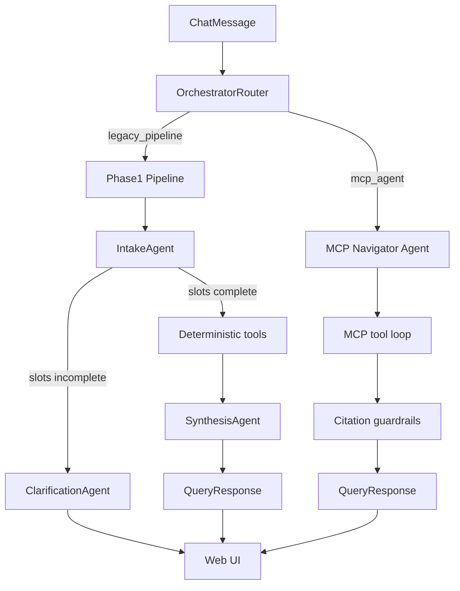

# Phase 2 Implementation Plan

**Medicare Drug Cost & Benefit-Transparency Navigator**

This document records what was built in Phase 2 on top of [phase-1-implementation-plan.md](./phase-1-implementation-plan.md). The functional specification remains [build-requirements.md](../build-requirements.md).

---

## 1. Overview

Phase 2 improves answer quality, adds cost-change explanations (FR4), introduces an MCP-based navigator agent as the default runtime path, and adds operational tooling for chat QA and UI regression checks.

**Phase 2 scope:** richer NLU and clarification; deterministic cost-change narratives; IRA negotiation awareness; supply/cost estimates; MCP tool-calling agent with citation guardrails; `medicare-chat-invoke` and `medicare-ui-test` CLIs; expanded test coverage.

---

## 2. Decisions locked for Phase 2

| Decision | Choice | Rationale |
|---|---|---|
| Default runtime | **MCP navigator agent** (`NAVIGATOR_MODE=mcp_agent`) | LLM chooses tools dynamically; better handles ambiguous drug/plan input |
| Legacy path | **Preserved** (`NAVIGATOR_MODE=legacy_pipeline`) | Phase 1 hand-rolled orchestrator remains for comparison and eval |
| Clarification | **Dedicated Clarification agent** | Separates slot-filling questions from synthesis; avoids premature tier/copay claims |
| Cost-change (FR4) | **Deterministic template + optional LLM polish** | `_explain_cost_change_answer` in synthesis uses tool artifacts; no fabricated tier-change claims |
| IRA awareness | **Static demo allowlist** (`tools/ira_drugs.py`) | Gates IRA negotiation mentions to known negotiated drugs only |
| Supply estimates | **`supply_estimate` on formulary lookup** | Deterministic multi-fill / quantity scenarios attached to `FormularyResult` |
| Tool surface | **MCP registry** wrapping existing tools + `lookup_plan`, `list_plans` | Single dispatch layer for navigator agent and optional MCP server |
| Guardrails | **Post-synthesis citation filter** | Strips unsupported dollar/tier claims when no formulary artifact exists |
| QA | **`medicare-chat-invoke` CLI** | Scripted chat against running API for manual/automated grading |
| UI checks | **`medicare-ui-test` CLI** | Static, API, and smoke-chat checks against `frontend/dist` |

---

## 3. Architecture changes

### 3.1 Dual orchestration paths



`orchestrator/router.py` selects the path via `settings.navigator_mode`. The API and session manager call `orchestrator` from `orchestrator/__init__.py`, which now exports the router.

### 3.2 MCP navigator agent

New package `agent/`:

| Module | Role |
|---|---|
| `agent/navigator.py` | Main tool-calling loop (Anthropic/OpenAI function calling) |
| `agent/fallback.py` | Deterministic fallback when LLM tool loop fails or exhausts rounds |
| `agent/prompts.py` | System prompt — tool-only facts, supply_estimate walkthrough rules |

The agent calls tools through `mcp/registry.py`, which serializes `ToolResult` envelopes for the LLM. `max_tool_rounds` (default 8) caps the loop.

### 3.3 MCP registry and server

| Module | Role |
|---|---|
| `mcp/registry.py` | `call_tool(name, args)` — dispatches to all deterministic tools |
| `mcp/schemas.py` | JSON schemas for Anthropic/OpenAI tool definitions |
| `mcp/server.py` | Optional FastMCP server exposing the same tool surface |

Registered tools: `normalize_drug`, `lookup_plan`, `list_plans`, `formulary_benefit_lookup`, `cost_trend_lookup`, `alternatives_finder`, `policy_retrieval`.

### 3.4 Guardrails

`guardrails/citations.py` and `guardrails/policy.py`:

- Build citations from tool artifacts when the LLM omits them.
- Remove or soften tier/copay/dollar claims when no formulary lookup succeeded.
- Enforce no plan-switching language.

---

## 4. Agent and intake improvements

### 4.1 Clarification agent (new)

`agents/clarification.py` — LLM-driven, single follow-up question when intake slots are incomplete.

Rules enforced in prompt:

- Only suggest drugs from `drug_candidates` / `resolved_drug`.
- Never state tier, copay, or coverage before formulary lookup.
- Confirm resolved drug and ask for plan when drug is known but plan is missing.

### 4.2 Intake agent and merger

- New intent: `explain_cost_change` (keywords: why, change, went up, increase, explain).
- `ytd_oop_spend_provided` flag — distinguishes user-supplied YTD spend from the $0 default.
- Plan required for `tier_lookup` and `explain_cost_change` intents.
- Improved drug candidate handling in `intake/merger.py`.

### 4.3 Synthesis agent

Major enhancements in `agents/synthesis.py`:

| Feature | Implementation |
|---|---|
| FR4 cost-change | `_explain_cost_change_answer()` — benefit-phase transition narrative using formulary + trend data |
| IRA negotiation | `is_ira_negotiated()` gates mentions to `tools/ira_drugs.py` allowlist |
| Non-covered drugs | Prompt blocks benefit-phase language when drug is not on formulary |
| Assumed YTD spend | Surfaces `ytd_oop_spend_assumed` when user did not provide spend |
| Tier-change guard | `tier_change_evidence` must be present before mentioning tier changes |
| Conversational tone | Shorter paragraphs; no markdown headers; 3–6 sentences default |
| Chat history | Last 3 turns passed into synthesis context |

### 4.4 Policy agent

`agents/policy.py` — `filter_policy_claims()` strips unsupported policy assertions from retrieved passages before synthesis.

---

## 5. Tool changes

| Tool | Phase 2 change |
|---|---|
| `normalize_drug` | Fuzzy matching, dosage parsing, multiple NDC candidates |
| `formulary_benefit` | `ytd_oop_spend_provided` param; attaches `supply_estimate` via `supply_estimate.py` |
| `lookup_plan` | **New** — exact key or fuzzy search over demo plan set |
| `ira_drugs` | **New** — static IRA negotiated-drug allowlist for synthesis gating |
| `supply_estimate` | **New** — deterministic multi-scenario cost estimate (fills, quantity, days supply) |

`formulary_benefit_lookup` now returns `SupplyEstimate` with `scenarios` when quantity/fills are inferable from the query.

---

## 6. Models

`models/query.py`:

- `ytd_oop_spend_provided: bool` on `ParsedQuery` / `IntakeResult`.

`models/response.py`:

- `SupplyEstimate`, `SupplyScenario` for multi-fill cost breakdowns.
- `ytd_oop_spend_assumed` on `FormularyResult`.

---

## 7. Configuration

New settings in `config.py` / `.env.example`:

| Variable | Default | Purpose |
|---|---|---|
| `NAVIGATOR_MODE` | `mcp_agent` | `mcp_agent` or `legacy_pipeline` |
| `MAX_TOOL_ROUNDS` | `8` | Cap on MCP navigator tool-calling iterations |

---

## 8. Operational tooling

### 8.1 Chat QA CLI

```bash
medicare-chat-invoke health
medicare-chat-invoke send "What is the copay for metformin on plan H1234-045?"
medicare-chat-invoke grade --bundle response.json
```

Package: `qa/chat_client.py`, `qa/cli.py`. Entry point: `medicare-chat-invoke`.

### 8.2 UI test CLI

```bash
medicare-ui-test run                    # static + API + chat smoke
medicare-ui-test run --groups static    # frontend/dist checks only
medicare-ui-test run --offline          # skip live API/chat
```

Package: `ui_test/checks.py`, `ui_test/cli.py`. Validates element IDs, API paths, and response fields the frontend expects.

### 8.3 Cursor skills (developer workflow)

| Skill | Purpose |
|---|---|
| `.cursor/skills/chat-QA/` | Guided chat QA against running API |
| `.cursor/skills/chat-bot-fixer/` | Diagnose and fix chat response issues |
| `.cursor/skills/UI-tester/` | Run and interpret `medicare-ui-test` |

---

## 9. Test coverage added

| Test file | Covers |
|---|---|
| `test_clarification.py` | Clarification agent output and constraints |
| `test_synthesis.py` | Synthesis formatting, IRA gating, non-covered rules |
| `test_explain_cost_change.py` | FR4 deterministic cost-change narratives |
| `test_chat_qa.py` | Chat client helpers |
| `test_navigator.py` | MCP navigator agent loop and fallback |
| `test_mcp_registry.py` | Tool dispatch and serialization |
| `test_supply_estimate.py` | Supply scenario math |
| `test_ui.py` | UI test check definitions (offline) |

Existing suites updated: `test_intake.py`, `test_follow_up.py`, `test_tools.py`.

---

## 10. Repo layout (Phase 2 additions)

```
src/medicare_navigator/
├── agent/           # MCP navigator agent (new)
├── mcp/             # Tool registry, schemas, optional server (new)
├── guardrails/      # Citation and policy guardrails (new)
├── qa/              # medicare-chat-invoke CLI (new)
├── ui_test/         # medicare-ui-test CLI (new)
├── agents/
│   └── clarification.py   # new
├── tools/
│   ├── lookup_plan.py     # new
│   ├── ira_drugs.py       # new
│   └── supply_estimate.py # new
└── orchestrator/
    └── router.py          # new — mode switch
```

---

## 11. How to run

```bash
# Default: MCP navigator agent
uvicorn medicare_navigator.api.app:app --reload --port 8000

# Legacy Phase 1 pipeline
NAVIGATOR_MODE=legacy_pipeline uvicorn medicare_navigator.api.app:app --reload

# Tests (offline — conftest clears API keys)
pytest tests/ -v

# Chat QA (API must be running)
medicare-chat-invoke send "copay for lisinopril plan S5678-012"

# UI regression
medicare-ui-test run
```

---

## 12. Phase 2 → Phase 3 (deferred)

Not in Phase 2:

- Full CMS PUF ingestion beyond demo subset
- Live tier-change detection across plan years
- Automated eval gate in CI
- Production deployment / hosting

See [build-requirements.md](../build-requirements.md) Section 12 for the full deferred list.
