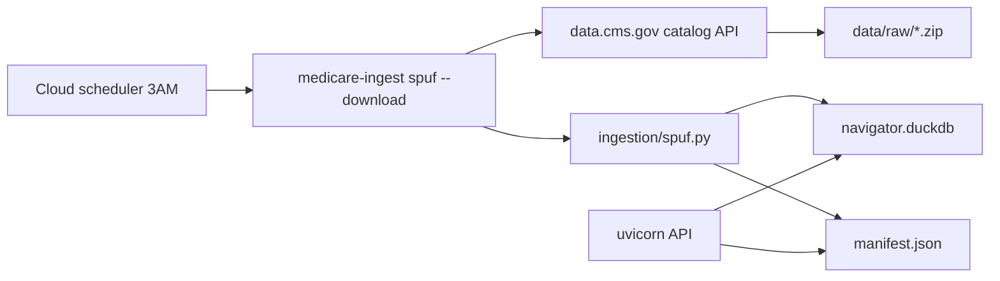

# Phase 3 Implementation Plan

**Medicare Drug Cost & Benefit-Transparency Navigator**

This document records what was built in Phase 3 on top of [phase-2-implementation-plan.md](./phase-2-implementation-plan.md). The functional specification remains [build-requirements.md](../build-requirements.md).

---

## 1. Overview

Phase 3 replaces the demo-only formulary data path with real CMS SPUF ingestion, adds production deployment patterns for scheduled data refresh, surfaces data freshness in health checks, and enriches citations with human-readable source labels and documentation URLs.

**Phase 3 scope:** CMS SPUF download and filtered ingest (FL + TX); manifest-driven source IDs and `as_of` dates; stale contract-year detection; `/api/health` freshness fields; citation URL enrichment; deployment guides and scheduler examples; expanded offline test coverage for ingest and monitoring.

**Explicitly unchanged in Phase 3:** cost-trend and alternatives loaders remain demo seed data; national plan coverage; live tier-change detection across plan years; CI eval gate.

---

## 2. Decisions locked for Phase 3

| Decision | Choice | Rationale |
|---|---|---|
| Real formulary data | **CMS SPUF quarterly zip** via `data.cms.gov` catalog API | Phase 2 deferred full PUF beyond demo subset |
| Geographic filter | **FL + TX** per `config/ingest_filters.yaml` | Keeps ingest tractable while covering two large PDP regions |
| Plan types | **S\*** (stand-alone PDP) and **H\*** (local MA-PD) prefixes | Matches CMS plan-type conventions in SPUF |
| Local dev default | **`medicare-ingest` (demo seed)** | Offline tests and quick iteration without CMS download |
| Production ingest | **`medicare-ingest spuf --download`** via external scheduler | API is read-only; ingest never runs at app startup |
| Demo vs real separation | **Distinct CLI subcommands** (`demo`, `spuf`, `fetch`) | Prevents accidental demo overwrite of production DuckDB |
| Non-SPUF tables | **Preserved by default** (`--preserve-other`) | Cost trends, alternatives, and policy corpus stay on demo seed unless re-seeded |
| Freshness signal | **`manifest.json` `seeded_at`** + `/api/health` `data_fresh` | Simple alert hook for failed 3 AM ingest jobs |
| Stale lookups | **`ToolStatus.stale`** when query contract year ≠ manifest year | Surfaces mismatched plan-year queries without inventing costs |
| Citation URLs | **`source_catalog.py` + `enrich_citations()`** | Beneficiaries and QA graders can trace claims to CMS documentation |
| NDC handling | **11-digit normalization** (`ingestion/ndc.py`) | CMS SPUF uses varied NDC formats; tools expect consistent keys |

---

## 3. Ingestion architecture

### 3.1 Data flow



### 3.2 New ingestion modules

| Module | Role |
|---|---|
| `ingestion/spuf.py` | Parse SPUF zip (plan, formulary, beneficiary cost, pricing files); apply `IngestFilters`; load DuckDB |
| `ingestion/cms_download.py` | Resolve and download latest CMS zip from catalog API; cache under `data/raw/` |
| `ingestion/manifest.py` | Read/write `manifest.json`; `seeded_at`, source IDs, freshness helpers |
| `ingestion/ndc.py` | Normalize NDC to 11-digit keys; display formatting |
| `ingestion/schema.py` | DuckDB table definitions and indexes for SPUF-scale data |
| `ingestion/cli.py` | Subcommands: `demo`, `spuf`, `fetch` |

### 3.3 CLI commands

| Command | When |
|---|---|
| `medicare-ingest` or `medicare-ingest demo` | Local dev — seeds **demo** data (default) |
| `medicare-ingest spuf --download` | Production — downloads latest CMS zip and loads filtered SPUF |
| `medicare-ingest spuf --source path/to.zip` | Ingest a local zip without network fetch |
| `medicare-ingest fetch` | Download CMS zip to `data/raw/` only (no DuckDB write) |
| `scripts/run-daily-ingest.sh` | Wrapper for schedulers (`DATA_DIR`, then `spuf --download`) |

**Do not** schedule bare `medicare-ingest` in production; it overwrites real data with demo seed.

### 3.4 Ingest filters

`config/ingest_filters.yaml`:

- `contract_year: 2026`
- `states: [FL, TX]`
- `pdp_region_codes` — PDP plans use region codes, not state (FL → `11`, TX → `22`)
- `plan_type_prefixes: [S, H]`

Override states at runtime: `medicare-ingest spuf --download --states FL`.

---

## 4. Manifest and freshness

### 4.1 `manifest.json` contract

Written/merged on every ingest via `merge_manifest()`:

| Key | Purpose |
|---|---|
| `seeded_at` | `YYYY-MM-DD` of last ingest (always updated) |
| `spuf.source_id` | e.g. `cms_spuf_2026_q1` |
| `spuf.as_of` | CMS dataset as-of date |
| `spuf.version` | CMS file version label |
| `spuf.contract_year` | Contract year loaded |
| `benefit_params` | Deductible/OOP thresholds (from demo seed or SPUF) |

Runtime helpers: `get_source_id()`, `get_as_of()`, `get_contract_year()`, `get_seeded_at()`.

### 4.2 Freshness logic

`is_data_fresh(max_staleness_days=1)` — `true` when `seeded_at` is today or yesterday.

`data_freshness_summary()` — returns `seeded_at`, `data_fresh`, `spuf_source_id`, `spuf_as_of`, `spuf_version` for health checks.

### 4.3 Stale contract-year handling

`formulary_benefit_lookup()` compares the query `contract_year` to `get_contract_year()` from manifest. When they differ, the tool returns `ToolStatus.stale` with a message directing the user to confirm the plan year — no fabricated tier or copay.

---

## 5. Health and monitoring

### 5.1 Extended `/api/health`

```json
{
  "status": "ok",
  "version": "0.1.0",
  "llm_configured": true,
  "llm_source": "claude-sonnet-4-6",
  "navigator_mode": "mcp_agent",
  "seeded_at": "2026-03-07",
  "data_fresh": true,
  "spuf_source_id": "cms_spuf_2026_q1",
  "spuf_as_of": "2026-01-15",
  "spuf_version": "SPUF.2026.01.15"
}
```

Alert when `data_fresh` is `false` for more than one check cycle (likely nightly ingest failure).

### 5.2 Full dataset metadata

`GET /api/meta/as-of` returns the full `manifest.json` contents for operators and debugging.

See [deployment.md](./deployment.md) for scheduler setup, shared `DATA_DIR` requirements, and platform examples.

---

## 6. Citation enrichment

### 6.1 Source catalog

`guardrails/source_catalog.py` — maps `source_id` values to:

- Human-readable `label` (e.g. "CMS Part D Formulary & Pricing (SPUF)")
- CMS documentation `url`
- `scope` description for UI tooltips

`guardrails/source_urls.py` — additional URL resolution helpers.

### 6.2 `enrich_citations()`

`guardrails/citations.py`:

- Attaches documentation URLs from the source registry when citations lack `url`
- Falls back to policy passage metadata from `policy_retrieval` artifacts
- Builds deterministic claim text via `formulary_citation_claim()` and `trend_citation_claim()`

Wired into the legacy pipeline in `orchestrator/pipeline.py` after synthesis. Synthesis agent updates use `label_for_source_id()` for `source_label` fields.

---

## 7. Tool and storage updates

| Component | Phase 3 change |
|---|---|
| `formulary_benefit.py` | Manifest-driven `source_id` and `as_of`; `ToolStatus.stale` for year mismatch; pharmacy channel cost lookup |
| `lookup_plan.py` | Fuzzy search over SPUF-scale plan set; improved not-found messaging |
| `repository.py` | Expanded queries for plans, formulary rows, and pricing at SPUF scale |
| `supply_estimate.py` | Pharmacy channel parameter alignment with SPUF beneficiary cost columns |
| `mcp/registry.py` | Serialization updates for stale status and manifest metadata |

NDC keys are normalized to 11 digits at ingest time so `normalize_drug` and formulary lookup share consistent identifiers.

---

## 8. Deployment

Phase 3 adds operational docs and scheduler templates — the API remains a modular monolith; ingest is a separate scheduled job.

| Asset | Purpose |
|---|---|
| [deployment.md](./deployment.md) | Architecture, commands, shared volume, monitoring |
| `scripts/run-daily-ingest.sh` | Cron/K8s entrypoint |
| `deploy/k8s/cronjob-spuf-ingest.yaml` | Kubernetes `CronJob` at `0 3 * * *` |
| `deploy/aws/eventbridge-ecs-ingest.md` | AWS EventBridge → ECS Fargate pattern |

First production deploy: run `medicare-ingest spuf --download` once before starting the API.

---

## 9. Test coverage added

| Test file | Covers |
|---|---|
| `test_spuf_ingest.py` | Fixture-based SPUF zip parse and DuckDB load |
| `test_cms_download.py` | Catalog API resolution (mocked); `@pytest.mark.integration` for live CMS |
| `test_manifest_freshness.py` | `seeded_at`, `is_data_fresh`, `data_freshness_summary` |
| `test_health.py` | `/api/health` freshness fields |
| `test_citations.py` | `enrich_citations`, source catalog labels and URLs |
| `test_ndc.py` | NDC normalization and display formatting |

Fixtures: `tests/fixtures/spuf/` — minimal SPUF file set for offline ingest tests.

`pyproject.toml` adds `integration` pytest marker — live CMS tests deselected by default (`pytest tests/ -v`).

Existing suites updated: `test_explain_cost_change.py` (manifest-aware assertions).

---

## 10. Repo layout (Phase 3 additions)

```
config/
└── ingest_filters.yaml          # FL + TX SPUF filters

deploy/
├── k8s/cronjob-spuf-ingest.yaml
└── aws/eventbridge-ecs-ingest.md

docs/
└── deployment.md

scripts/
└── run-daily-ingest.sh

src/medicare_navigator/
├── ingestion/
│   ├── spuf.py                  # new
│   ├── cms_download.py          # new
│   ├── manifest.py              # new
│   ├── ndc.py                   # new
│   └── schema.py                # new
└── guardrails/
    ├── source_catalog.py        # new
    └── source_urls.py           # new

tests/
├── fixtures/spuf/               # new
├── test_spuf_ingest.py          # new
├── test_cms_download.py         # new
├── test_manifest_freshness.py   # new
├── test_health.py               # new
├── test_citations.py            # new
└── test_ndc.py                  # new
```

---

## 11. How to run

```bash
# Local dev — demo seed (default, offline-safe)
medicare-ingest

# Production first load — real CMS data (FL + TX)
medicare-ingest spuf --download

# Daily scheduled ingest (or use scripts/run-daily-ingest.sh)
medicare-ingest spuf --download

# Check data freshness
curl -s http://localhost:8000/api/health | jq '{seeded_at, data_fresh, spuf_source_id}'

# Full manifest
curl -s http://localhost:8000/api/meta/as-of | jq .

# Tests (offline — integration tests skipped by default)
pytest tests/ -v

# Live CMS download test (optional, requires network)
pytest tests/test_cms_download.py -m integration -v

# API (reads DuckDB; does not ingest)
uvicorn medicare_navigator.api.app:app --reload --port 8000
```

---

## 12. Phase 3 → Phase 4 (deferred)

The following were deferred from Phase 3 and implemented in [phase-4-implementation-plan.md](./phase-4-implementation-plan.md):

- Production deployment / hosting (Docker + Render Blueprint)
- Remove demo seed path; SPUF-only ingest and offline fixture for tests

Still deferred (Phase 5+):

- National plan coverage (all states / all PDP regions)
- Real CMS cost-trend and alternatives loaders
- Live tier-change detection across plan years
- Automated eval gate in CI (`.github/` workflows)
- Frontend build pipeline (`frontend/dist` remains gitignored; local-only)

See [build-requirements.md](../build-requirements.md) Section 12 for the full deferred list.
