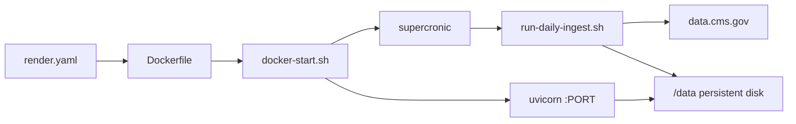

# Phase 4 Implementation Plan

**Medicare Drug Cost & Benefit-Transparency Navigator**

This document records what was built in Phase 4 on top of [phase-3-implementation-plan.md](./phase-3-implementation-plan.md). The functional specification remains [build-requirements.md](../build-requirements.md).

---

## 1. Overview

Phase 4 removes the demo-seed data path, makes SPUF the sole production ingest surface, adds a portable Docker + Render deployment with in-container scheduled refresh, and updates tests and evaluation to use the offline SPUF fixture. Supplemental datasets (cost trends, alternatives, policy corpus) now return honest structured failures instead of fabricated demo rows.

**Phase 4 scope:** drop `medicare-ingest demo` and `ingestion/seed.py`; Docker image with supercronic nightly ingest; Render Blueprint (`render.yaml`); operator config in `config/deploy.yaml`; `tests/spuf_fixture.py` for offline pytest; eval suite aligned to SPUF fixture plan keys; MIT `LICENSE`; deployment doc updates.

**Explicitly unchanged in Phase 4:** national plan coverage; real CMS cost-trend, Orange Book, and policy-corpus loaders; live tier-change detection across plan years; automated eval gate in CI; committed `frontend/dist` build pipeline.

---

## 2. Decisions locked for Phase 4

| Decision | Choice | Rationale |
|---|---|---|
| Local / test data | **SPUF fixture only** (`tests/fixtures/spuf/`) | Same ingest path as production; no parallel demo tables |
| Demo seed | **Removed** | Prevent accidental demo overwrite of production DuckDB |
| CLI surface | **`spuf` and `fetch` subcommands only** | `medicare-ingest spuf --download` is the production entrypoint |
| Render scheduling | **In-container supercronic** | Render cron jobs cannot mount persistent disks |
| Cron config | **`config/deploy.yaml`** (`ingest.cron`, UTC) | Schedule lives in repo; `generate-crontab.py` emits supercronic line |
| Nightly ingest | **`--preserve-other`** in `run-daily-ingest.sh` | SPUF tables refresh; empty supplemental tables are not wiped |
| Missing supplemental data | **`not_found` / `no_match` tool statuses** | Agents must not invent trends, alternatives, or policy passages |
| Pytest bootstrap | **`tests/spuf_fixture.py` + `spuf_db` fixture** | Every test loads minimal FL+TX SPUF + RxNorm cache rows |
| Eval harness | **Loads SPUF fixture before cases** | `queries.jsonl` uses fixture plan keys (`S9999-001`, `H8888-001`, etc.) |
| License | **MIT** | Open-source distribution |

---

## 3. Deployment architecture

### 3.1 Render / Docker flow



### 3.2 New deployment assets

| Asset | Role |
|---|---|
| `Dockerfile` | Python 3.11-slim image; installs app, supercronic, `frontend/dist` |
| `render.yaml` | Blueprint: web service, 5 GB disk at `/data`, env defaults |
| `config/deploy.yaml` | Operator settings — `ingest.cron` (default `0 3 * * *` UTC) |
| `scripts/docker-start.sh` | Generates crontab, starts supercronic in background, execs uvicorn |
| `scripts/generate-crontab.py` | Reads `config/deploy.yaml` → supercronic crontab line |
| `scripts/run-daily-ingest.sh` | `medicare-ingest spuf --download --preserve-other` |
| `LICENSE` | MIT license |

### 3.3 Environment

Production (Render / Docker):

```bash
DATA_DIR=/data
DUCKDB_PATH=/data/navigator.duckdb
CHROMA_PATH=/data/chroma
PORT=8000          # injected by Render
CORS_ORIGINS=https://your-app.onrender.com
```

Local dev uses `./data` paths from `.env.example`.

### 3.4 First deploy checklist

1. Connect GitHub → Render **New Blueprint** → apply `render.yaml`.
2. Set secrets: `ANTHROPIC_API_KEY`, `CORS_ORIGINS`.
3. After deploy, **Shell** on the web service: `medicare-ingest spuf --download`.
4. Verify `GET /api/health` → `data_fresh: true`.

See [deployment.md](./deployment.md) for K8s/AWS alternatives and monitoring.

---

## 4. Data model changes

### 4.1 Removed

| Path | Was |
|---|---|
| `ingestion/seed.py` | Demo DuckDB seeder |
| `config/demo_plans.yaml` | Demo plan allowlist |
| `medicare-ingest demo` CLI subcommand | Default local seed |

### 4.2 Supplemental tables (empty until Phase 5+)

`cost_trends`, `alternatives`, and Chroma policy corpus are **not** populated by SPUF ingest. Tools return structured failures:

| Tool | Empty-table behavior |
|---|---|
| `cost_trend_lookup` | `not_found` — no spending rows for RxCUI |
| `alternatives_finder` | `no_match` — no Orange Book equivalents loaded |
| `policy_retrieval` | `no_match` — no embedded policy passages |

Downstream agents and guardrails must surface these honestly (no fabricated tier-change or trend narratives).

### 4.3 Offline test fixture

`tests/spuf_fixture.py`:

- Ingests `tests/fixtures/spuf/` with FL + TX filters
- Seeds minimal `drugs` cache rows for offline RxNorm (metformin, lisinopril, omeprazole, januvia)
- Exposes `patch_settings()` and pytest `spuf_db` fixture via `conftest.py`

Fixture plan keys used across tests and eval:

| Key | Type |
|---|---|
| `S9999-001` | FL stand-alone PDP |
| `H8888-001` | FL MA-PD |
| `S9999-002` | TX stand-alone PDP |

---

## 5. Ingestion CLI (post–Phase 4)

| Command | When |
|---|---|
| `medicare-ingest spuf --download` | Production first load + nightly refresh |
| `medicare-ingest spuf --source path` | Local zip or `tests/fixtures/spuf` |
| `medicare-ingest fetch` | Download CMS zip to `data/raw/` only |

**There is no demo subcommand.** Local API without CMS download:

```bash
medicare-ingest spuf --source tests/fixtures/spuf
```

---

## 6. Evaluation updates

`medicare-eval` (`eval/run_eval.py`):

- Loads SPUF fixture into `settings.data_dir` before running cases
- Clears LLM API keys for deterministic offline runs
- Writes `eval/results.json` with per-case pass/fail

`eval/queries.jsonl` — 16 cases covering formulary lookup, not-covered, not-found, benefit phases, supply estimates, cost-change questions, and clarification. Plan IDs match the SPUF fixture.

**Not yet in CI:** eval is a manual/local gate (`medicare-eval` exit code 1 on failure). GitHub Actions workflow deferred to Phase 5.

---

## 7. Test coverage changes

| Change | Covers |
|---|---|
| `tests/spuf_fixture.py` | Shared SPUF + drug cache bootstrap |
| `conftest.py` | `spuf_db` fixture; autouse LLM key clearing |
| Updated `test_tools.py`, `test_intake.py`, `test_follow_up.py`, etc. | Fixture plan keys and honest `no_match` for alternatives/trends |
| `test_explain_cost_change.py` | No fabricated tier-change claims without evidence |
| `test_health.py`, `test_citations.py` | Manifest and source catalog without demo seed |

Run offline suite:

```bash
pytest tests/ -v
```

---

## 8. Repo layout (Phase 4 additions / removals)

```
Dockerfile                         # new
render.yaml                        # new
LICENSE                            # new
config/deploy.yaml                 # new (cron schedule)
scripts/docker-start.sh            # new
scripts/generate-crontab.py        # new

config/demo_plans.yaml             # removed
src/medicare_navigator/ingestion/seed.py   # removed

tests/spuf_fixture.py              # new

docs/
├── phase-4-implementation-plan.md # new
└── deployment.md                  # updated (Render section)
```

---

## 9. How to run

```bash
# Local — offline fixture (no CMS download)
medicare-ingest spuf --source tests/fixtures/spuf
uvicorn medicare_navigator.api.app:app --reload --port 8000

# Local — real CMS data (FL + TX)
medicare-ingest spuf --download

# Tests (fixture auto-loaded per test via conftest)
pytest tests/ -v

# Evaluation
medicare-eval

# Docker (local)
docker build -t medicare-navigator .
docker run -p 8000:8000 -v medicare-data:/data \
  -e ANTHROPIC_API_KEY=sk-... medicare-navigator
```

---

## 10. Phase 4 → Phase 5 (deferred)

Not in Phase 4:

- **National plan coverage** — expand `config/ingest_filters.yaml` beyond FL + TX
- **Real supplemental loaders** — CMS Part D spending (cost trends), FDA Orange Book (alternatives), policy corpus → Chroma
- **Live tier-change detection** across plan years with `tier_change_evidence` artifacts
- **CI eval gate** — `.github/workflows` running `pytest` + `medicare-eval` on PRs
- **Frontend build in CI** — `frontend/dist` remains local-only / Docker COPY

See [build-requirements.md](../build-requirements.md) Section 9 for acceptance criteria these items satisfy.
