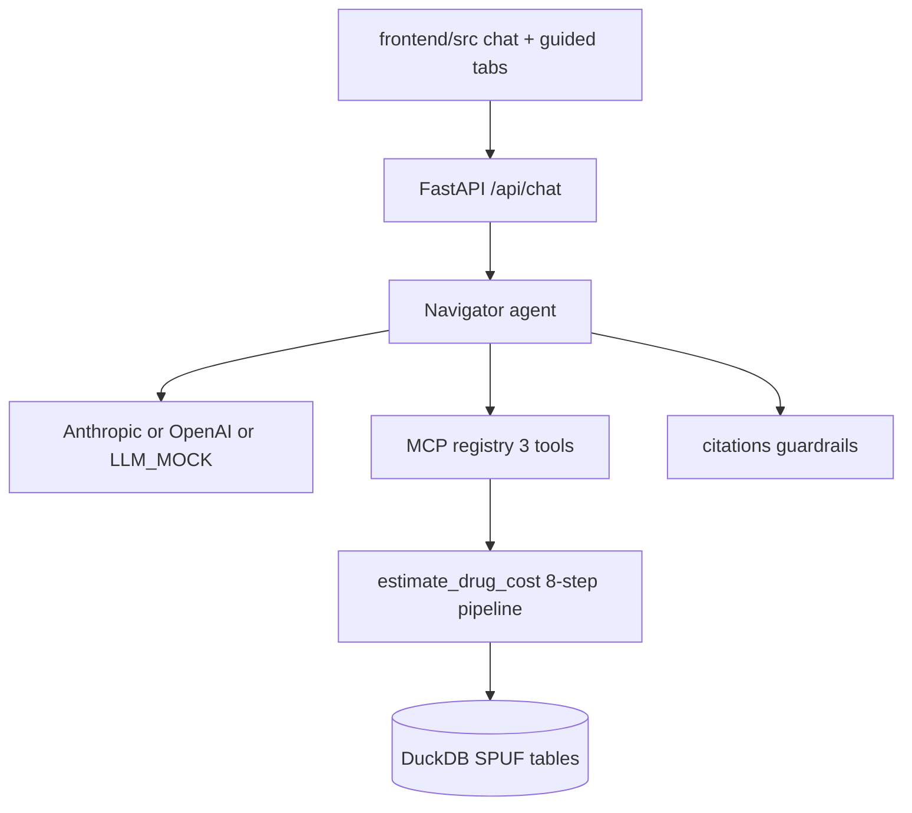

# Phase 6 Implementation Plan

**Medicare Drug Cost & Benefit-Transparency Navigator**

This document records what was built in Phase 6 on top of [phase-5-implementation-plan.md](./phase-5-implementation-plan.md). Phase 6 is a **major scope pivot**: the functional specification is now [navigator-implementation-spec.md](./navigator-implementation-spec.md), not the broader [build-requirements.md](../build-requirements.md) multi-agent assistant.

**Commit range:** `968147c` (last Phase 5 commit) → `0e69aa2` (HEAD at time of writing). Unstaged / untracked work is excluded.

---

## 1. Overview

Phases 1–5 built a broad Medicare assistant: policy Q&A over a Chroma-backed RAG corpus, multi-year cost-trend history, therapeutic alternatives, a clarification agent, and a formulary/cost-share calculator, all orchestrated by an LLM tool-calling loop over seven MCP tools.

Phase 6 discards everything outside a narrower goal: **estimate the out-of-pocket cost of one drug, on one plan's regular formulary, for one fill**, for a non-LIS beneficiary in the pre-deductible or initial-coverage phase — with six specific CMS data-correctness rules ("Bugs" 1–6 in the implementation spec) handled explicitly rather than glossed over. Insulin, excluded-drug formulary entries, and the catastrophic phase are explicit future work, not silently approximated.

Between the Phase 5 doc commit and the pivot, three interim commits landed (`4a60e4a`, `096b63d`, `968147c`). The policy-corpus work from `096b63d` was **fully reverted** in the pivot commit `7f99ea6`. Plan polling and explicit mock mode survived.

**Phase 6 scope:** new four-table SPUF schema persisting previously-discarded CMS fields (`PLAN_SUPPRESSED_YN`, `QUANTITY_LIMIT_*`, `PRIOR_AUTHORIZATION_YN`, `STEP_THERAPY_YN`, `DED_APPLIES_YN`); a single consolidated `estimate_drug_cost` tool implementing the spec's eight-step pipeline and all six bugs; corrected `COVERAGE_LEVEL` code mapping discovered via real CMS data; verbatim-caveat guardrail enforcement; rewritten frontend (chat + guided estimate tabs, Sources-only side panel); explicit `LLM_MOCK` mode; DuckDB schema migrations for persistent Render disks; production resilience for empty/missing schemas; citations on lookup failures; plan-list polling UX; prompt chips aligned to real FL plans.

**Deleted in Phase 6:** `agents/` (clarification, policy, synthesis), `intake/`, `orchestrator/pipeline.py`, `agent/fallback.py`, `ingestion/policy_corpus.py`, `tools/{policy_retrieval,cost_trend,alternatives,ira_drugs,formulary_benefit,supply_estimate}.py`, `config/{policy_corpus,benefit_params}.yaml`, the Chroma vector store dependency (`chromadb`), and the `instructor` dependency.

**Explicitly unchanged / still deferred:** national multi-state real-data coverage beyond ingested states; insulin / excluded-drugs / catastrophic-phase estimators; CI eval gate on PRs; npm/bundler frontend pipeline; stale references to Chroma in `docs/deployment.md`, `docs/data-sources.md`, and `scripts/docker-start.sh` (directory still created but unused).

---

## 2. Major scope shift from build-requirements

| Area | Phases 1–5 (`build-requirements.md`) | Phase 6 (`navigator-implementation-spec.md`) |
|---|---|---|
| Primary user goal | Explain formulary, trends, alternatives, and policy in plain language | Estimate dollar cost for **one drug fill on one plan** |
| MCP tools | 7 tools (normalize, formulary, cost trend, alternatives, policy retrieval, supply estimate, IRA drugs) | 3 tools (`estimate_drug_cost`, `lookup_plan`, `list_plans`) |
| Agents | Intake, policy, synthesis, clarification | Single navigator agent with tool-calling loop only |
| Orchestration | `orchestrator/pipeline.py` legacy mode + navigator mode | `orchestrator/router.py` → `Navigator` only |
| Policy Q&A | Chroma RAG over `config/policy_corpus.yaml` | Removed entirely |
| Cost trends / alternatives | DuckDB tables + dedicated tools | Removed entirely |
| Response model | `FormularyResult`, `CostTrend`, `Alternative`, `SupplyEstimate` | `DrugCostEstimate` only |
| Frontend results panel | Formulary card, trend bars, alternatives list, citations | **Sources panel** (citations + data-as-of only); cost in chat text |
| Data correctness | General failure contract (Section 5.5) | Six named CMS bugs with verbatim caveats and hard stops |
| Source of truth doc | `build-requirements.md` | `navigator-implementation-spec.md` for v1 scope |

`build-requirements.md` remains the long-term product vision. Phase 6 intentionally ships a **trimmed, verifiable slice** where every dollar figure traces to a deterministic eight-step pipeline.

---

## 3. Product boundaries (can / can't)

This section is the user-facing scope contract. The implementation spec and system prompt (`agent/prompts.py`) match these boundaries; hard stops are enforced inside `estimate_drug_cost`, not left to the LLM.

### Can (in scope)

| Boundary | What the tool does |
|---|---|
| **Medicare Part D** | Estimates drug cost for standalone PDPs and MAPD plans with a Part D benefit, using CMS SPUF quarterly data |
| **Ingested states** | Real CMS data verified for **FL** (572 plans in the 2026 zip) |
| **Non-insulin drugs** | Generic or brand drugs on a plan's **regular** (`basic_drugs_formulary`) tier |
| **Orally administered** | Tablets, capsules, and other standard oral formulations |
| **Non-LIS beneficiaries** | Assumes no Low-Income Subsidy; published copay rows used as-is |
| **Pre-deductible or initial-coverage phase** | User supplies YTD OOP; tool applies per-tier `DED_APPLIES_YN` overrides (Bug 2) |
| **One drug, one plan, one fill** | Single cost estimate per request |
| **30 / 60 / 90-day fills** | Standard CMS days-supply codes via `DAYS_SUPPLY_CODE_MAP` (Bug 1) |
| **Copay cost-sharing** | Returns a dollar estimate when the matched tier's cost-share type is copay |
| **Prior auth / step therapy** | Surfaces PA or ST as a verbatim caveat; cost still computed (soft caveat) |
| **Multiple NDCs per drug** | Reports a low–high range across matched manufacturer NDCs (Bug 5) |
| **Plan lookup** | Resolve by contract–plan ID (`S5921-383`) or list plans in ingested state(s) |

### Can't (out of scope)

| Boundary | What happens instead |
|---|---|
| **Un-ingested states** | No plan/drug rows unless that state was ingested |
| **Insulin** | **Hard stop** — `is_insulin()` routes before formulary lookup |
| **Medicaid** | Not supported — Medicare Part D SPUF only |
| **LIS / Extra Help** | Not supported |
| **Catastrophic coverage phase** | Not computed — TrOOP threshold not in SPUF |
| **Excluded-drug formulary** | Not supported |
| **Indication-based restrictions** | Not supported |
| **Coinsurance dollar amounts** | **Not computed** — Bug 4 caveat returned instead |
| **Suppressed plans** | **Hard stop** — `PLAN_SUPPRESSED_YN=Y` (Bug 6) |
| **Quantity-limit violations** | **Hard stop** when requested days supply exceeds plan limit (Bug 5b) |
| **Non-standard fill sizes** | Partial estimate (ingredient cost only) when days supply is not 30/60/90 |
| **Policy Q&A, alternatives, cost trends** | Removed in Phase 6 |
| **Plan switching / enrollment advice** | Never recommended |
| **Real-time pharmacy pricing** | CMS quarterly reference data only |

---

## 4. Decisions locked for Phase 6

| Decision | Choice | Rationale |
|---|---|---|
| Tool granularity | **One consolidated `estimate_drug_cost` tool** + `lookup_plan` / `list_plans` helpers | Hard-stop ordering (suppressed check first; days-supply mapping before joins) must not depend on LLM tool-call sequencing |
| Drug resolution | **`normalize_drug()` called internally**, not LLM-visible | Insulin hard-stop lives inside drug resolution |
| Suppressed plans (Bug 6) | **Persist `plan_suppressed`, do not filter at ingest** | Ingest-time exclusion prevented the mandated hard-stop from ever firing |
| Coinsurance (Bug 4) | **Excluded from cost range**, never estimated | CMS layout does not confirm coinsurance dollar base |
| PA / step therapy | **Soft caveat, cost still computed** | Contrasts with Bug 6's explicit hard stop |
| `COVERAGE_LEVEL` codes | **0 = deductible, 1 = initial coverage, 3 = catastrophic** (2 unused) | Verified against real 2026 FL data — initial 1/2 assumption was wrong |
| Disclaimer enforcement | **Guardrail force-appends**, not prompt-only | Bug 4/6 text must never be dropped by LLM paraphrase |
| Days-supply mapping | **Single named lookup** (`tools/days_supply.py`) | Spec forbids inlining at each join site |
| Multi-NDC pricing (Bug 5) | **Independent per-NDC computation, low–high range** | Different manufacturers can differ in tier and price |
| LLM without API key | **`LLM_MOCK=1` explicit mode**; 503 on `/api/health` and chat when unconfigured | Replaced silent heuristic fallback (`agent/fallback.py` deleted) |
| Persistent disk schema | **`migrate_schema()` additive ALTERs** | Render disks survive deploys; `CREATE TABLE IF NOT EXISTS` does not add new columns |
| API read paths | **Read-only DuckDB connections** for `fetchone`/`fetchall` | Safe concurrent reads during background ingest |
| Frontend during ingest | **Poll `/api/plans` every 20s** (max 30 attempts) + Refresh button | Phase 5 deferred UX item, shipped in `4a60e4a` |
| Lookup failures in UI | **Show citations and data-as-of** even for `not_found` / `not_covered` | User sees which source was queried (`f29959e`) |

---

## 5. Architecture (post-pivot)



The orchestrator is a thin router — no legacy pipeline mode:

```python
# orchestrator/router.py
return await navigator.run(message, filter_slots=filter_slots, session_id=session_id)
```

MCP tools (down from 7):

| Tool | Role |
|---|---|
| `estimate_drug_cost` | Eight-step deterministic cost pipeline |
| `lookup_plan` | Resolve plan by key or search text |
| `list_plans` | List ingested plans (powers `/api/plans` and guided form) |

---

## 6. New DB schema

Rebuilt from scratch for greenfield installs — existing Render disks get additive migrations instead of full rebuild.

```
plans                    plan_key PK, contract_id, plan_id, plan_name, plan_type, state,
                          contract_year, formulary_id, deductible, plan_suppressed

basic_drugs_formulary     formulary_id, ndc, rxcui, tier, quantity_limit_yn,
   (was: formulary)        quantity_limit_amount, quantity_limit_days,
                           prior_authorization_yn, step_therapy_yn, as_of_date

pricing                   plan_key, ndc, days_supply (raw day count), unit_cost

beneficiary_cost          plan_key, tier, coverage_level, days_supply_code (CMS 1–4),
                          pharmacy_channel, cost_type, copay, coinsurance_pct,
                          ded_applies_yn, as_of_date
```

**Removed tables:** `cost_trends`, `alternatives`, `policy_passages`.

**Schema migrations** (`ingestion/schema.py`):

```python
SCHEMA_MIGRATIONS = (
    ("plans", "plan_suppressed", "BOOLEAN DEFAULT FALSE"),
    ("beneficiary_cost", "ded_applies_yn", "BOOLEAN"),
)
```

`ensure_schema()` calls `create_tables(drop_existing=False)` → `migrate_schema()` → `create_indexes()`. Invoked on FastAPI lifespan and in `scripts/docker-start.sh` before uvicorn.

**Ingestion changes** (`ingestion/spuf.py`):

- `PLAN_SUPPRESSED_YN` no longer filtered at ingest — suppressed plans persist for Bug 6 hard stop
- `basic_drugs_formulary` dedupes to max `FORMULARY_VERSION` per `(formulary_id, contract_year)`
- `_extract_cost_shares` retains **all** `days_supply` / `coverage_level` CMS codes (not just code 1)
- Phase 5 batch inserts, progress logging, `--merge-states`, and index drop/recreate unchanged

---

## 7. `estimate_drug_cost` — the consolidated tool

`src/medicare_navigator/tools/estimate_drug_cost.py` runs spec Section 3's eight steps as one deterministic async function:

1. Resolve plan → hard stop if `plan_suppressed` (Bug 6)
2. Resolve drug via `normalize_drug()` → hard stop if insulin
3. Formulary lookup → screen NDCs against `QUANTITY_LIMIT_*` (Bug 5b); PA/ST soft caveat
4. Map days supply via `DAYS_SUPPLY_CODE_MAP` (Bug 1); unmapped values take explicit "other" branch
5. Price each surviving NDC: `unit_cost × ceil(days_supply / 1)` (Bug 3)
6. Benefit phase from YTD vs deductible; per-tier `DED_APPLIES_YN` override (Bug 2)
7. Cost-share lookup; coinsurance NDCs excluded from range (Bug 4)
8. Assemble `DrugCostEstimate`: low–high range, all triggered caveats attached verbatim

Supporting modules:

| Module | Role |
|---|---|
| `tools/days_supply.py` | `DAYS_SUPPLY_CODE_MAP` — 30→1, 60→4, 90→2 |
| `tools/insulin.py` | `is_insulin()` name/ingredient allowlist |
| `tools/disclaimers.py` | Verbatim Bug 2/4/5/5b/6 and insulin messages |
| `tools/lookup_plan.py` | Plan resolution helper exposed to MCP |

New `ToolStatus` values: `suppressed`, `insulin_out_of_scope`, `quantity_limit_blocked`.

---

## 8. LLM, prompt, and guardrail changes

### Explicit mock mode (`968147c`)

- Deleted `agent/fallback.py` (silent heuristic answers when LLM unavailable)
- `llm/client.py`: `is_available()` true when API key **or** `LLM_MOCK=1`
- `llm/errors.py`: `LLMNotConfiguredError`, `LLMRequestError`
- `/api/health` returns **503 degraded** when LLM not configured
- `/api/chat` and `/api/query` return **503** / **502** with structured error detail
- `llm/mock.py`: simplified single-tool mock flow for offline tests and eval

### Navigator (`agent/navigator.py`)

- Extracts `DrugCostEstimate` from `estimate_drug_cost` artifacts
- Sets `not_found` when tool returns `not_found`/`no_match`, or `lookup_plan` fails on a parsed plan ID in the message
- Guardrail retry on citation/dollar-amount validation failure

### Guardrails (`guardrails/citations.py`)

- `apply_guardrails` force-appends tool caveats and hard-stop messages not verbatim in LLM output
- `_ENFORCED_STATUSES`: `suppressed`, `insulin_out_of_scope`, `quantity_limit_blocked`
- **`f29959e`:** `build_citations_from_artifacts` emits citations for lookup failures (`not_found`, `not_covered`, suppressed, insulin, quantity-limit) so the Sources panel shows what was queried
- Fixed false positives: `not_covered` no longer triggers dollar-amount retry; insulin "$35/month" text in hard-stop message no longer flagged as untraceable

### Dependencies removed (`pyproject.toml`)

- `chromadb` — policy RAG removed
- `instructor` — structured completion only served deleted pipeline

### Render config

- `CHROMA_PATH` removed from `render.yaml` and `.env.example`
- `scripts/docker-start.sh` still `mkdir -p` for `$CHROMA_PATH` (harmless legacy; no code reads it)

---

## 9. Frontend rewrite

Phase 6 is a second rewrite on the Phase 5 static UI. Cost and caveats live in the **chat transcript**; the right panel is **Sources only**.

### Layout change

| Before (Phase 5) | After (Phase 6) |
|---|---|
| 3-column: filters · chat · results | 2-column: **main panel** · **Sources** |
| Filters always in left sidebar | Filters in **Guided estimate** tab |
| Formulary card + trend bars + alternatives + citations | **Citations only** + data-as-of badge + tool-status footer |
| `filter-alternatives` / `filter-trend` checkboxes | Removed |

### Dual input modes

1. **Ask in chat** — free-form textarea; optional guided-form filters still sent via `getFilters()`
2. **Guided estimate** — drug, dosage, plan (with Refresh + poll), contract year, days supply (30/60/90), YTD OOP. **Get estimate** composes a natural-language prompt, calls `/api/chat`, switches to chat tab

### Plan polling (`4a60e4a`)

- `pollPlansUntilLoaded()`: 20s interval, max 30 attempts while DB empty
- `plan-load-hint` status text; **Refresh** button reloads `/api/plans`
- Prompt chips updated to real FL plan `S5921-383` (`0e69aa2`)

### Error handling (`eeedba0`)

- `chatErrorMessage()` parses FastAPI JSON `detail`, plain text, and validation arrays
- User-visible assistant message on 502/503 instead of silent failure

### Lookup failure Sources (`f29959e`)

- `renderResults()` shows citations/data-as-of for `needs_clarification` and `not_found` when no baseline exists

### Cache busting (`0e69aa2`)

- `_NoCacheFrontendMiddleware` in `api/app.py`: `Cache-Control: no-cache` on `/`, `.html`, `.js`, `.css`
- `index.html` meta tag + `?v=` query params on static assets

### Cost display model

The UI does **not** render a dedicated cost-range card from `response.estimate`. Dollar figures appear in the assistant `explanation`. API still returns `estimate` for tests and guardrails.

---

## 10. Production resilience (`5ed9e7e`, `eeedba0`)

| Change | Behavior |
|---|---|
| Read-only DuckDB reads | `DuckDBConnection.fetchone/fetchall` use `read_only=True`; swallow missing-table `CatalogException` → `None` / `[]` |
| Empty disk bootstrap | `ensure_schema()` on lifespan + docker-start before serving |
| Legacy disk migration | `migrate_schema()` adds `plan_suppressed`, `ded_applies_yn` to pre-Phase-6 tables |
| Graceful empty DB | `/api/plans` returns `[]`; chat returns `not_found` with explanation when schema exists but no matching rows |
| Tests | `tests/test_db_resilience.py`, `tests/test_connection.py`, `tests/test_health.py` |

---

## 11. Real-data findings (FL-only ingest)

The cached CMS SPUF zip (`data/raw/SPUF_2026_20260408.zip`) re-ingested with `--states FL`: **572 plans**, 188,841 formulary rows, 5,726,853 pricing rows, 60,314 beneficiary-cost rows.

**COVERAGE_LEVEL correction:** real values are **0** (deductible), **1** (initial coverage), **3** (catastrophic). Code **2** never appears. The pre-pivot 1/2 assumption would have matched wrong cost-share rows (e.g. returning $0 catastrophic copay instead of Bug 4 coinsurance disclaimer). Fixed in `estimate_drug_cost.py`; fixtures updated.

Other real-data checks: quantity-limit blocking (Bug 5b) and coinsurance exclusion (Bug 4) confirmed. No suppressed plans or multi-NDC-per-formulary drugs in the FL slice — covered by fixture unit tests.

### Example live query (plan `S5921-383`, lovastatin 40mg, $0 YTD)

- Plan: **AARP Medicare Rx Preferred from UHC (PDP)**, Florida 2026
- Raw phase: `pre_deductible` ($130 deductible, $0 YTD)
- Tier 1 has `DED_APPLIES_YN=N` → Bug 2 override applies $5.00 initial-coverage copay
- Tool returns `benefit_phase: pre_deductible` with $5.00 reflecting the override; Bug 2 caveat discloses tier exemption

(`H8888-001` / `S9999-001` are **fixture-only** synthetic plans for offline tests, not real CMS plans.)

---

## 12. Test coverage

| File | Covers |
|---|---|
| `tests/test_estimate_drug_cost.py` | Bugs 1–6, insulin, suppressed plan, PA/ST caveat |
| `tests/test_spuf_ingest.py` | New schema, suppressed persistence, FORMULARY_VERSION dedup, QL/PA/ST/DED_APPLIES_YN, all days-supply/coverage codes |
| `tests/test_mcp_registry.py` | Three-tool dispatch, suppressed/insulin routing |
| `tests/test_navigator.py` | End-to-end agent: cost estimate, clarification, hard stops |
| `tests/test_citations.py` | Artifact citations, guardrail force-append, lookup-failure citations |
| `tests/test_db_resilience.py` | Missing schema, legacy migration, empty-DB chat |
| `tests/test_connection.py` | Read-only connection behavior |
| `tests/test_health.py` | `/api/health` degraded when LLM unconfigured |
| `tests/test_ui.py` | Frontend dist contract; `estimate` in `CHAT_RESPONSE_UI_FIELDS` |
| `ui_test/checks.py` | Guided-estimate IDs, `switchMode`/`submitGuidedEstimate`, cost smoke messages |

**85 tests pass** (2 integration tests deselected by default). Run:

```bash
scripts/build-frontend.sh   # optional; conftest runs it if needed
pytest tests/ -v
```

`medicare-eval` passes **12/12** cases against the offline fixture with `LLM_MOCK=1`.

**Deleted test files** (features removed): `test_clarification.py`, `test_intake.py`, `test_follow_up.py`, `test_explain_cost_change.py`, `test_pipeline_policy.py`, `test_policy_agent.py`, `test_policy_corpus.py`, `test_policy_retrieval.py`, `test_supply_estimate.py`, `test_synthesis.py`, `test_tools.py`.

---

## 13. Repo layout (Phase 6 additions / changes)

```
docs/
├── navigator-implementation-spec.md   # new — v1 scope + Bugs 1–6
└── phase-6-implementation-plan.md     # this file

src/medicare_navigator/
├── tools/
│   ├── estimate_drug_cost.py          # new — consolidated 8-step tool
│   ├── days_supply.py                 # new
│   ├── insulin.py                     # new
│   ├── disclaimers.py                 # new
│   └── lookup_plan.py                 # kept / simplified
├── ingestion/
│   ├── schema.py                      # 4-table shape + migrations
│   └── spuf.py                        # QL/PA/ST/DED_APPLIES_YN + plan_suppressed
├── storage/
│   ├── connection.py                  # read-only fetch + missing-table handling
│   └── repository.py                  # BasicDrugsFormularyRepository, BeneficiaryCostRepository
├── models/response.py                 # DrugCostEstimate; removed trend/alternative types
├── mcp/{schemas,registry}.py          # 3 tools
├── agent/{prompts,navigator}.py       # narrow scope prompt
├── llm/{client,mock,errors,types}.py  # explicit mock mode
├── guardrails/citations.py            # verbatim enforcement + failure citations
├── orchestrator/router.py             # navigator-only (pipeline deleted)
└── api/app.py                         # LLM error HTTP codes, no-cache middleware

frontend/src/                          # 2-col chat/guided + Sources
scripts/docker-start.sh                # ensure_schema before uvicorn

(deleted)
  agents/, intake/, orchestrator/pipeline.py, agent/fallback.py,
  ingestion/policy_corpus.py,
  tools/{policy_retrieval,cost_trend,alternatives,ira_drugs,formulary_benefit,supply_estimate}.py,
  config/{policy_corpus,benefit_params}.yaml
```

---

## 14. How to run

```bash
# Build frontend for local dev / tests
scripts/build-frontend.sh

# Local — offline fixture
medicare-ingest spuf --source tests/fixtures/spuf
LLM_MOCK=1 uvicorn medicare_navigator.api.app:app --reload --port 8000

# Local — real CMS data, FL only (low memory: add --merge-states)
medicare-ingest spuf --source data/raw/SPUF_2026_20260408.zip --states FL

# UI contract checks
medicare-ui-test run --offline

# Tests
pytest tests/ -v

# Eval
LLM_MOCK=1 python -m medicare_navigator.eval.run_eval

# Docker (builds frontend inside image)
docker build -t medicare-navigator .
docker run -p 8000:8000 -v medicare-data:/data \
  -e ANTHROPIC_API_KEY=sk-... medicare-navigator
```

---

## 15. Commits in Phase 6

| Commit | Summary |
|---|---|
| `106ad37` | Add Phase 5 implementation plan (documentation only) |
| `4a60e4a` | Read-only DuckDB reads; frontend plan polling + Refresh button |
| `096b63d` | Policy corpus ingestion + pipeline integration **(reverted in `7f99ea6`)** |
| `968147c` | Explicit `LLM_MOCK` mode; delete silent `agent/fallback.py`; `/api/health` degraded state |
| `7f99ea6` | **Pivot:** Phase 6 MCP cost navigator; delete legacy agents/tools/Chroma; new spec + schema + frontend |
| `5ed9e7e` | DuckDB `migrate_schema()` for legacy persistent databases |
| `eeedba0` | Missing-schema graceful handling; chat error messages in frontend; `ensure_schema` in docker-start |
| `f29959e` | Citations and data-as-of for lookup failures in Sources panel |
| `0e69aa2` | Real-plan prompt chips (`S5921-383`); no-cache middleware + asset versioning |

---

## 16. Phase 6 → Phase 7 (deferred)

Not in Phase 6 (committed scope):

- **Insulin cost-share** — separate $35/month statutory cap, separate CMS file
- **Excluded-drugs formulary** — enhanced/supplemental plan coverage only
- **Indication-based coverage restrictions**
- **Catastrophic-phase computation** — annual TrOOP threshold not in SPUF
- **Confirmed coinsurance base** — replace Bug 4 disclaimer with computation when authoritative
- **National multi-state ingest** — expand beyond FL real-data verification; automate multi-state `--merge-states`
- **CI eval gate** — `.github/workflows` running `pytest` + `medicare-eval` on PRs
- **Frontend bundler** — minification, cache-busting build step (current copy-is-build)
- **Doc cleanup** — remove stale Chroma references from `deployment.md`, `data-sources.md`, deployment-agent skill

See [navigator-implementation-spec.md](./navigator-implementation-spec.md) Section 6 and [build-requirements.md](../build-requirements.md) Section 9 for longer-term acceptance criteria.
