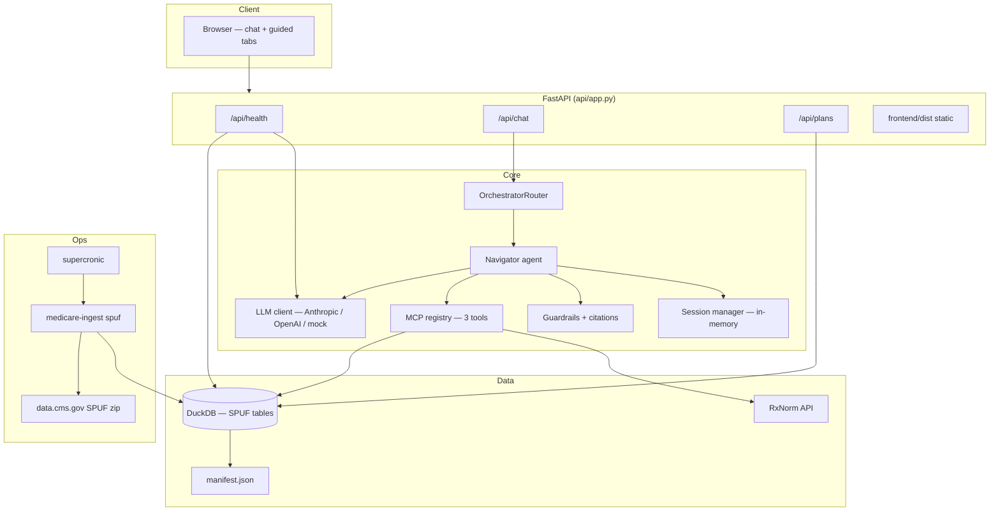
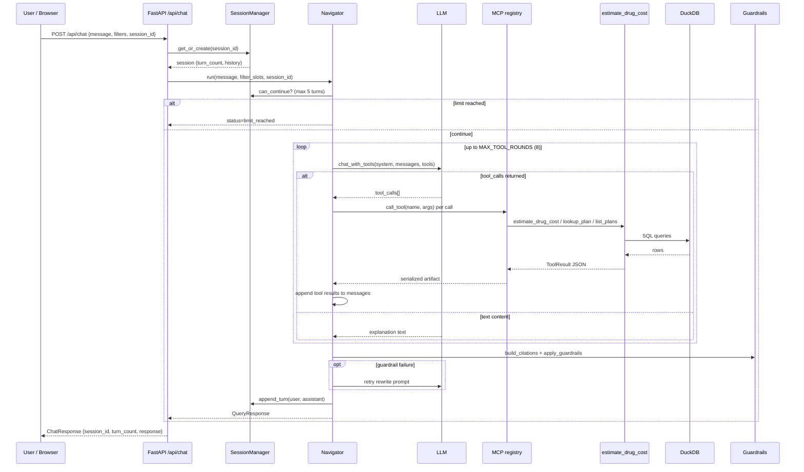
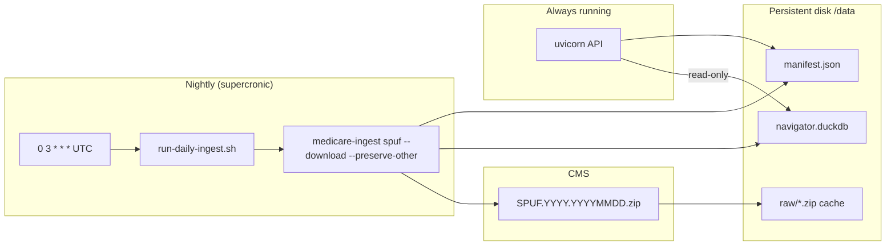
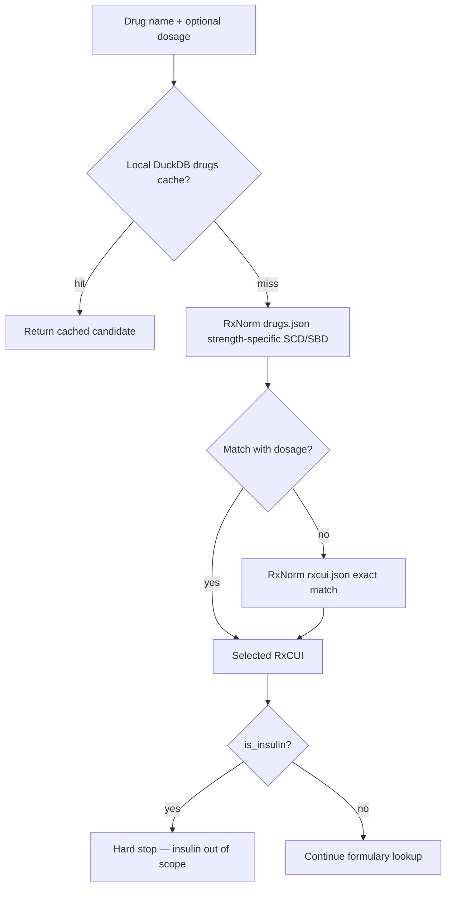
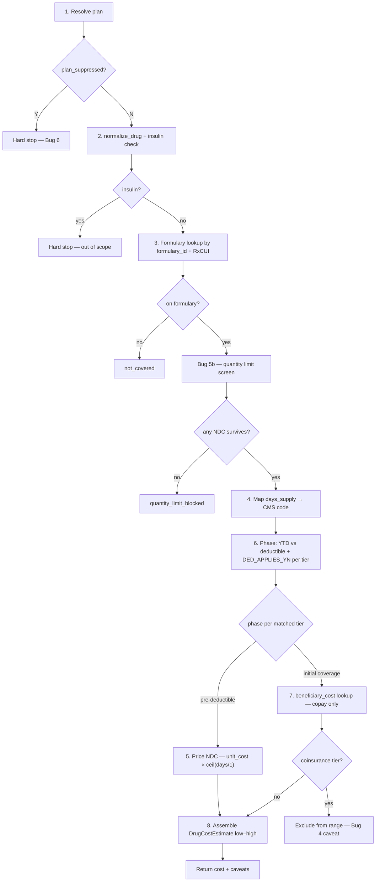
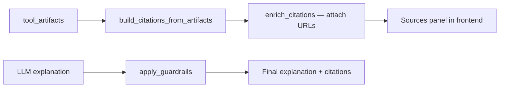
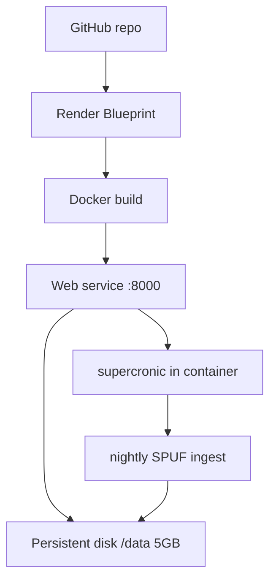

# Medicare Drug Cost Navigator — Technical Notes

Developer reference for running, developing, testing, and deploying the system. This document reflects **Phase 6** scope (see [navigator-implementation-spec.md](./navigator-implementation-spec.md) and [phase-6-implementation-plan.md](./phase-6-implementation-plan.md)).

---

## Table of contents

1. [What this system does](#1-what-this-system-does)
2. [Technology stack](#2-technology-stack)
3. [High-level architecture](#3-high-level-architecture)
4. [Request and data flows](#4-request-and-data-flows)
5. [Cost estimation pipeline](#5-cost-estimation-pipeline)
6. [Repository layout](#6-repository-layout)
7. [Local development](#7-local-development)
8. [Data ingestion](#8-data-ingestion)
9. [Database schema](#9-database-schema)
10. [API reference](#10-api-reference)
11. [MCP tools and agent loop](#11-mcp-tools-and-agent-loop)
12. [LLM integration](#12-llm-integration)
13. [Guardrails and citations](#13-guardrails-and-citations)
14. [Frontend](#14-frontend)
15. [Testing](#15-testing)
16. [Evaluation and QA CLIs](#16-evaluation-and-qa-clis)
17. [Deployment](#17-deployment)
18. [Configuration reference](#18-configuration-reference)
19. [Troubleshooting](#19-troubleshooting)
20. [Related documentation](#20-related-documentation)

---

## 1. What this system does

The Medicare Drug Cost Navigator estimates **out-of-pocket cost for a single drug fill on a single Medicare Part D plan's regular formulary**, for a non-LIS beneficiary in the pre-deductible or initial-coverage phase.

| In scope | Out of scope |
|---|---|
| One drug, one plan, one fill (30/60/90-day) | Insulin, excluded-drug formulary, catastrophic phase |
| Copay cost-sharing with dollar estimate | Coinsurance dollar amounts (caveat only) |
| FL real CMS data (configurable) | Un-ingested states |
| Prior auth / step therapy as soft caveats | LIS / Medicaid / enrollment advice |
| Multi-NDC low–high cost range | Policy Q&A, alternatives, cost trends (removed Phase 6) |

The LLM is a **conversational layer** over three deterministic MCP tools. Dollar figures always originate from `estimate_drug_cost`, not from model invention.

---

## 2. Technology stack

### 2.1 Runtime and language

| Layer | Technology | Version / notes |
|---|---|---|
| Language | **Python** | `>=3.11` (`pyproject.toml`) |
| Package manager | **pip** + **hatchling** | Editable install: `pip install -e ".[dev]"` |
| ASGI server | **uvicorn** | Serves FastAPI; binds `0.0.0.0:$PORT` in production |

### 2.2 Backend framework and libraries

| Component | Library | Role |
|---|---|---|
| HTTP API | **FastAPI** | REST endpoints, static file serving, lifespan hooks |
| Validation | **Pydantic v2** + **pydantic-settings** | Request/response models, env-based config |
| Embedded OLAP DB | **DuckDB** | SPUF tabular data, query log, read-only API paths |
| HTTP client | **httpx** | RxNorm API calls in `normalize_drug` |
| LLM — Anthropic | **anthropic** SDK | Tool-calling with Claude models |
| LLM — OpenAI | **openai** SDK | Tool-calling with GPT models |
| Config files | **PyYAML** | `config/ingest_filters.yaml`, `config/deploy.yaml` |
| MCP protocol | **mcp** (`FastMCP`) | Optional external MCP server (`mcp/server.py`) |
| Multipart uploads | **python-multipart** | FastAPI dependency |

**Removed in Phase 6:** `chromadb` (policy RAG), `instructor` (structured completion for deleted agents).

### 2.3 Frontend

| Component | Technology | Notes |
|---|---|---|
| UI | **Vanilla HTML/CSS/JS** | No npm, bundler, or framework |
| Build | `scripts/build-frontend.sh` | Copies `frontend/src/*` → `frontend/dist/` |
| API client | `fetch()` | Same-origin; `window.location.origin` |
| Markdown rendering | Lightweight regex in `app.js` | Chat messages only |

### 2.4 External data sources (live)

| Source | Protocol | Used by |
|---|---|---|
| **CMS SPUF** (quarterly zip) | HTTPS download from data.cms.gov | `medicare-ingest spuf` → DuckDB |
| **RxNorm REST API** (NLM) | HTTPS JSON | `normalize_drug()` (internal to cost pipeline) |

Offline tests use `tests/fixtures/spuf/` — no network required for pytest.

### 2.5 Infrastructure and ops

| Component | Technology | Notes |
|---|---|---|
| Container | **Docker** (multi-stage) | Python 3.11-slim + Alpine frontend copy stage |
| PaaS | **Render** | `render.yaml` Blueprint, persistent disk at `/data` |
| In-container cron | **supercronic** | Nightly SPUF refresh; schedule from `config/deploy.yaml` |
| Alt schedulers | K8s CronJob, AWS EventBridge | See `deploy/k8s/`, `deploy/aws/` |
| Lint (dev) | **ruff** | `line-length = 100`, target `py311` |
| Tests | **pytest** + **pytest-asyncio** | `asyncio_mode = auto` |

### 2.6 CLI entry points (`pyproject.toml` scripts)

| Command | Module | Purpose |
|---|---|---|
| `medicare-ingest` | `ingestion/cli.py` | SPUF download + DuckDB load |
| `medicare-eval` | `eval/run_eval.py` | Acceptance eval over `queries.jsonl` |
| `medicare-chat-invoke` | `qa/cli.py` | Hit `/api/chat` from terminal |
| `medicare-ui-test` | `ui_test/cli.py` | Static/API/chat smoke checks |

---

## 3. High-level architecture



**Key design choices:**

- **Single agent, no multi-agent pipeline.** `orchestrator/router.py` delegates directly to `Navigator`.
- **One consolidated cost tool.** The eight-step CMS pipeline runs inside `estimate_drug_cost` so hard-stop ordering cannot be skipped by LLM tool-call sequencing.
- **API reads only DuckDB.** Ingestion is a separate scheduled job, not an app startup hook.
- **Sessions are in-process memory.** Not persisted across restarts or horizontal scale-out.

---

## 4. Request and data flows

### 4.1 Chat request lifecycle



### 4.2 Ingestion vs. serving (production)



### 4.3 Drug name resolution (internal)

`normalize_drug` is **not** an LLM-visible tool. It runs inside `estimate_drug_cost`:



---

## 5. Cost estimation pipeline

Implemented in `src/medicare_navigator/tools/estimate_drug_cost.py`. Full spec: [navigator-implementation-spec.md](./navigator-implementation-spec.md).



Steps 5 and 7 are alternatives selected by step 6's phase result (per matched tier), not a sequential pair — a pre-deductible tier is priced from `pricing.UNIT_COST` (step 5) and never touches `beneficiary_cost`; an initial-coverage tier is priced from the copay in `beneficiary_cost` (step 7) and never touches `pricing`.

### 5.1 CMS "bugs" handled explicitly

| ID | Issue | Handling |
|---|---|---|
| Bug 1 | `pricing.DAYS_SUPPLY` ≠ `beneficiary_cost.DAYS_SUPPLY` | `DAYS_SUPPLY_CODE_MAP` in `tools/days_supply.py`: 30→1, 60→4, 90→2 |
| Bug 2 | Deductible is per-tier (`DED_APPLIES_YN`) | Override phase per tier; append Bug 2 caveat |
| Bug 3 | `UNIT_COST` is per unit, not per fill | `ceil(days_supply / 1)` × unit cost |
| Bug 4 | Coinsurance dollar base unknown | Never compute dollars; verbatim caveat |
| Bug 5 | Multiple NDCs per RxCUI | Independent per-NDC cost; report low–high range |
| Bug 5b | Quantity limits | Hard stop if requested fill exceeds limit |
| Bug 6 | Suppressed plans (`PLAN_SUPPRESSED_YN=Y`) | Hard stop; plans ingested but not silently filtered |

### 5.2 Coverage level codes (verified against 2026 FL data)

| Code | Meaning | Used in v1 |
|---|---|---|
| 0 | Deductible phase | Yes |
| 1 | Initial coverage | Yes |
| 2 | Coverage gap | Unused post-IRA redesign |
| 3 | Catastrophic | Not computed (out of scope) |

### 5.3 `DrugCostEstimate` response shape

```python
# models/response.py (abbreviated)
class DrugCostEstimate(BaseModel):
    plan_key: str
    plan_name: str
    drug_name: str
    rxcui: str | None
    tiers_matched: list[int]
    matched_ndc_count: int
    same_tier: bool
    days_supply: int
    benefit_phase: str | None      # "pre_deductible" | "initial_coverage"
    cost_low: float | None
    cost_high: float | None
    caveats: list[str]
    quantity_limit_blocked: bool
    max_allowed_days_supply: int | None
    covered: bool
```

---

## 6. Repository layout

```
Medicare-drug-cost-navigator/
├── src/medicare_navigator/
│   ├── api/                 # FastAPI app, routes, static mount
│   ├── agent/               # Navigator + system prompt
│   ├── orchestrator/        # Thin router → Navigator
│   ├── mcp/                 # Tool schemas, registry, optional FastMCP server
│   ├── tools/               # estimate_drug_cost, lookup_plan, normalize_drug, …
│   ├── storage/             # DuckDB connection + repositories
│   ├── ingestion/           # SPUF ingest, CMS download, schema, CLI
│   ├── llm/                 # Provider adapter, mock mode, errors
│   ├── guardrails/          # Citation builder, dollar-amount validation
│   ├── session/             # In-memory chat sessions
│   ├── models/              # Pydantic request/response types
│   ├── eval/                # Eval runner + queries.jsonl
│   ├── qa/                  # Chat invoke CLI for manual QA
│   └── ui_test/             # UI smoke test harness
├── frontend/
│   ├── src/                 # index.html, app.js, styles.css (source)
│   └── dist/                # Built assets (gitignored; created by build script)
├── config/
│   ├── ingest_filters.yaml  # States, contract year, plan type filters
│   ├── deploy.yaml          # Cron schedule, Render plan hints
│   └── disclaimer.txt       # Canonical disclaimer text
├── tests/                   # pytest suite + SPUF fixtures
├── scripts/                 # build-frontend, docker-start, daily ingest, crontab gen
├── deploy/                  # K8s cron, AWS EventBridge notes
├── docs/                    # Implementation plans, this file
├── Dockerfile
├── render.yaml
├── pyproject.toml
└── .env.example
```

---

## 7. Local development

### 7.1 Prerequisites

- Python 3.11+
- Git
- (Recommended) Anthropic or OpenAI API key for live LLM responses
- (Optional) Network access for RxNorm and CMS download

### 7.2 First-time setup

```bash
cd Medicare-drug-cost-navigator
python -m venv .venv
source .venv/bin/activate          # Windows: .venv\Scripts\activate
pip install -e ".[dev]"
cp .env.example .env
# Edit .env — set ANTHROPIC_API_KEY or OPENAI_API_KEY, or LLM_MOCK=1
```

### 7.3 Seed data

**Option A — offline fixture (fast, no network):**

```bash
medicare-ingest spuf --source tests/fixtures/spuf
```

**Option B — real CMS data (FL per `config/ingest_filters.yaml`):**

```bash
medicare-ingest spuf --download
```

**Low-memory / merge mode:**

```bash
medicare-ingest spuf --download --states FL --merge-states
```

### 7.4 Build frontend

```bash
scripts/build-frontend.sh
```

Required before opening the UI locally. Docker/Render builds `dist` automatically.

### 7.5 Run API server

```bash
uvicorn medicare_navigator.api.app:app --reload --host 0.0.0.0 --port 8000
```

Open http://localhost:8000

On startup, `lifespan` calls `ensure_schema()` to create/migrate DuckDB tables.

### 7.6 Verify health

```bash
curl -s http://localhost:8000/api/health | python -m json.tool
```

Expect `data_fresh: true` after ingest. Without an LLM key and without `LLM_MOCK=1`, health returns **503 degraded**.

### 7.7 Development modes

| Mode | Env vars | Behavior |
|---|---|---|
| Full stack | `ANTHROPIC_API_KEY` or `OPENAI_API_KEY` | Live LLM tool-calling |
| Offline / CI | `LLM_MOCK=1` (pytest sets this automatically) | Deterministic mock responses |
| Tools only | Ingest data + call tools in Python REPL | No LLM needed |

Example direct tool call:

```python
import asyncio
from medicare_navigator.tools.estimate_drug_cost import estimate_drug_cost

async def main():
    r = await estimate_drug_cost(
        plan_key="S5921-383",
        drug_name="lovastatin",
        dosage="40mg",
        days_supply=30,
        ytd_oop_spend=0,
    )
    print(r.status, r.data)

asyncio.run(main())
```

---

## 8. Data ingestion

### 8.1 CLI commands

```bash
# Full production-style refresh
medicare-ingest spuf --download

# Preserve non-SPUF tables (nightly default)
medicare-ingest spuf --download --preserve-other

# Offline fixture
medicare-ingest spuf --source tests/fixtures/spuf

# Download zip only (no DuckDB write)
medicare-ingest fetch

# Force re-download (ignore raw/ cache)
medicare-ingest spuf --download --force-download

# Filter states
medicare-ingest spuf --download --states FL --merge-states
```

### 8.2 Ingest filters (`config/ingest_filters.yaml`)

| Setting | Current value | Meaning |
|---|---|---|
| `contract_year` | `2026` | Filter SPUF rows to this benefit year |
| `states` | `FL` | MA-PD plans by state |
| `pdp_region_codes` | FL=`11` | Standalone PDP region filter |
| `plan_type_prefixes` | `S`, `H` | S=PDP, H=local MA-PD |

### 8.3 SPUF files loaded

| CMS file | DuckDB table | Key fields |
|---|---|---|
| `plan information` | `plans` | `plan_key`, `formulary_id`, `deductible`, `plan_suppressed` |
| `basic drugs formulary` | `basic_drugs_formulary` | `ndc`, `rxcui`, `tier`, QL/PA/ST flags |
| `pricing` | `pricing` | `unit_cost` by NDC + days supply |
| `beneficiary cost` | `beneficiary_cost` | copay/coinsurance by tier, phase, days-supply code |

### 8.4 Manifest (`data/manifest.json`)

Written on each ingest. Drives `/api/health` freshness and UI "data as of" badges.

```json
{
  "spuf": {
    "version": "SPUF.2026.20260115",
    "as_of": "2026-01-15",
    "source_id": "cms_spuf_2026_q1",
    "states": ["FL"]
  }
}
```

`data_fresh` is `true` when `seeded_at` is today or yesterday (see `ingestion/manifest.py`).

### 8.5 On-disk layout

| Path | Purpose |
|---|---|
| `data/navigator.duckdb` | Primary database |
| `data/manifest.json` | Source versions and as-of dates |
| `data/raw/` | Cached CMS zip files |

Production (Render): `DATA_DIR=/data`, `DUCKDB_PATH=/data/navigator.duckdb`.

---

## 9. Database schema

Defined in `src/medicare_navigator/ingestion/schema.py`.

### 9.1 Tables

```sql
-- plans
plan_key VARCHAR PRIMARY KEY
contract_id, plan_id, plan_name, plan_type, state VARCHAR
deductible DOUBLE, contract_year INTEGER
formulary_id VARCHAR
plan_suppressed BOOLEAN DEFAULT FALSE

-- basic_drugs_formulary
formulary_id, ndc, rxcui VARCHAR
tier INTEGER
quantity_limit_yn BOOLEAN, quantity_limit_amount DOUBLE, quantity_limit_days INTEGER
prior_authorization_yn, step_therapy_yn BOOLEAN
as_of_date VARCHAR

-- pricing
plan_key, ndc VARCHAR
days_supply INTEGER          -- raw day count (30, 60, 90)
unit_cost DOUBLE

-- beneficiary_cost
plan_key VARCHAR, tier INTEGER, coverage_level INTEGER
days_supply_code INTEGER     -- CMS code 1–4 (not raw days)
pharmacy_channel VARCHAR
cost_type VARCHAR, copay DOUBLE, coinsurance_pct DOUBLE
ded_applies_yn BOOLEAN, as_of_date VARCHAR

-- drugs (RxNorm cache, optional)
drug_name, rxcui, ndc, dosage, ingredient VARCHAR

-- query_log (analytics)
query_id, session_id, tools_invoked, statuses VARCHAR
latency_ms DOUBLE, created_at TIMESTAMP
```

### 9.2 Indexes

| Index | Columns |
|---|---|
| `idx_basic_drugs_formulary` | `(formulary_id, rxcui)` |
| `idx_plans_state_year` | `(state, contract_year)` |
| `idx_beneficiary_cost_lookup` | `(plan_key, tier, coverage_level, days_supply_code, pharmacy_channel)` |
| `idx_pricing_plan_ndc` | `(plan_key, ndc, days_supply)` |

Indexes are dropped before bulk deletes during ingest (DuckDB ART index delete bug), then recreated.

### 9.3 Migrations

Additive `ALTER TABLE` for persistent disks:

```python
SCHEMA_MIGRATIONS = (
    ("plans", "plan_suppressed", "BOOLEAN DEFAULT FALSE"),
    ("beneficiary_cost", "ded_applies_yn", "BOOLEAN"),
)
```

`ensure_schema()` runs on API lifespan and `docker-start.sh`.

### 9.4 Connection modes

| Method | Mode | Use |
|---|---|---|
| `fetchone` / `fetchall` | `read_only=True` | API request path |
| `connect()` | read-write | Ingestion, query_log writes |
| Missing table | Returns `None` / `[]` | Graceful empty DB on first boot |

---

## 10. API reference

Base URL: `http://localhost:8000` (dev) or `https://<app>.onrender.com` (prod).

### 10.1 Endpoints

| Method | Path | Description |
|---|---|---|
| `GET` | `/api/health` | Service health, LLM config, data freshness |
| `GET` | `/api/disclaimer` | Canonical disclaimer text |
| `GET` | `/api/meta/as-of` | Raw `manifest.json` |
| `GET` | `/api/plans` | List plans (`?state=FL&year=2026&plan_type=...`) |
| `POST` | `/api/query` | Structured + message query → `QueryResponse` |
| `POST` | `/api/chat` | Conversational turn → `ChatResponse` |
| `GET` | `/` | SPA (`frontend/dist/index.html`) |

### 10.2 `POST /api/chat`

**Request:**

```json
{
  "session_id": "optional-uuid",
  "message": "How much will lovastatin 40mg cost on plan S5921-383?",
  "filters": {
    "drug": "lovastatin",
    "dosage": "40mg",
    "plan_id": "S5921-383",
    "days_supply": 30,
    "ytd_oop_spend": 0,
    "contract_year": 2026
  }
}
```

**Response:**

```json
{
  "session_id": "…",
  "turn_count": 1,
  "response": {
    "query_id": "…",
    "status": "ok",
    "drug_name": "lovastatin 40 MG Oral Tablet",
    "rxcui": "197905",
    "estimate": { "cost_low": 5.0, "cost_high": 5.0, "…": "…" },
    "explanation": "…",
    "citations": [{ "label": "…", "url": "…", "claim": "…" }],
    "disclaimer": "…",
    "data_as_of": { "estimate": "2026-01-15" },
    "tools_invoked": ["estimate_drug_cost"],
    "tool_statuses": { "estimate_drug_cost": "ok" },
    "response_source": "anthropic/claude-sonnet-4-6"
  }
}
```

**Status values:** `ok`, `needs_clarification`, `not_found`, `limit_reached`.

**HTTP errors:** `503` (LLM not configured), `502` (LLM request failed after retries).

### 10.3 `GET /api/health` fields

| Field | Meaning |
|---|---|
| `status` | `ok` or `degraded` |
| `llm_configured` | API key present or `LLM_MOCK=1` |
| `data_fresh` | Manifest seeded within 1 day |
| `seeded_at` | Last ingest timestamp |
| `spuf_source_id`, `spuf_as_of`, `spuf_version` | SPUF manifest slice |

---

## 11. MCP tools and agent loop

### 11.1 Registered tools

| Tool | LLM-visible | Implementation |
|---|---|---|
| `estimate_drug_cost` | Yes | `tools/estimate_drug_cost.py` |
| `lookup_plan` | Yes | `tools/lookup_plan.py` |
| `list_plans` | Yes | `storage/repository.py` → `PlanRepository.list_plans` |
| `normalize_drug` | **No** | Called internally by `estimate_drug_cost` |

Tool JSON schemas: `mcp/schemas.py`. Dispatch: `mcp/registry.py`.

### 11.2 Agent loop (`agent/navigator.py`)

1. Build messages from history (last 3 turns), filter context, and user message.
2. Call `llm_client.chat_with_tools` with `NAVIGATOR_SYSTEM_PROMPT`.
3. On tool calls: execute via `call_tool`, append results, repeat (max `MAX_TOOL_ROUNDS=8`).
4. On text: extract explanation.
5. Build citations; run `apply_guardrails`.
6. On guardrail failure: one LLM retry with validation errors.
7. Log to `query_log`; append session history.

### 11.3 External MCP server

Optional stdio/SSE server for external agents:

```python
from medicare_navigator.mcp.server import create_mcp_server
mcp = create_mcp_server()
# Run per mcp package docs
```

Requires `pip install mcp`.

---

## 12. LLM integration

### 12.1 Provider selection

| `LLM_PROVIDER` | SDK | Default model |
|---|---|---|
| `anthropic` | `anthropic.AsyncAnthropic` | `claude-sonnet-4-6` |
| `openai` | `openai.AsyncOpenAI` | from `LLM_MODEL` |

### 12.2 Reliability settings

| Variable | Default | Purpose |
|---|---|---|
| `LLM_TIMEOUT_SECONDS` | `60` | Per-request asyncio timeout |
| `LLM_MAX_RETRIES` | `2` | Exponential backoff retries |
| `LLM_MOCK` | `false` | Offline deterministic responses |

### 12.3 Mock mode (`llm/mock.py`)

Used by pytest (`conftest.py` sets `llm_mock_mode=True`). Parses user message for drug/plan hints and returns a single `estimate_drug_cost` tool call, then a templated explanation.

**Do not set `LLM_MOCK=1` on production Render.**

### 12.4 Session limits

| Setting | Default | Effect |
|---|---|---|
| `MAX_CHAT_TURNS` | `5` | Max user turns per session |
| `SESSION_TTL_MINUTES` | `30` | In-memory session expiry |

---

## 13. Guardrails and citations

Module: `guardrails/citations.py`, source registry: `guardrails/source_catalog.py`.

### 13.1 What guardrails enforce

| Check | Action |
|---|---|
| Hard-stop statuses (`suppressed`, `insulin_out_of_scope`, `quantity_limit_blocked`) | Force-append verbatim tool message if LLM omitted it |
| Tool caveats (Bug 2, 4, 5, PA/ST) | Force-append missing caveats |
| Dollar amounts in explanation | Must trace to `cost_low`/`cost_high` from tool data |
| Lookup failures | Citations still emitted for `not_found`, `not_covered`, etc. |

### 13.2 Citation flow



---

## 14. Frontend

### 14.1 Structure

| File | Role |
|---|---|
| `frontend/src/index.html` | Layout: disclaimer banner, chat/guided tabs, sources panel |
| `frontend/src/app.js` | API calls, plan polling, markdown render, tab switching |
| `frontend/src/styles.css` | Responsive layout |

### 14.2 UX modes

| Tab | Behavior |
|---|---|
| **Ask in chat** | Free-form message → `POST /api/chat`; prompt chips with real FL plan examples |
| **Guided estimate** | Form filters → same `/api/chat` endpoint with `filters` payload |

### 14.3 Sources panel

Right panel shows **citations and data-as-of only** — not a separate cost card. Dollar amounts and caveats appear in the chat transcript (Phase 6 design).

### 14.4 Plan loading

On boot, polls `GET /api/plans` every **20s** for up to **30 attempts** (~10 min) while ingest runs. Manual **Refresh** button available.

### 14.5 FastAPI static serving

- `GET /` → `index.html` with no-cache headers
- `app.mount("/", StaticFiles(...))` for assets
- `_NoCacheFrontendMiddleware` prevents stale JS/CSS during dev

---

## 15. Testing

### 15.1 Run all tests

```bash
pytest
```

Default: excludes `@pytest.mark.integration` tests (live CMS catalog).

### 15.2 Run integration tests

```bash
pytest -m integration
```

### 15.3 Test layout

| File / area | Coverage |
|---|---|
| `test_estimate_drug_cost.py` | All CMS bugs 1–6, insulin, formulary edge cases |
| `test_spuf_ingest.py` | Fixture ingest, merge-states, suppressed plans, schema columns |
| `test_navigator.py` | End-to-end agent with mock LLM |
| `test_citations.py` | Guardrails, citation URLs, lookup failures |
| `test_health.py` | Health endpoint, 503 without LLM |
| `test_ui.py` | Static assets, API smoke, chat offline |
| `test_db_resilience.py` | Empty/missing schema graceful degradation |
| `test_mcp_registry.py` | Tool dispatch |
| `conftest.py` | Auto `LLM_MOCK`, auto-build `frontend/dist`, `spuf_db` fixture |

### 15.4 Fixtures

| Fixture | Scope | Purpose |
|---|---|---|
| `spuf_db` | function | Temp DuckDB loaded from `tests/fixtures/spuf/` |
| `ensure_frontend_dist` | session | Runs `build-frontend.sh` if needed |
| `use_mock_llm` | autouse | Forces `LLM_MOCK` |

### 15.5 Lint

```bash
ruff check src tests
ruff format --check src tests
```

---

## 16. Evaluation and QA CLIs

### 16.1 `medicare-eval`

Runs `eval/queries.jsonl` cases against the orchestrator with mock LLM + fixture data.

```bash
medicare-eval
# Writes src/medicare_navigator/eval/results.json
```

Checks: `expected_status`, `expected_tier`, `expected_cost`, `expected_phase`, `expected_tool_status`.

### 16.2 `medicare-chat-invoke`

Manual API testing against a running server:

```bash
# Health
medicare-chat-invoke health

# Send chat
medicare-chat-invoke send "lovastatin 40mg on S5921-383"

# With filters JSON
medicare-chat-invoke send "estimate" --filters-json '{"drug":"lovastatin","plan_id":"S5921-383"}'
```

### 16.3 `medicare-ui-test`

```bash
# Offline (no server) — static + import checks
medicare-ui-test run --offline

# Live server checks
medicare-ui-test run --base-url http://localhost:8000

# List checked paths/elements
medicare-ui-test list
```

Groups: `static`, `api`, `chat`.

---

## 17. Deployment

Full operator guide: [deployment.md](./deployment.md).

### 17.1 Render (recommended)



**Steps:**

1. Push to GitHub.
2. Render → **New Blueprint** → `render.yaml`.
3. Set secrets: `ANTHROPIC_API_KEY`, `CORS_ORIGINS=https://<app>.onrender.com`.
4. After first deploy, Shell:

   ```bash
   medicare-ingest spuf --download
   ```

5. Verify `GET /api/health` → `data_fresh: true`.

### 17.2 Docker locally

```bash
docker build -t medicare-navigator .
docker run -p 8000:8000 \
  -e ANTHROPIC_API_KEY=sk-... \
  -e LLM_MOCK=1 \
  -v "$(pwd)/data:/data" \
  medicare-navigator
```

`scripts/docker-start.sh` starts supercronic + uvicorn, runs `ensure_schema()`.

### 17.3 Cron schedule

`config/deploy.yaml`:

```yaml
ingest:
  cron: "0 3 * * *"   # 03:00 UTC daily
```

Generated into a temp crontab by `scripts/generate-crontab.py`. Nightly command:

```bash
medicare-ingest spuf --download --preserve-other
```

### 17.4 Render platform constraints

- Bind to `0.0.0.0:$PORT` (handled via `settings.api_port` reading `PORT`).
- Filesystem is ephemeral except attached disk — DuckDB must live on `/data` disk.
- Free tier spins down after 15 min inactivity.
- Linux paths are case-sensitive.

---

## 18. Configuration reference

### 18.1 Environment variables

| Variable | Default | Description |
|---|---|---|
| `LLM_PROVIDER` | `anthropic` | `anthropic` or `openai` |
| `LLM_MODEL` | `claude-sonnet-4-6` | Model name |
| `ANTHROPIC_API_KEY` | — | Claude API key |
| `OPENAI_API_KEY` | — | OpenAI API key |
| `LLM_MOCK` | `0` | `1` = offline mock LLM |
| `LLM_TIMEOUT_SECONDS` | `60` | Request timeout |
| `LLM_MAX_RETRIES` | `2` | Retry count |
| `DATA_DIR` | `./data` | Data root |
| `DUCKDB_PATH` | `./data/navigator.duckdb` | DuckDB file |
| `PROJECT_ROOT` | auto-detected | Repo root (`/app` in Docker) |
| `API_HOST` | `0.0.0.0` | Uvicorn bind host |
| `API_PORT` / `PORT` | `8000` | Uvicorn port (`PORT` wins on Render) |
| `CORS_ORIGINS` | localhost origins | Comma-separated allowed origins |
| `SESSION_TTL_MINUTES` | `30` | Session expiry |
| `MAX_CHAT_TURNS` | `5` | Per-session turn limit |
| `MAX_TOOL_ROUNDS` | `8` | Max LLM↔tool iterations |

### 18.2 Committed config files

| File | Purpose |
|---|---|
| `config/ingest_filters.yaml` | Which states/years to ingest |
| `config/deploy.yaml` | Cron schedule, Render plan hints |
| `config/disclaimer.txt` | Legal disclaimer served by API |

---

## 19. Troubleshooting

| Symptom | Likely cause | Fix |
|---|---|---|
| `data_fresh: false` | No ingest or stale manifest | Run `medicare-ingest spuf --download` |
| `503` on `/api/health` | No LLM key and no `LLM_MOCK` | Set `ANTHROPIC_API_KEY` or `LLM_MOCK=1` (dev only) |
| Empty plan dropdown | Ingest still running or not started | Wait for poll or click Refresh; check Shell logs |
| `Plan not found` | State not ingested or wrong plan key | Use `GET /api/plans?state=FL`; format `S5921-383` |
| `not_covered` for known drug | RxCUI mismatch | Ensure dosage included; check `normalize_drug` strength lookup |
| Ingest `Killed` on Render | OOM on Starter plan | `--merge-states` one at a time; upgrade plan |
| Stale frontend in browser | Browser cache | Hard refresh; no-cache headers are set on HTML/JS/CSS |
| Missing `plan_suppressed` column | Old disk before migration | Restart app (`ensure_schema` runs migrations) |
| Coinsurance shows caveat only | By design (Bug 4) | Not a bug — CMS base unconfirmed |

### 19.1 Useful debug commands

```bash
# Plan count
python -c "from medicare_navigator.storage.repository import PlanRepository; print(len(PlanRepository().list_plans()))"

# Manifest
cat data/manifest.json | python -m json.tool

# DuckDB tables
python -c "import duckdb; c=duckdb.connect('data/navigator.duckdb'); print(c.execute('SHOW TABLES').fetchall())"

# Direct ingest stats
medicare-ingest spuf --source tests/fixtures/spuf -v  # if verbose flag exists; else watch stdout
```

---

## 20. Related documentation

| Document | Contents |
|---|---|
| [navigator-implementation-spec.md](./navigator-implementation-spec.md) | v1 product spec, pipeline, CMS bugs |
| [phase-6-implementation-plan.md](./phase-6-implementation-plan.md) | What shipped in Phase 6 pivot |
| [deployment.md](./deployment.md) | Render ops, cron, monitoring |
| [data-sources.md](./data-sources.md) | External dataset URLs (some Phase 1 entries are historical) |
| [build-requirements.md](../build-requirements.md) | Long-term product vision (broader than v1) |
| Phase 1–5 plans | Historical implementation records |

---

*Last aligned with Phase 6 codebase. When README or older docs disagree with this file, treat this document and `navigator-implementation-spec.md` as authoritative for current behavior.*
