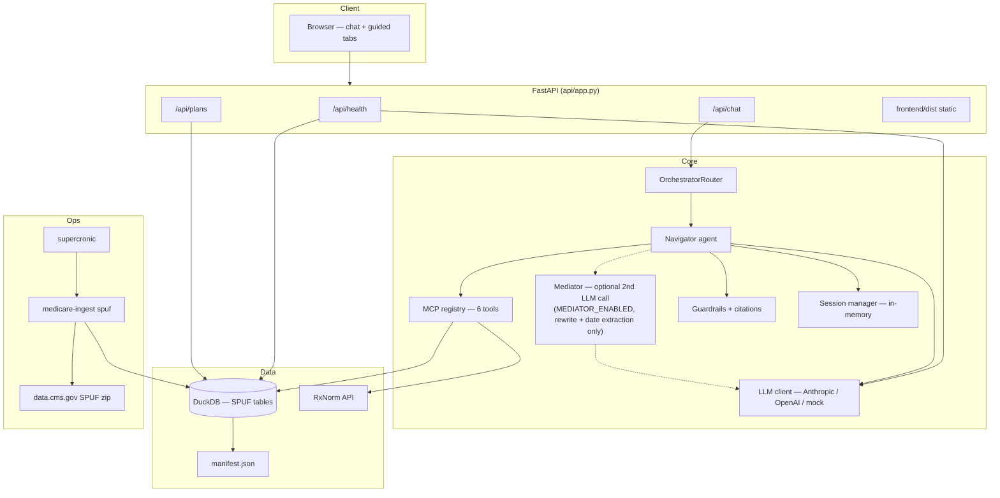
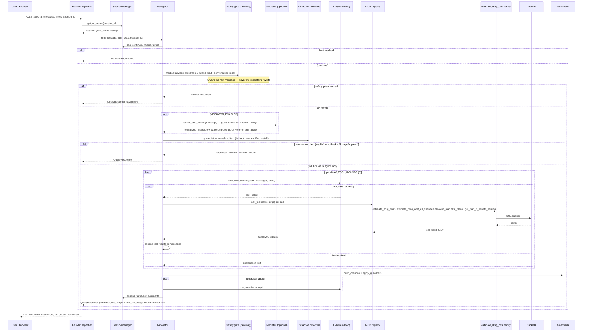
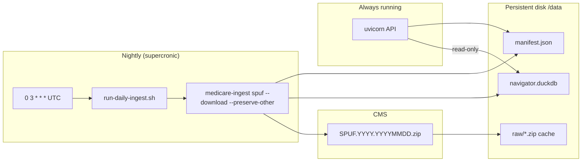
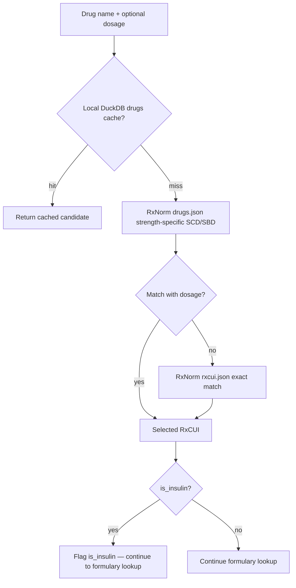
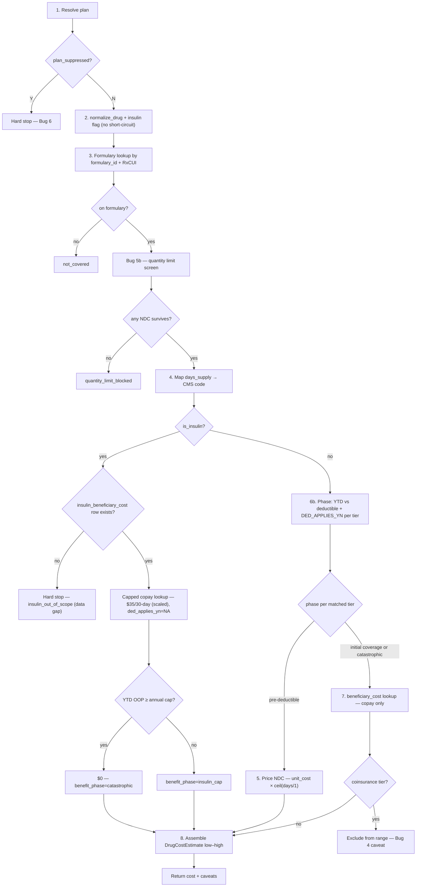
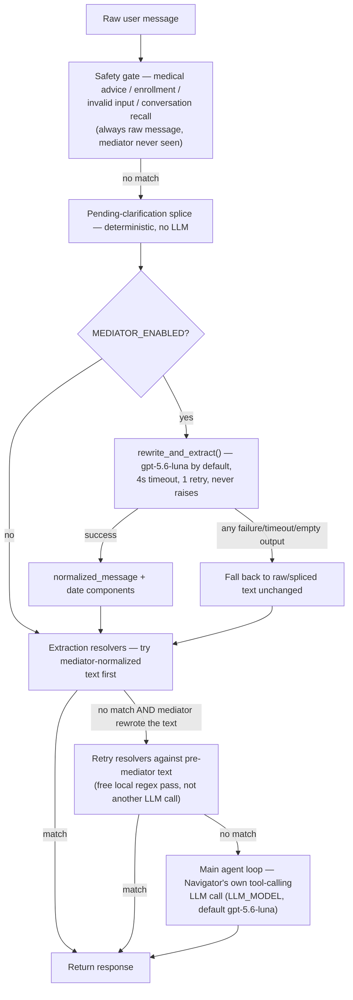
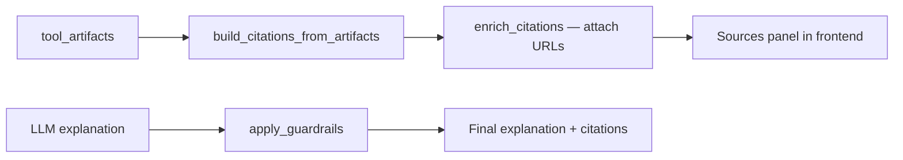
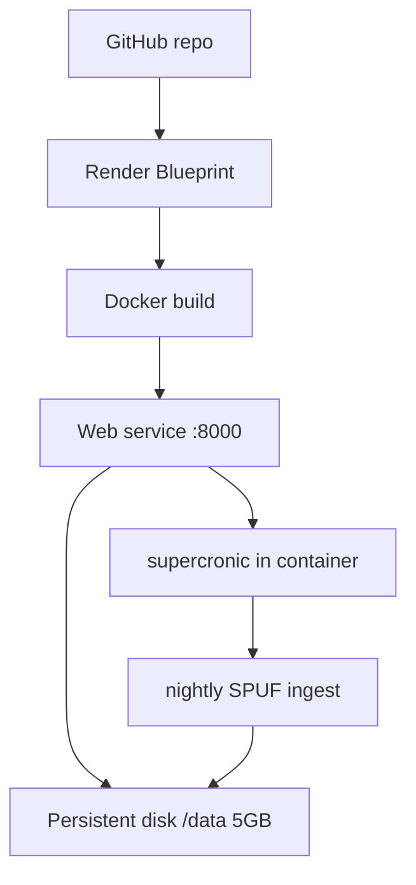

# Medicare Drug Cost Navigator — Technical Notes

Developer reference for running, developing, testing, and deploying the system. This document reflects **Phase 6** scope plus the subsequent insulin-cap, mixed-basket, and ZIP pharmacy-locator work (see [navigator-implementation-spec.md](./navigator-implementation-spec.md), [insulin-cost-estimation.md](./insulin-cost-estimation.md), and the [Developer Guide](./developer-guide.md), which is the canonical/actively-maintained reference — this file overlaps it and may lag behind on newer features).

---

## Table of contents

1. [What this system does](#1-what-this-system-does)
2. [Technology stack](#2-technology-stack)
3. [High-level architecture](#3-high-level-architecture)
4. [Request and data flows](#4-request-and-data-flows)
5. [Cost estimation pipeline](#5-cost-estimation-pipeline)
6. [Repository layout](#6-repository-layout)
7. [Local development](#7-local-development)
8. [Data ingestion](#8-data-ingestion)
9. [Database schema](#9-database-schema)
10. [API reference](#10-api-reference)
11. [MCP tools and agent loop](#11-mcp-tools-and-agent-loop)
12. [LLM integration](#12-llm-integration)
13. [Guardrails and citations](#13-guardrails-and-citations)
14. [Frontend](#14-frontend)
15. [Testing](#15-testing)
16. [Evaluation and QA CLIs](#16-evaluation-and-qa-clis)
17. [Deployment](#17-deployment)
18. [Configuration reference](#18-configuration-reference)
19. [Troubleshooting](#19-troubleshooting)
20. [Related documentation](#20-related-documentation)

---

## 1. What this system does

The Medicare Drug Cost Navigator estimates **out-of-pocket cost for one or more drug fills on a single Medicare Part D plan's regular formulary**, for a non-LIS beneficiary in the pre-deductible, initial-coverage, insulin-cap, or catastrophic phase.

| In scope | Out of scope |
|---|---|
| One or more drugs, one plan, one fill each (30/60/90-day), including mixed insulin + oral baskets | Excluded-drug formulary |
| Copay cost-sharing with dollar estimate, including catastrophic phase | Coinsurance dollar amounts (caveat only) |
| Insulin priced via its own IRA $35/30-day statutory cap (no deductible phase) — see [insulin-cost-estimation.md](./insulin-cost-estimation.md) | Un-ingested states |
| Per-pharmacy-channel pricing (`estimate_drug_cost_all_channels`) | LIS / Medicaid / enrollment advice |
| AR, TX real CMS data (configurable) | Policy Q&A, alternatives, cost trends (removed Phase 6) |
| Prior auth / step therapy as soft caveats | |
| Multi-NDC low–high cost range | |

The LLM is a **conversational layer** over deterministic MCP tools plus a stateless LLM mediator that only normalizes phrasing and extracts date/duration components (never computes cost or routes requests). Dollar figures always originate from `estimate_drug_cost` / `estimate_drug_cost_all_channels`, not from model invention.

---

## 2. Technology stack

### 2.1 Runtime and language

| Layer | Technology | Version / notes |
|---|---|---|
| Language | **Python** | `>=3.11` (`pyproject.toml`) |
| Package manager | **pip** + **hatchling** | Editable install: `pip install -e ".[dev]"` |
| ASGI server | **uvicorn** | Serves FastAPI; binds `0.0.0.0:$PORT` in production |

### 2.2 Backend framework and libraries

| Component | Library | Role |
|---|---|---|
| HTTP API | **FastAPI** | REST endpoints, static file serving, lifespan hooks |
| Validation | **Pydantic v2** + **pydantic-settings** | Request/response models, env-based config |
| Embedded OLAP DB | **DuckDB** | SPUF tabular data, query log, read-only API paths |
| HTTP client | **httpx** | RxNorm API calls in `normalize_drug` |
| LLM — Anthropic | **anthropic** SDK | Tool-calling with Claude models |
| LLM — OpenAI | **openai** SDK | Tool-calling with GPT models |
| Config files | **PyYAML** | `config/ingest_filters.yaml`, `config/deploy.yaml` |
| MCP protocol | **mcp** (`FastMCP`) | Optional external MCP server (`mcp/server.py`) |
| Multipart uploads | **python-multipart** | FastAPI dependency |

**Removed in Phase 6:** `chromadb` (policy RAG), `instructor` (structured completion for deleted agents).

### 2.3 Frontend

| Component | Technology | Notes |
|---|---|---|
| UI | **Vanilla HTML/CSS/JS** | No npm, bundler, or framework |
| Build | `scripts/build-frontend.sh` | Copies `frontend/src/*` → `frontend/dist/` |
| API client | `fetch()` | Same-origin; `window.location.origin` |
| Markdown rendering | Lightweight regex in `app.js` | Chat messages only |

### 2.4 External data sources (live)

| Source | Protocol | Used by |
|---|---|---|
| **CMS SPUF** (quarterly zip) | HTTPS download from data.cms.gov | `medicare-ingest spuf` → DuckDB |
| **RxNorm REST API** (NLM) | HTTPS JSON | `normalize_drug()` (internal to cost pipeline) |
| **NPPES NPI Registry API** (CMS) | HTTPS JSON, no auth | `ingestion/npi_enrichment.py` — pharmacy name/address enrichment, at ingest time and (for unresolved stubs) at pharmacy-locator query time |

Offline tests use `tests/fixtures/spuf/` — no network required for pytest. ZIP-centroid distances for the pharmacy locator come from a static, committed CSV (`config/zip_centroids.csv`), not a live source.

### 2.5 Infrastructure and ops

| Component | Technology | Notes |
|---|---|---|
| Container | **Docker** (multi-stage) | Python 3.11-slim + Alpine frontend copy stage |
| PaaS | **Render** | `render.yaml` Blueprint, persistent disk at `/data` |
| In-container cron | **supercronic** | Nightly SPUF refresh; schedule from `config/deploy.yaml` |
| Alt schedulers | K8s CronJob, AWS EventBridge | See `deploy/k8s/`, `deploy/aws/` |
| Lint (dev) | **ruff** | `line-length = 100`, target `py311` |
| Tests | **pytest** + **pytest-asyncio** | `asyncio_mode = auto` |

### 2.6 CLI entry points (`pyproject.toml` scripts)

| Command | Module | Purpose |
|---|---|---|
| `medicare-ingest` | `ingestion/cli.py` | SPUF download + DuckDB load |
| `medicare-eval` | `eval/run_eval.py` | Acceptance eval over `queries.jsonl` |
| `medicare-chat-invoke` | `qa/cli.py` | Hit `/api/chat` from terminal |
| `medicare-ui-test` | `ui_test/cli.py` | Static/API/chat smoke checks |

---

## 3. High-level architecture


```mermaid
flowchart TB
    subgraph Client
        Browser[Browser — chat + guided tabs]
    end

    subgraph API["FastAPI (api/app.py)"]
        Health["/api/health"]
        Chat["/api/chat"]
        Plans["/api/plans"]
        Static["frontend/dist static"]
    end

    subgraph Core
        Orch[OrchestratorRouter]
        Med["Mediator — optional 2nd LLM call\n(MEDIATOR_ENABLED, rewrite + date extraction only)"]
        Nav[Navigator agent]
        LLM[LLM client — Anthropic / OpenAI / mock]
        MCP[MCP registry — 6 tools]
        Guard[Guardrails + citations]
        Session[Session manager — in-memory]
    end

    subgraph Data
        DuckDB[(DuckDB — SPUF tables)]
        RxNorm[RxNorm API]
        Manifest[manifest.json]
    end

    subgraph Ops
        Cron[supercronic]
        Ingest[medicare-ingest spuf]
        CMS[data.cms.gov SPUF zip]
    end

    Browser --> API
    Chat --> Orch --> Nav
    Nav -.-> Med
    Med -.-> LLM
    Nav --> LLM
    Nav --> MCP
    Nav --> Guard
    Nav --> Session
    MCP --> DuckDB
    MCP --> RxNorm
    DuckDB --> Manifest
    Cron --> Ingest --> CMS
    Ingest --> DuckDB
    Plans --> DuckDB
    Health --> DuckDB
    Health --> LLM
```

**Key design choices:**

- **Single agent, no multi-agent pipeline.** `orchestrator/router.py` delegates directly to `Navigator`.
- **One consolidated cost tool.** The eight-step CMS pipeline runs inside `estimate_drug_cost` so hard-stop ordering cannot be skipped by LLM tool-call sequencing.
- **Optional second LLM call ahead of the agent loop.** When `MEDIATOR_ENABLED=1`, every message is first passed through a stateless mediator (§12.5) that only normalizes phrasing and extracts date/duration components — never routing, never cost, never advice. It sits strictly after the raw-message safety gate and before the deterministic extraction resolvers, so it can be disabled without changing safety behavior. Off by default.
- **API reads only DuckDB.** Ingestion is a separate scheduled job, not an app startup hook.
- **Sessions are in-process memory.** Not persisted across restarts or horizontal scale-out.

---

## 4. Request and data flows

### 4.1 Chat request lifecycle


```mermaid
sequenceDiagram
    participant U as User / Browser
    participant API as FastAPI /api/chat
    participant S as SessionManager
    participant N as Navigator
    participant Safe as Safety gate (raw msg)
    participant Med as Mediator (optional)
    participant R as Extraction resolvers
    participant L as LLM (main loop)
    participant M as MCP registry
    participant T as estimate_drug_cost family
    participant D as DuckDB
    participant G as Guardrails

    U->>API: POST /api/chat {message, filters, session_id}
    API->>S: get_or_create(session_id)
    S-->>API: session (turn_count, history)
    API->>N: run(message, filter_slots, session_id)
    N->>S: can_continue? (max 5 turns)
    alt limit reached
        N-->>API: status=limit_reached
    else continue
        N->>Safe: medical advice / enrollment / invalid input / conversation recall
        Note over Safe: Always the raw message — never the mediator's rewrite
        alt safety gate matched
            Safe-->>N: canned response
            N-->>API: QueryResponse (System/*)
        else no match
            opt MEDIATOR_ENABLED
                N->>Med: rewrite_and_extract(message) — gpt-5.6-luna, 4s timeout, 1 retry
                Med-->>N: normalized_message + date components, or None on any failure
            end
            N->>R: try mediator-normalized text (fallback: raw text if no match)
            alt resolver matched (insulin/mixed-basket/dosage/oop/etc.)
                R-->>N: response, no main LLM call needed
                N-->>API: QueryResponse
            else fall through to agent loop
                loop up to MAX_TOOL_ROUNDS (8)
                    N->>L: chat_with_tools(system, messages, tools)
                    alt tool_calls returned
                        L-->>N: tool_calls[]
                        N->>M: call_tool(name, args) per call
                        M->>T: estimate_drug_cost / estimate_drug_cost_all_channels / lookup_plan / list_plans / get_part_d_benefit_params
                        T->>D: SQL queries
                        D-->>T: rows
                        T-->>M: ToolResult JSON
                        M-->>N: serialized artifact
                        N->>N: append tool results to messages
                    else text content
                        L-->>N: explanation text
                    end
                end
                N->>G: build_citations + apply_guardrails
                opt guardrail failure
                    N->>L: retry rewrite prompt
                end
                N->>S: append_turn(user, assistant)
                N-->>API: QueryResponse (mediator_llm_usage + total_llm_usage set if mediator ran)
            end
        end
    end
    API-->>U: ChatResponse {session_id, turn_count, response}
```

### 4.2 Ingestion vs. serving (production)


```mermaid
flowchart LR
    subgraph Scheduled["Nightly (supercronic)"]
        Cron["0 3 * * * UTC"]
        Script["run-daily-ingest.sh"]
        CLI["medicare-ingest spuf --download --preserve-other"]
    end

    subgraph CMS
        Zip["SPUF.YYYY.YYYYMMDD.zip"]
    end

    subgraph Volume["Persistent disk /data"]
        DB["navigator.duckdb"]
        Raw["raw/*.zip cache"]
        Man["manifest.json"]
    end

    subgraph Live["Always running"]
        UV["uvicorn API"]
    end

    Cron --> Script --> CLI
    CLI --> Zip
    CLI --> DB
    CLI --> Man
    Zip --> Raw
    UV -->|read-only| DB
    UV --> Man
```

### 4.3 Drug name resolution (internal)

`normalize_drug` is **not** an LLM-visible tool. It runs inside `estimate_drug_cost`:


```mermaid
flowchart TD
    A[Drug name + optional dosage] --> B{Local DuckDB drugs cache?}
    B -->|hit| C[Return cached candidate]
    B -->|miss| D[RxNorm drugs.json strength-specific SCD/SBD]
    D --> E{Match with dosage?}
    E -->|yes| F[Selected RxCUI]
    E -->|no| G[RxNorm rxcui.json exact match]
    G --> F
    F --> H{is_insulin?}
    H -->|yes| I[Flag is_insulin — continue to formulary lookup]
    H -->|no| J[Continue formulary lookup]
```

`is_insulin` is checked twice — once pre-RxNorm on the canonical name, once post-RxNorm on the resolved name + ingredient — but in both cases only sets a flag consumed later in the pipeline (§5); it no longer short-circuits resolution. See [insulin-cost-estimation.md](./insulin-cost-estimation.md) §6.

---

## 5. Cost estimation pipeline

Implemented in `src/medicare_navigator/tools/estimate_drug_cost.py`. Full spec: [navigator-implementation-spec.md](./navigator-implementation-spec.md).


```mermaid
flowchart TD
    S1["1. Resolve plan"] --> S1a{plan_suppressed?}
    S1a -->|Y| STOP6["Hard stop — Bug 6"]
    S1a -->|N| S2["2. normalize_drug + insulin flag (no short-circuit)"]
    S2 --> S3["3. Formulary lookup by formulary_id + RxCUI"]
    S3 --> S3a{on formulary?}
    S3a -->|no| NC["not_covered"]
    S3a -->|yes| S3b["Bug 5b — quantity limit screen"]
    S3b --> S3c{any NDC survives?}
    S3c -->|no| QL["quantity_limit_blocked"]
    S3c -->|yes| S4["4. Map days_supply → CMS code"]
    S4 --> S6{is_insulin?}
    S6 -->|yes| SI1{insulin_beneficiary_cost row exists?}
    SI1 -->|no| STOPI["Hard stop — insulin_out_of_scope (data gap)"]
    SI1 -->|yes| SI2["Capped copay lookup — $35/30-day (scaled), ded_applies_yn=NA"]
    SI2 --> SI3{YTD OOP ≥ annual cap?}
    SI3 -->|yes| SI4["$0 — benefit_phase=catastrophic"]
    SI3 -->|no| SI5["benefit_phase=insulin_cap"]
    SI4 --> S8
    SI5 --> S8
    S6 -->|no| S6b["6b. Phase: YTD vs deductible + DED_APPLIES_YN per tier"]
    S6b --> S6a{phase per matched tier}
    S6a -->|pre-deductible| S5["5. Price NDC — unit_cost × ceil(days/1)"]
    S6a -->|initial coverage or catastrophic| S7["7. beneficiary_cost lookup — copay only"]
    S5 --> S8["8. Assemble DrugCostEstimate low–high"]
    S7 --> S7a{coinsurance tier?}
    S7a -->|yes| BUG4["Exclude from range — Bug 4 caveat"]
    S7a -->|no| S8
    S8 --> OUT["Return cost + caveats"]
```

Steps 5 and 7 are alternatives selected by step 6's phase result (per matched tier), not a sequential pair — a pre-deductible tier is priced from `pricing.UNIT_COST` (step 5) and never touches `beneficiary_cost`; an initial-coverage or catastrophic tier is priced from `beneficiary_cost` (step 7, `COVERAGE_LEVEL` 1 or 3 respectively) and never touches `pricing`. Catastrophic phase applies once reported YTD OOP spend meets or exceeds the statutory annual Part D out-of-pocket maximum for the contract year (`config/benefit_params.yaml`, `tools/part_d_benefit_params.py`), typically pricing the fill at $0 with a caveat attached.

### 5.1 CMS "bugs" handled explicitly

| ID | Issue | Handling |
|---|---|---|
| Bug 1 | `pricing.DAYS_SUPPLY` ≠ `beneficiary_cost.DAYS_SUPPLY` | `DAYS_SUPPLY_CODE_MAP` in `tools/days_supply.py`: 30→1, 60→4, 90→2 |
| Bug 2 | Deductible is per-tier (`DED_APPLIES_YN`) | Override phase per tier; append Bug 2 caveat |
| Bug 3 | `UNIT_COST` is per unit, not per fill | `ceil(days_supply / 1)` × unit cost |
| Bug 4 | Coinsurance dollar base unknown | Never compute dollars; verbatim caveat |
| Bug 5 | Multiple NDCs per RxCUI | Independent per-NDC cost; report low–high range |
| Bug 5b | Quantity limits | Hard stop if requested fill exceeds limit |
| Bug 6 | Suppressed plans (`PLAN_SUPPRESSED_YN=Y`) | Hard stop; plans ingested but not silently filtered |

### 5.2 Coverage level codes (verified against real 2026 CMS data)

| Code | Meaning | Used in v1 |
|---|---|---|
| 0 | Deductible phase | Yes |
| 1 | Initial coverage | Yes |
| 2 | Coverage gap | Unused post-IRA redesign |
| 3 | Catastrophic | Yes — YTD OOP spend at or above the statutory annual Part D out-of-pocket maximum (`config/benefit_params.yaml`) routes here with a caveat |

### 5.3 `DrugCostEstimate` response shape

```python
# models/response.py (abbreviated)
class DrugCostEstimate(BaseModel):
    plan_key: str
    plan_name: str
    drug_name: str
    rxcui: str | None
    tiers_matched: list[int]
    matched_ndc_count: int
    same_tier: bool
    days_supply: int
    benefit_phase: str | None      # "pre_deductible" | "initial_coverage"
    cost_low: float | None
    cost_high: float | None
    caveats: list[str]
    quantity_limit_blocked: bool
    max_allowed_days_supply: int | None
    covered: bool
```

`benefit_phase` may also be `"insulin_cap"` (insulin, pre-catastrophic) or `"catastrophic"`. `estimate_drug_cost_all_channels` returns the richer `MultiChannelDrugCostEstimate` instead — same core fields plus `channels: dict[str, ChannelCost]` (one per CMS pharmacy channel), `tier`, `ded_applies_yn` (`"NA"` for insulin), `effective_phase`, and annual-budget projection fields.

---

## 6. Repository layout

```
Medicare-drug-cost-navigator/
├── src/medicare_navigator/
│   ├── api/                 # FastAPI app, routes, static mount
│   ├── agent/               # Navigator, mediator, insulin/mixed-basket/dosage/oop resolvers, system prompt
│   ├── orchestrator/        # Thin router → Navigator
│   ├── mcp/                 # Tool schemas, registry, optional FastMCP server
│   ├── tools/               # estimate_drug_cost, lookup_plan, normalize_drug, …
│   ├── storage/             # DuckDB connection + repositories
│   ├── ingestion/           # SPUF ingest, CMS download, schema, CLI
│   ├── llm/                 # Provider adapter, mock mode, errors
│   ├── guardrails/          # Citation builder, dollar-amount validation
│   ├── session/             # In-memory chat sessions
│   ├── models/              # Pydantic request/response types
│   ├── eval/                # Eval runner + queries.jsonl
│   ├── qa/                  # Chat invoke CLI for manual QA
│   └── ui_test/             # UI smoke test harness
├── frontend/
│   ├── src/                 # index.html, app.js, styles.css (source)
│   └── dist/                # Built assets (gitignored; created by build script)
├── config/
│   ├── ingest_filters.yaml  # States, contract year, plan type filters
│   ├── deploy.yaml          # Cron schedule, Render plan hints
│   └── disclaimer.txt       # Canonical disclaimer text
├── tests/                   # pytest suite + SPUF fixtures
├── scripts/                 # build-frontend, docker-start, daily ingest, crontab gen
├── deploy/                  # K8s cron, AWS EventBridge notes
├── docs/                    # Implementation plans, this file
├── Dockerfile
├── render.yaml
├── pyproject.toml
└── .env.example
```

---

## 7. Local development

### 7.1 Prerequisites

- Python 3.11+
- Git
- (Recommended) Anthropic or OpenAI API key for live LLM responses
- (Optional) Network access for RxNorm and CMS download

### 7.2 First-time setup

```bash
cd Medicare-drug-cost-navigator
python -m venv .venv
source .venv/bin/activate          # Windows: .venv\Scripts\activate
pip install -e ".[dev]"
cp .env.example .env
# Edit .env — set ANTHROPIC_API_KEY or OPENAI_API_KEY, or LLM_MOCK=1
```

### 7.3 Seed data

**Option A — offline fixture (fast, no network):**

```bash
medicare-ingest spuf --source tests/fixtures/spuf
```

**Option B — real CMS data (AR + TX per `config/ingest_filters.yaml`):**

```bash
medicare-ingest spuf --download
```

**Low-memory / merge mode:**

```bash
medicare-ingest spuf --download --states AR --merge-states
```

### 7.4 Build frontend

```bash
scripts/build-frontend.sh
```

Required before opening the UI locally. Docker/Render builds `dist` automatically.

### 7.5 Run API server

```bash
uvicorn medicare_navigator.api.app:app --reload --host 0.0.0.0 --port 8000
```

Open http://localhost:8000

On startup, `lifespan` calls `ensure_schema()` to create/migrate DuckDB tables.

### 7.6 Verify health

```bash
curl -s http://localhost:8000/api/health | python -m json.tool
```

Expect `data_fresh: true` after ingest. Without an LLM key and without `LLM_MOCK=1`, health returns **503 degraded**.

### 7.7 Development modes

| Mode | Env vars | Behavior |
|---|---|---|
| Full stack | `ANTHROPIC_API_KEY` or `OPENAI_API_KEY` | Live LLM tool-calling |
| Offline / CI | `LLM_MOCK=1` (pytest sets this automatically) | Deterministic mock responses |
| Tools only | Ingest data + call tools in Python REPL | No LLM needed |

Example direct tool call:

```python
import asyncio
from medicare_navigator.tools.estimate_drug_cost import estimate_drug_cost

async def main():
    r = await estimate_drug_cost(
        plan_key="S5921-400",
        drug_name="lovastatin",
        dosage="40mg",
        days_supply=30,
        ytd_oop_spend=0,
    )
    print(r.status, r.data)

asyncio.run(main())
```

---

## 8. Data ingestion

### 8.1 CLI commands

```bash
# Full production-style refresh
medicare-ingest spuf --download

# Preserve non-SPUF tables (nightly default)
medicare-ingest spuf --download --preserve-other

# Offline fixture
medicare-ingest spuf --source tests/fixtures/spuf

# Download zip only (no DuckDB write)
medicare-ingest fetch

# Force re-download (ignore raw/ cache)
medicare-ingest spuf --download --force-download

# Filter states
medicare-ingest spuf --download --states AR --merge-states
medicare-ingest spuf --download --states CA --merge-states
```

### 8.2 Ingest filters (`config/ingest_filters.yaml` + `INGEST_STATES`)

| Setting | Location | Meaning |
|---|---|---|
| `contract_year` | yaml | Filter SPUF rows to this benefit year |
| `pdp_region_codes` | yaml | **Full catalog** — all states/territories with CMS PDP region codes |
| `states` | yaml | Default active set when `INGEST_STATES` is unset (local dev) |
| `INGEST_STATES` | env (Render) | Comma-separated active states; intersected with catalog (no redeploy) |
| `plan_type_prefixes` | yaml | `S`=PDP, `H`=local MA-PD |

Resolution order: `--states` CLI → `INGEST_STATES` env → yaml `states`. Nightly cron uses env/yaml defaults with `--preserve-other` (full SPUF table replace for active states only). Use `--merge-states` in Shell to add a state without removing others.

### 8.3 SPUF files loaded

| CMS file | DuckDB table | Key fields |
|---|---|---|
| `plan information` | `plans` | `plan_key`, `formulary_id`, `deductible`, `plan_suppressed` |
| `basic drugs formulary` | `basic_drugs_formulary` | `ndc`, `rxcui`, `tier`, QL/PA/ST flags |
| `pricing` | `pricing` | `unit_cost` by NDC + days supply |
| `beneficiary cost` | `beneficiary_cost` | copay/coinsurance by tier, phase, days-supply code |

### 8.4 Manifest (`data/manifest.json`)

Written on each ingest. Drives `/api/health` freshness and UI "data as of" badges.

```json
{
  "spuf": {
    "version": "SPUF.2026.20260115",
    "as_of": "2026-01-15",
    "source_id": "cms_spuf_2026_q1",
    "states": ["AR", "TX"]
  }
}
```

`data_fresh` is `true` when `seeded_at` is today or yesterday (see `ingestion/manifest.py`).

### 8.5 On-disk layout

| Path | Purpose |
|---|---|
| `data/navigator.duckdb` | Primary database |
| `data/manifest.json` | Source versions and as-of dates |
| `data/raw/` | Cached CMS zip files |

Production (Render): `DATA_DIR=/data`, `DUCKDB_PATH=/data/navigator.duckdb`.

---

## 9. Database schema

Defined in `src/medicare_navigator/ingestion/schema.py`.

### 9.1 Tables

```sql
-- plans
plan_key VARCHAR PRIMARY KEY
contract_id, plan_id, plan_name, plan_type, state VARCHAR
deductible DOUBLE, contract_year INTEGER
formulary_id VARCHAR
plan_suppressed BOOLEAN DEFAULT FALSE

-- basic_drugs_formulary
formulary_id, ndc, rxcui VARCHAR
tier INTEGER
quantity_limit_yn BOOLEAN, quantity_limit_amount DOUBLE, quantity_limit_days INTEGER
prior_authorization_yn, step_therapy_yn BOOLEAN
as_of_date VARCHAR

-- pricing
plan_key, ndc VARCHAR
days_supply INTEGER          -- raw day count (30, 60, 90)
unit_cost DOUBLE

-- beneficiary_cost
plan_key VARCHAR, tier INTEGER, coverage_level INTEGER
days_supply_code INTEGER     -- CMS code 1–4 (not raw days)
pharmacy_channel VARCHAR
cost_type VARCHAR, copay DOUBLE, coinsurance_pct DOUBLE
ded_applies_yn BOOLEAN, as_of_date VARCHAR

-- insulin_beneficiary_cost (IRA $35/30-day cap; no coverage_level or cost_type — see insulin-cost-estimation.md §4)
plan_key VARCHAR, segment_id VARCHAR, tier INTEGER  -- tier NULL for defined-standard plans
days_supply_code INTEGER
pharmacy_channel VARCHAR
copay DOUBLE                 -- already-capped figure; coinsurance field discarded at ingest, never stored
as_of_date VARCHAR

-- drugs (RxNorm cache, optional)
drug_name, rxcui, ndc, dosage, ingredient VARCHAR

-- pharmacy_network (CMS pharmacy-network file; column layout unconfirmed, ingested defensively)
plan_key, npi VARCHAR
preferred_yn, retail_yn, mail_yn, ltc_yn, home_infusion_yn BOOLEAN
as_of_date VARCHAR

-- pharmacies (NPPES enrichment; not plan-key-keyed, never purged per state)
npi VARCHAR PRIMARY KEY
pharmacy_name, address_line1, city, state, zip_code, phone VARCHAR
enrichment_source VARCHAR    -- nppes_api | nppes_offline | cms_pharmacy_zipcode (stub)
as_of_date VARCHAR

-- query_log (analytics)
query_id, session_id, tools_invoked, statuses VARCHAR
latency_ms DOUBLE, created_at TIMESTAMP
```

### 9.2 Indexes

| Index | Columns |
|---|---|
| `idx_basic_drugs_formulary` | `(formulary_id, rxcui)` |
| `idx_plans_state_year` | `(state, contract_year)` |
| `idx_beneficiary_cost_lookup` | `(plan_key, tier, coverage_level, days_supply_code, pharmacy_channel)` |
| `idx_pricing_plan_ndc` | `(plan_key, ndc, days_supply)` |
| `idx_pharmacy_network_plan` | `(plan_key, preferred_yn)` |
| `idx_pharmacies_zip` | `(zip_code)` |

Indexes are dropped before bulk deletes during ingest (DuckDB ART index delete bug), then recreated.

### 9.3 Migrations

Additive `ALTER TABLE` for persistent disks:

```python
SCHEMA_MIGRATIONS = (
    ("plans", "plan_suppressed", "BOOLEAN DEFAULT FALSE"),
    ("beneficiary_cost", "ded_applies_yn", "BOOLEAN"),
)
```

`ensure_schema()` runs on API lifespan and `docker-start.sh`.

### 9.4 Connection modes

| Method | Mode | Use |
|---|---|---|
| `fetchone` / `fetchall` | `read_only=True` | API request path |
| `connect()` | read-write | Ingestion, query_log writes |
| Missing table | Returns `None` / `[]` | Graceful empty DB on first boot |

---

## 10. API reference

Base URL: `http://localhost:8000` (dev) or `https://medicare-drug-cost.onrender.com` (prod).

### 10.1 Endpoints

| Method | Path | Description |
|---|---|---|
| `GET` | `/api/health` | Service health, LLM config, data freshness |
| `GET` | `/api/disclaimer` | Canonical disclaimer text |
| `GET` | `/api/meta/as-of` | Raw `manifest.json` |
| `GET` | `/api/plans` | List plans (`?state=AR&year=2026&plan_type=...`) |
| `GET` | `/api/models` | Available LLM models with per-provider `configured` status |
| `POST` | `/api/query` | Structured + message query → `QueryResponse` |
| `POST` | `/api/chat` | Conversational turn → `ChatResponse` (accepts optional `model` override) |
| `POST` | `/api/estimate` | Structured, non-chat cost estimate (`estimate_drug_cost_all_channels`, no LLM call) |
| `POST` | `/api/feedback` | User feedback — appends to `{DATA_DIR}/feedback.jsonl` |
| `GET` | `/` | SPA (`frontend/dist/index.html`) |

### 10.2 `POST /api/chat`

**Request:**

```json
{
  "session_id": "optional-uuid",
  "message": "How much will lovastatin 40mg cost on plan S5921-400?",
  "filters": {
    "drug": "lovastatin",
    "dosage": "40mg",
    "plan_id": "S5921-400",
    "days_supply": 30,
    "ytd_oop_spend": 0,
    "contract_year": 2026
  }
}
```

**Response:**

```json
{
  "session_id": "…",
  "turn_count": 1,
  "response": {
    "query_id": "…",
    "status": "ok",
    "drug_name": "lovastatin 40 MG Oral Tablet",
    "rxcui": "197905",
    "estimate": { "cost_low": 5.0, "cost_high": 5.0, "…": "…" },
    "explanation": "…",
    "citations": [{ "label": "…", "url": "…", "claim": "…" }],
    "disclaimer": "…",
    "data_as_of": { "estimate": "2026-01-15" },
    "tools_invoked": ["estimate_drug_cost_all_channels"],
    "tool_statuses": { "estimate_drug_cost_all_channels": "ok" },
    "response_source": "openai/gpt-5.6-luna",
    "llm_usage": { "model": "gpt-5.6-luna", "provider": "openai", "input_tokens": 512, "output_tokens": 96, "total_tokens": 608, "cost_usd": 0.000089 },
    "mediator_llm_usage": { "model": "gpt-5.6-luna", "provider": "openai", "input_tokens": 180, "output_tokens": 40, "total_tokens": 220, "cost_usd": 0.000170 },
    "total_llm_usage": { "input_tokens": 692, "output_tokens": 136, "total_tokens": 828, "cost_usd": 0.000260 }
  }
}
```

**Status values:** `ok`, `needs_clarification`, `not_found`, `limit_reached`.

**HTTP errors:** `503` (LLM not configured), `502` (LLM request failed after retries).

### 10.3 `POST /api/feedback`

Appends user feedback to `{DATA_DIR}/feedback.jsonl` (one JSON object per line). Not counted in usage analytics.

**Request:** `{ "message": "…", "state": "TX", "zip": "75001" }` — `state` and `zip` optional; validated as 2-letter state and 5-digit ZIP.

**Response:** `{ "status": "ok", "submitted_at": "…" }`

**HTTP errors:** `400` (empty message, invalid state/ZIP, message > 2000 chars).

### 10.4 `GET /api/health` fields

| Field | Meaning |
|---|---|
| `status` | `ok` or `degraded` |
| `llm_configured` | API key present or `LLM_MOCK=1` |
| `data_fresh` | Manifest seeded within 1 day |
| `seeded_at` | Last ingest timestamp |
| `spuf_source_id`, `spuf_as_of`, `spuf_version` | SPUF manifest slice |

---

## 11. MCP tools and agent loop

### 11.1 Registered tools

| Tool | LLM-visible | Implementation |
|---|---|---|
| `estimate_drug_cost` | Yes | `tools/estimate_drug_cost.py` (single pharmacy channel); insulin priced via the statutory $35/30-day cap instead of the tiered/deductible pipeline |
| `estimate_drug_cost_all_channels` | Yes | `tools/estimate_drug_cost.py` — all four CMS channels in one call; default tool for general cost questions |
| `lookup_plan` | Yes | `tools/lookup_plan.py` |
| `list_plans` | Yes | `storage/repository.py` → `PlanRepository.list_plans` |
| `find_pharmacies` | Yes | `tools/pharmacy_lookup.py` — CMS pharmacy-network locator by ZIP (fixed 25-mile straight-line radius); also reachable via deterministic pre-LLM routing in `agent/pharmacy_questions.py`. See [Developer Guide §8.2](./developer-guide.md#82-pharmacy-locator-find_pharmacies-toolspharmacy_lookuppy) |
| `get_part_d_benefit_params` | Yes | `tools/part_d_benefit_lookup.py` — annual Part D OOP cap and other statutory benefit parameters for a contract year; used to answer catastrophic-phase/cap questions without inventing figures |
| `normalize_drug` | **No** | Called internally by `estimate_drug_cost` |

Multi-product requests (e.g. an insulin + an oral drug in one message) are detected and resolved by the application layer (`agent/mixed_basket_requests.py`), which issues one `estimate_drug_cost`-family call per drug and combines the results — not a separate MCP tool.

Tool JSON schemas: `mcp/schemas.py`. Dispatch: `mcp/registry.py`.

### 11.2 Agent loop (`agent/navigator.py`)

1. Build messages from history (last 3 turns), filter context, and user message.
2. Call `llm_client.chat_with_tools` with `NAVIGATOR_SYSTEM_PROMPT`.
3. On tool calls: execute via `call_tool`, append results, repeat (max `MAX_TOOL_ROUNDS=8`).
4. On text: extract explanation.
5. Build citations; run `apply_guardrails`.
6. On guardrail failure: one LLM retry with validation errors.
7. Log to `query_log`; append session history.

### 11.3 External MCP server

Optional stdio/SSE server for external agents:

```python
from medicare_navigator.mcp.server import create_mcp_server
mcp = create_mcp_server()
# Run per mcp package docs
```

Requires `pip install mcp`.

---

## 12. LLM integration

### 12.1 Provider selection

Provider is resolved **per model**, not from `LLM_PROVIDER`/`settings.llm_provider` — that setting only controls which provider's missing-key warning is logged at startup (`api/app.py` lifespan).

**The model catalog is config-driven, not hardcoded.** `llm/models.py` loads it from `config/deploy.yaml`'s `llm:` section (`llm.models`, `llm.default_model`, `llm.mediator_default_model`) via `_load_deploy_llm_config()`, cached with `lru_cache`. Adding, repricing, or re-defaulting a model is a `config/deploy.yaml` edit, not a code change or redeploy of `llm/models.py` itself. A small hardcoded catalog inside `llm/models.py` is used **only** as a fallback if `config/deploy.yaml` is missing or its `llm:` section is malformed/empty — the same fail-safe pattern `tools/part_d_benefit_lookup.py` uses for `benefit_params.yaml`. Out of the box, `config/deploy.yaml` ships:

| Model ID | Provider | SDK | Notes |
|---|---|---|---|
| `gpt-5.6-luna` | `openai` | `openai.AsyncOpenAI` | **Default** (`llm.default_model` in `config/deploy.yaml`). Reasoning model; forced `reasoning_effort="none"` so function tools work on chat/completions. Also the mediator's default model (`llm.mediator_default_model`, §12.5) — the two are independent config keys that happen to point at the same model out of the box |
| `gpt-5.4-nano` | `openai` | `openai.AsyncOpenAI` | Cheaper/faster alternative; select via `ChatRequest.model` or `LLM_MODEL` |
| `claude-haiku-4-5-20251001` | `anthropic` | `anthropic.AsyncAnthropic` | |

`GET /api/models` lists the catalog with a `configured` flag per provider's API key. `ChatRequest.model` lets a caller (or the frontend's `#model-select`) override the default per turn — the ID must exist in the loaded catalog (`ValueError` otherwise, surfaced as an API error). `LLM_MODEL`/`MEDIATOR_LLM_MODEL` env vars, when set, must also name a model ID present in `config/deploy.yaml`; when unset, `Settings.llm_model`/`Settings.mediator_llm_model` default to empty string and the code falls back to the YAML's `default_model`/`mediator_default_model`. Every response includes token usage and an estimated USD cost (`LlmUsage`, via `estimate_cost_usd()` using each model's `input_per_mtok`/`output_per_mtok`, also sourced from `config/deploy.yaml`).

### 12.2 Reliability settings

| Variable | Default | Purpose |
|---|---|---|
| `LLM_TIMEOUT_SECONDS` | `60` | Per-request asyncio timeout |
| `LLM_MAX_RETRIES` | `2` | Exponential backoff retries |
| `LLM_MOCK` | `false` | Offline deterministic responses |

### 12.3 Mock mode (`llm/mock.py`)

Used by pytest (`conftest.py` sets `llm_mock_mode=True`). Parses user message for drug/plan hints and returns a single `estimate_drug_cost` tool call, then a templated explanation.

**Do not set `LLM_MOCK=1` on production Render.**

### 12.4 Session limits

| Setting | Default | Effect |
|---|---|---|
| `MAX_CHAT_TURNS` | `5` | Max user turns per session |
| `SESSION_TTL_MINUTES` | `30` | In-memory session expiry |

### 12.5 Mediator — a second, upstream LLM call (`agent/mediator.py`)

The system is **not** a single-model pipeline once `MEDIATOR_ENABLED=1`. A second, independently-configured LLM call runs *before* the main Navigator tool-calling loop on every message that reaches it:

| Variable | Default | Purpose |
|---|---|---|
| `MEDIATOR_ENABLED` | `false` | Feature flag — mediator is off by default; without it the pipeline behaves as a single-model system |
| `MEDIATOR_LLM_MODEL` | empty → falls back to `config/deploy.yaml`'s `llm.mediator_default_model` (`gpt-5.6-luna` out of the box) | Independent from `LLM_MODEL`; can point at a different model than the main chat loop |
| `MEDIATOR_TIMEOUT_SECONDS` | `4.0` | Deliberately tight — much shorter than `LLM_TIMEOUT_SECONDS` (60s), since a slow mediator should fail fast and fall back, not stall the turn |
| `MEDIATOR_MAX_RETRIES` | `1` | Retry budget for the mediator's own structured-completion call |

**What it does:** a single `structured_complete` call (Pydantic `MediatorRewrite`, not tool-calling) that (1) rewrites the raw message into normalized text — fixing typos, stripping filler, copying through anything already unambiguous — and (2) extracts date/duration components (`duration_count`, `duration_unit`, `anchor_today`, `explicit_month/day/year`) as raw fields only. It never computes a resulting date itself (that arithmetic stays in `agent/datetime_context.py`), never invents a drug/plan/dollar value, and never decides routing or answers the user.

**Where it sits in `Navigator.run()` (`agent/navigator.py`):**


```mermaid
flowchart TD
    MSG[Raw user message] --> GATE["Safety gate — medical advice / enrollment /\ninvalid input / conversation recall\n(always raw message, mediator never seen)"]
    GATE -->|no match| PEND[Pending-clarification splice — deterministic, no LLM]
    PEND --> MED{MEDIATOR_ENABLED?}
    MED -->|no| RESOLVERS
    MED -->|yes| CALL["rewrite_and_extract() — gpt-5.6-luna by default,\n4s timeout, 1 retry, never raises"]
    CALL -->|success| NORM[normalized_message + date components]
    CALL -->|any failure/timeout/empty output| RAW[Fall back to raw/spliced text unchanged]
    NORM --> RESOLVERS["Extraction resolvers — try mediator-normalized\ntext first"]
    RAW --> RESOLVERS
    RESOLVERS -->|no match AND mediator rewrote the text| RETRY["Retry resolvers against pre-mediator text\n(free local regex pass, not another LLM call)"]
    RESOLVERS -->|match| DONE[Return response]
    RETRY -->|match| DONE
    RETRY -->|no match| LOOP["Main agent loop — Navigator's own tool-calling\nLLM call (LLM_MODEL, default gpt-5.6-luna)"]
    LOOP --> DONE
```

**Guarantees worth knowing:**

- The safety gate (medical advice, enrollment, invalid input, conversation recall) runs **only on the raw message** — a refusal decision can never depend on how the mediator chose to rephrase input, even if the mediator is enabled and misbehaves.
- `rewrite_and_extract()` is documented to **never raise** — every failure mode (timeout, API error, validation error, empty `normalized_message`) is caught inside it and degrades to "use the raw text for this turn," never a 500.
- If the mediator rewrites the text but no extraction resolver matches the rewritten version, the resolvers are retried once more against the original pre-mediator text before falling through to the full agent loop — insurance against the mediator corrupting an otherwise-parseable message, at the cost of a local regex pass, not a second LLM call.
- Mediator token usage is tracked separately (`mediator_llm_usage` on `ChatResponse`) and combined with the main call's usage into `total_llm_usage` (see §10.2) — a turn that uses the mediator makes **two** billed LLM calls, not one.
- `llm/mock.py` provides a mock implementation of the mediator's structured-completion path for offline/pytest use, distinct from the mock chat-completion path used for the main loop.

---

## 13. Guardrails and citations

Module: `guardrails/citations.py`, source registry: `guardrails/source_catalog.py`.

### 13.1 What guardrails enforce

| Check | Action |
|---|---|
| Hard-stop statuses (`suppressed`, `insulin_out_of_scope`, `quantity_limit_blocked`) | Force-append verbatim tool message if LLM omitted it |
| Tool caveats (Bug 2, 4, 5, PA/ST) | Force-append missing caveats |
| Dollar amounts in explanation | Must trace to `cost_low`/`cost_high` from tool data |
| Lookup failures | Citations still emitted for `not_found`, `not_covered`, etc. |

### 13.2 Citation flow


```mermaid
flowchart LR
    Artifacts[tool_artifacts] --> Build[build_citations_from_artifacts]
    Build --> Enrich[enrich_citations — attach URLs]
    Enrich --> UI[Sources panel in frontend]
    Explain[LLM explanation] --> Apply[apply_guardrails]
    Apply --> Final[Final explanation + citations]
```

---

## 14. Frontend

### 14.1 Structure

| File | Role |
|---|---|
| `frontend/src/index.html` | Layout: disclaimer banner, chat/guided tabs, sources panel |
| `frontend/src/app.js` | API calls, plan polling, markdown render, tab switching |
| `frontend/src/styles.css` | Responsive layout |

### 14.2 UX modes

| Tab | Behavior |
|---|---|
| **Ask in chat** | Free-form message → `POST /api/chat`; prompt chips with real AR plan examples |
| **Guided estimate** | Form filters → same `/api/chat` endpoint with `filters` payload |

### 14.3 Sources panel

Right panel shows **citations and data-as-of only** — not a separate cost card. Dollar amounts and caveats appear in the chat transcript (Phase 6 design).

### 14.4 Plan loading

On boot, polls `GET /api/plans` every **20s** for up to **30 attempts** (~10 min) while ingest runs. Manual **Refresh** button available.

### 14.5 FastAPI static serving

- `GET /` → `index.html` with no-cache headers
- `app.mount("/", StaticFiles(...))` for assets
- `_NoCacheFrontendMiddleware` prevents stale JS/CSS during dev

---

## 15. Testing

### 15.1 Run all tests

```bash
pytest
```

Default: excludes `@pytest.mark.integration` tests (live CMS catalog).

### 15.2 Run integration tests

```bash
pytest -m integration
```

### 15.3 Test layout

| File / area | Coverage |
|---|---|
| `test_estimate_drug_cost.py` | All CMS bugs 1–6, insulin, formulary edge cases |
| `test_spuf_ingest.py` | Fixture ingest, merge-states, suppressed plans, schema columns |
| `test_navigator.py` | End-to-end agent with mock LLM |
| `test_citations.py` | Guardrails, citation URLs, lookup failures |
| `test_health.py` | Health endpoint, 503 without LLM |
| `test_ui.py` | Static assets, API smoke, chat offline |
| `test_db_resilience.py` | Empty/missing schema graceful degradation |
| `test_mcp_registry.py` | Tool dispatch |
| `conftest.py` | Auto `LLM_MOCK`, auto-build `frontend/dist`, `spuf_db` fixture |

### 15.4 Fixtures

| Fixture | Scope | Purpose |
|---|---|---|
| `spuf_db` | function | Temp DuckDB loaded from `tests/fixtures/spuf/` |
| `ensure_frontend_dist` | session | Runs `build-frontend.sh` if needed |
| `use_mock_llm` | autouse | Forces `LLM_MOCK` |

### 15.5 Lint

```bash
ruff check src tests
ruff format --check src tests
```

---

## 16. Evaluation and QA CLIs

### 16.1 `medicare-eval`

Runs `eval/queries.jsonl` cases against the orchestrator with mock LLM + fixture data.

```bash
medicare-eval
# Writes src/medicare_navigator/eval/results.json
```

Checks: `expected_status`, `expected_tier`, `expected_cost`, `expected_phase`, `expected_tool_status`.

### 16.2 `medicare-chat-invoke`

Manual API testing against a running server:

```bash
# Health
medicare-chat-invoke health

# Send chat
medicare-chat-invoke send "lovastatin 40mg on S5921-400"

# With filters JSON
medicare-chat-invoke send "estimate" --filters-json '{"drug":"lovastatin","plan_id":"S5921-400"}'
```

### 16.3 `medicare-ui-test`

```bash
# Offline (no server) — static + import checks
medicare-ui-test run --offline

# Live server checks
medicare-ui-test run --base-url http://localhost:8000

# List checked paths/elements
medicare-ui-test list
```

Groups: `static`, `api`, `chat`.

---

## 17. Deployment

Full operator guide: [deployment.md](./deployment.md).

### 17.1 Render (recommended)


```mermaid
flowchart TB
    GH[GitHub repo] --> Render[Render Blueprint]
    Render --> Docker[Docker build]
    Docker --> Web[Web service :8000]
    Web --> Disk["Persistent disk /data 5GB"]
    Web --> Cron[supercronic in container]
    Cron --> Ingest[nightly SPUF ingest]
    Ingest --> Disk
```

**Steps:**

1. Push to GitHub.
2. Render → **New Blueprint** → `render.yaml`.
3. Set secrets: `ANTHROPIC_API_KEY`, `CORS_ORIGINS=https://medicare-drug-cost.onrender.com`.
4. After first deploy, Shell:

   ```bash
   medicare-ingest spuf --download
   ```

5. Verify `GET /api/health` → `data_fresh: true`.

### 17.2 Docker locally

```bash
docker build -t medicare-navigator .
docker run -p 8000:8000 \
  -e ANTHROPIC_API_KEY=sk-... \
  -e LLM_MOCK=1 \
  -v "$(pwd)/data:/data" \
  medicare-navigator
```

`scripts/docker-start.sh` starts supercronic + uvicorn, runs `ensure_schema()`.

### 17.3 Cron schedule

`config/deploy.yaml`:

```yaml
ingest:
  cron: "0 3 * * *"   # 03:00 UTC daily
```

Generated into a temp crontab by `scripts/generate-crontab.py`. Nightly command:

```bash
medicare-ingest spuf --download --preserve-other
```

### 17.4 Render platform constraints

- Bind to `0.0.0.0:$PORT` (handled via `settings.api_port` reading `PORT`).
- Filesystem is ephemeral except attached disk — DuckDB must live on `/data` disk.
- Free tier spins down after 15 min inactivity.
- Linux paths are case-sensitive.

---

## 18. Configuration reference

### 18.1 Environment variables

| Variable | Default | Description |
|---|---|---|
| `LLM_PROVIDER` | `anthropic` | Only affects the startup missing-key warning — does not select the active model/provider (see §12.1) |
| `LLM_MODEL` | empty → `config/deploy.yaml`'s `llm.default_model` (`gpt-5.6-luna` out of the box) | Model ID; must exist in `config/deploy.yaml`'s `llm.models` catalog. Overridable per chat turn via `ChatRequest.model` |
| `ANTHROPIC_API_KEY` | — | Claude API key |
| `OPENAI_API_KEY` | — | OpenAI API key — required for the default model (`gpt-5.6-luna` out of the box; see `config/deploy.yaml`) |
| `LLM_MOCK` | `0` | `1` = offline mock LLM |
| `LLM_TIMEOUT_SECONDS` | `60` | Request timeout (main chat model) |
| `LLM_MAX_RETRIES` | `2` | Retry count (main chat model) |
| `MEDIATOR_ENABLED` | `0` | `1` = run the pre-processing mediator LLM call before the main loop (§12.5) |
| `MEDIATOR_LLM_MODEL` | empty → `config/deploy.yaml`'s `llm.mediator_default_model` (`gpt-5.6-luna` out of the box) | Model for the mediator's structured-completion call; independent of `LLM_MODEL` |
| `MEDIATOR_TIMEOUT_SECONDS` | `4.0` | Mediator request timeout — deliberately much shorter than `LLM_TIMEOUT_SECONDS` |
| `MEDIATOR_MAX_RETRIES` | `1` | Retry count for the mediator's own call |
| `DEFAULT_TIMEZONE` | `America/Chicago` | Timezone used for date/duration resolution when the client doesn't supply one |
| `DATA_DIR` | `./data` | Data root |
| `DUCKDB_PATH` | `./data/navigator.duckdb` | DuckDB file |
| `PROJECT_ROOT` | auto-detected | Repo root (`/app` in Docker) |
| `API_HOST` | `0.0.0.0` | Uvicorn bind host |
| `API_PORT` / `PORT` | `8000` | Uvicorn port (`PORT` wins on Render) |
| `CORS_ORIGINS` | localhost origins | Comma-separated allowed origins |
| `SESSION_TTL_MINUTES` | `30` | Session expiry |
| `MAX_CHAT_TURNS` | `5` | Per-session turn limit |
| `MAX_TOOL_ROUNDS` | `8` | Max LLM↔tool iterations |
| `INGEST_STATES` | yaml `states` | Comma-separated active ingest states; intersected with `pdp_region_codes` |

### 18.2 Committed config files

| File | Purpose |
|---|---|
| `config/ingest_filters.yaml` | PDP region catalog + default states; runtime via `INGEST_STATES` |
| `config/deploy.yaml` | Cron schedule, Render plan hints, **and the LLM model catalog** (`llm.models`, `llm.default_model`, `llm.mediator_default_model` — see §12.1) |
| `config/benefit_params.yaml` | Annual Part D OOP cap by contract year |
| `config/disclaimer.txt` | Legal disclaimer served by API |

---

## 19. Troubleshooting

| Symptom | Likely cause | Fix |
|---|---|---|
| `data_fresh: false` | No ingest or stale manifest | Run `medicare-ingest spuf --download` |
| `503` on `/api/health` | No LLM key and no `LLM_MOCK` | Set `ANTHROPIC_API_KEY` or `LLM_MOCK=1` (dev only) |
| Empty plan dropdown | Ingest still running or not started | Wait for poll or click Refresh; check Shell logs |
| `Plan not found` | State not ingested or wrong plan key | Use `GET /api/plans?state=AR`; format `S5921-400` |
| `not_covered` for known drug | RxCUI mismatch | Ensure dosage included; check `normalize_drug` strength lookup |
| Ingest `Killed` on Render | OOM on Starter plan | `--merge-states` one at a time; upgrade plan |
| Stale frontend in browser | Browser cache | Hard refresh; no-cache headers are set on HTML/JS/CSS |
| Missing `plan_suppressed` column | Old disk before migration | Restart app (`ensure_schema` runs migrations) |
| Coinsurance shows caveat only | By design (Bug 4) | Not a bug — CMS base unconfirmed |

### 19.1 Useful debug commands

```bash
# Plan count
python -c "from medicare_navigator.storage.repository import PlanRepository; print(len(PlanRepository().list_plans()))"

# Manifest
cat data/manifest.json | python -m json.tool

# DuckDB tables
python -c "import duckdb; c=duckdb.connect('data/navigator.duckdb'); print(c.execute('SHOW TABLES').fetchall())"

# Direct ingest stats
medicare-ingest spuf --source tests/fixtures/spuf -v  # if verbose flag exists; else watch stdout
```

---

## 19.2 Usage analytics (aggregate-only, privacy-safe)

The app tracks lightweight, **aggregate-only** usage stats — request/session counts,
prompt-length buckets, success/error counts, and latency sums, rolled up per UTC hour.
This never includes message text, drug names, IP addresses, or anything that identifies
an individual — consistent with `config/privacy_policy.txt`.

**How it works** (`src/medicare_navigator/analytics/`): requests increment in-memory
counters (`collector.py`) with zero disk I/O on the request path. A background task
(`flush.py`, started in `api/app.py`'s `lifespan()`) drains and writes those counters to
the `usage_hourly` DuckDB table every `ANALYTICS_FLUSH_INTERVAL_SECONDS` (default 60s).
Set `ANALYTICS_ENABLED=false` to disable entirely.

**Reading the data:**

```bash
# Direct DuckDB query (local or after copying the deployed .duckdb file down)
duckdb data/navigator.duckdb -c "select * from usage_hourly order by hour_bucket desc limit 48"
```

```bash
# Via the API (requires ADMIN_TOKEN set in the environment; off/404 if unset)
curl -H "X-Admin-Token: $ADMIN_TOKEN" https://<host>/api/admin/usage
```

A small self-contained UI is also served at `/admin/usage.html` (`frontend/src/admin/usage.html`,
not linked from the main app). It prompts for the token client-side (stored only in
`sessionStorage`, never in the URL) and calls the same `/api/admin/usage` JSON endpoint —
no server-side session/auth beyond the header check above.

`ADMIN_TOKEN` is a shared-secret env var (set separately per environment — local `.env`
and Render's env vars are independent). There is no user-account system in this app, so
this is a simple gate, not full auth — treat the token like a password and don't commit it.

The `region` column holds the **user-selected state** from the chat/guided-form state
picker (`chatState` / `guidedState` in `frontend/src/app.js`) — the same picker already
used to scope the plan combobox, including the existing ZIP→state resolution
(`GET /api/zip-lookup`, `tools/zip_lookup.py`, a static USPS ZIP3 table). No IP-based
geo-IP lookup was added. `api/app.py`'s `_resolve_region()` tries, in order:

1. A 2-letter state code sent directly in the request body (the state picker's value).
2. The state of `filters.plan_id`, if a plan was picked via the plan combobox/guided form
   (`PlanRepository.get_plan(...).state`, off the event loop via `asyncio.to_thread`).
3. The state of a plan ID found by regex directly in the message text
   (`_PLAN_KEY_IN_TEXT_RE`, matching CMS's `<contract_id>-<plan_id>` shape, e.g.
   `S9999-001`) — covers a user typing a plan ID without ever touching the picker.

Anything else — no state, no resolvable plan, or a malformed/free-text value — collapses
to `"unknown"` so the bucket key can't be polluted. As with the plan-picker feature, this
state is never sent to `/api/estimate*` or `/api/compare-plans` and never affects a cost
figure — it exists solely as an analytics label. Session-creation counts (`sessions_new`)
are always bucketed under `"unknown"` regardless, since the region isn't known yet at the
point a session is first created.

---

## 20. Related documentation

| Document | Contents |
|---|---|
| [navigator-implementation-spec.md](./navigator-implementation-spec.md) | v1 product spec, pipeline, CMS bugs |
| [insulin-cost-estimation.md](./insulin-cost-estimation.md) | IRA $35/30-day insulin cap: source docs, calculation methodology, implementation |
| [developer-guide.md](./developer-guide.md) | Canonical, actively-maintained technical reference (this file overlaps it) |
| [deployment.md](./deployment.md) | Render ops, cron, monitoring |
| [data-sources.md](./data-sources.md) | External dataset URLs (some Phase 1 entries are historical) |
| [build-requirements.md](../build-requirements.md) | Long-term product vision (broader than v1) |

---

*Last aligned with the Phase 6 codebase plus the insulin-cap/mixed-basket work. When README or older docs disagree with this file, treat this document, `navigator-implementation-spec.md`, and `insulin-cost-estimation.md` as authoritative for current behavior.*
