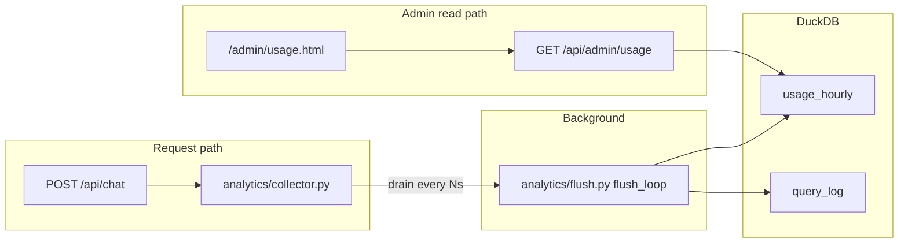

# Usage Analytics

Privacy-safe, **aggregate-only** usage telemetry for the Medicare Drug Cost Navigator. This feature ships on the `feature/frontend_anonymous` branch and records request counts, coarse prompt-length buckets, latency sums, LLM token/cost rollups, and optional state labels — never message text, drug names, IP addresses, or per-user identity. The design aligns with [`config/privacy_policy.txt`](../../config/privacy_policy.txt).

For day-to-day development context, see also the [Developer Guide](./developer-guide.md) (schema, API table, configuration) and [Deployment](./deployment.md) (Render `ADMIN_TOKEN` setup).

---

## Table of contents

1. [Overview](#1-overview)
2. [What is collected](#2-what-is-collected)
3. [What is not collected](#3-what-is-not-collected)
4. [Architecture](#4-architecture)
5. [Region resolution](#5-region-resolution)
6. [Interaction modes](#6-interaction-modes)
7. [Configuration](#7-configuration)
8. [Admin API](#8-admin-api)
9. [Admin dashboard](#9-admin-dashboard)
10. [Operations](#10-operations)
11. [Privacy policy and user disclosure](#11-privacy-policy-and-user-disclosure)
12. [Related code and tests](#12-related-code-and-tests)

---

## 1. Overview

Operators need lightweight visibility into how the public chat UI is used — volume, errors, latency, and LLM spend — without storing chat content or building a user-account system. The analytics layer:

- Increments **in-memory counters** on the request path (`analytics/collector.py`) with zero disk I/O.
- Drains counters to DuckDB on a **background interval** (default 60s) via `analytics/flush.py`.
- Exposes rollups through **`GET /api/admin/usage`** (shared-secret gate) and a small static dashboard at **`/admin/usage.html`**.

`query_log` rows (per-query tool/latency metadata used for debugging) are also queued in the collector and flushed in the same batch — replacing the previous inline `INSERT` on the Navigator hot path.

Set `ANALYTICS_ENABLED=false` to disable collection and the flush task entirely.

---

## 2. What is collected

### 2.1 Bucket dimensions

Each row in `usage_hourly` is keyed by:

| Column | Meaning |
|---|---|
| `hour_bucket` | UTC hour start (truncated) |
| `region` | Two-letter US state code, or `unknown` (see §5) |
| `mode` | Interaction mode (see §6) |
| `model` | LLM model ID used for the request |

Primary key: `(hour_bucket, region, mode, model)`.

### 2.2 Counter columns

| Column | Description |
|---|---|
| `sessions_new` | New in-memory chat sessions created in this bucket |
| `requests_total` | Chat/query requests recorded |
| `requests_ok` | Requests that completed without HTTP/LLM failure |
| `requests_error` | Requests that failed (non-ok path) |
| `requests_clarification` | Responses with `status=needs_clarification` |
| `requests_not_found` | Responses with `status=not_found` |
| `requests_limit_reached` | Responses with `status=limit_reached` |
| `prompt_len_short` | Prompts with length &lt; 50 characters |
| `prompt_len_medium` | Prompts with length 50–199 characters |
| `prompt_len_long` | Prompts with length ≥ 200 characters |
| `prompt_len_sum` | Sum of raw prompt character counts (for averages) |
| `latency_ms_sum` | Sum of end-to-end request latency (ms) |
| `tokens_in_sum` | Sum of input tokens from `total_llm_usage` |
| `tokens_out_sum` | Sum of output tokens from `total_llm_usage` |
| `requests_with_tokens` | Requests where at least one token counter was &gt; 0 |
| `cost_usd_sum` | Sum of estimated LLM cost (USD) from `total_llm_usage` |

`requests_with_tokens` is **request-scoped**, not session-scoped — the collector never retains session identity, so this approximates “requests that incurred LLM usage” without storing who sent them.

### 2.3 `query_log` (separate table)

Still written by the flush loop, not exposed through the admin usage API:

| Column | Description |
|---|---|
| `query_id` | Per-turn UUID |
| `session_id` | In-memory session id (not linked to analytics rollups) |
| `tools_invoked` | JSON list of MCP tool names |
| `statuses` | JSON map of tool name → status |
| `latency_ms` | Navigator turn latency |
| `created_at` | Insert timestamp |

---

## 3. What is not collected

| Data | Notes |
|---|---|
| Message text | Only prompt **length** buckets and sums |
| Drug names, plan names, RxCUIs | Never stored in analytics tables |
| IP addresses, cookies, device IDs | No geo-IP; `region` is a **user-selected state label** from the UI state picker |
| Per-user or per-session rollups in `usage_hourly` | Session ids appear only in `query_log`, not in hourly aggregates |

The `region` field and the optional `region`/`mode` request body fields **do not affect cost estimates** — they exist solely as analytics labels. The state picker is the same control used to scope the plan combobox; it is not sent to `/api/estimate*` or used in the cost pipeline.

`sessions_new` is always bucketed under `region=unknown`, `mode=unknown`, `model=unknown` because region/mode are not known at the moment a session is first created.

---

## 4. Architecture



1. **FastAPI lifespan** (`api/app.py`) starts `flush_loop(ANALYTICS_FLUSH_INTERVAL_SECONDS)` when `ANALYTICS_ENABLED` is true.
2. **`POST /api/chat`** (and related query paths) call `collector.record_request(...)` after each turn, and `collector.record_new_session()` when `session_manager` creates a session.
3. **`Navigator._log_query`** queues `query_log` rows via `collector.record_query_log(...)` instead of writing DuckDB inline.
4. **`flush_loop`** sleeps, drains the collector, and runs `INSERT ... ON CONFLICT DO UPDATE` upserts into `usage_hourly` plus batch inserts into `query_log`. Failures log a warning and drop the batch (no retry of drained data).
5. **`flush_now()`** is the synchronous drain+write used in tests.

---

## 5. Region resolution

`api/app.py` → `_resolve_region(region, plan_id, message)` determines the analytics label. Order:

1. **Direct state code** — `region` in the request body (from `chatState` / `guidedState` in `frontend/src/app.js`). Must be exactly two letters; lowercased input is normalized to uppercase.
2. **Plan picker / guided form** — state of `filters.plan_id` via `PlanRepository.get_plan(...).state` (off the event loop with `asyncio.to_thread`).
3. **Plan ID in message text** — regex `\b([A-Z]\d{4}-\d{3})\b` (CMS `contract_id-plan_id`, e.g. `S5921-400`) matched against the message, then plan state resolved the same way as (2).
4. **Fallback** — `"unknown"` for missing state, junk values (e.g. injection strings), or unresolvable plans.

If a junk `region` is sent but a valid plan ID appears in the message, the plan-state fallback still wins for the request row.

---

## 6. Interaction modes

Sent as optional `mode` on `POST /api/chat`. Analytics-only — `_resolve_mode()` in `api/app.py` does not change routing or responses.

| Value | Source |
|---|---|
| `chat` | Default; free-form chat tab |
| `guided_single` | Guided estimate — single drug |
| `guided_compare_drug` | Guided — compare multiple drugs |
| `guided_compare_plan` | Guided — compare plans |

Unrecognized values fall back to `chat`. Mapped in `frontend/src/app.js` from guided sub-tabs (`guidedAnalyticsMode()`).

---

## 7. Configuration

| Variable | Default | Description |
|---|---|---|
| `ANALYTICS_ENABLED` | `true` | Set `false` to disable collector writes and the flush background task |
| `ANALYTICS_FLUSH_INTERVAL_SECONDS` | `60` | Seconds between flush drains |
| `ADMIN_TOKEN` | empty | Shared secret for `/api/admin/usage`. Endpoint returns **404** when unset |
| `ADMIN_USAGE_HOURS` | `2160` | Default lookback window (~3 months) when the API/dashboard omit `since`/`until` |

See [`.env.example`](../../.env.example) for commented placeholders.

---

## 8. Admin API

### `GET /api/admin/usage`

| Aspect | Detail |
|---|---|
| Auth | Header `X-Admin-Token: <ADMIN_TOKEN>` required when token is configured |
| 404 | Returned when `ADMIN_TOKEN` is unset (endpoint hidden) |
| 403 | Wrong or missing token |
| Query params | `since`, `until` — optional ISO-8601 datetimes; window is `[since, until)` |
| Default window | Last `ADMIN_USAGE_HOURS` hours ending now |

**Response shape:**

```json
{
  "since": "2026-05-13T00:00:00+00:00",
  "until": "2026-08-13T16:00:00+00:00",
  "default_timezone": "America/Chicago",
  "rows": [
    {
      "hour_bucket": "2026-08-13T15:00:00",
      "region": "AR",
      "mode": "chat",
      "model": "gpt-5.6-luna",
      "sessions_new": 0,
      "requests_total": 12,
      "requests_ok": 11,
      "requests_error": 1,
      "requests_clarification": 2,
      "requests_not_found": 0,
      "requests_limit_reached": 0,
      "prompt_len_short": 3,
      "prompt_len_medium": 7,
      "prompt_len_long": 2,
      "prompt_len_sum": 890,
      "latency_ms_sum": 45200.0,
      "tokens_in_sum": 6144,
      "tokens_out_sum": 1024,
      "requests_with_tokens": 11,
      "cost_usd_sum": 0.0042
    }
  ]
}
```

Returns 400 if `since >= until`.

The handler uses an explicit column list (not `SELECT *`) so additive `ALTER TABLE` migrations on persistent disks cannot desync positional mapping.

---

## 9. Admin dashboard

**URL:** `/admin/usage.html` (built to `frontend/dist/admin/usage.html` by [`scripts/build-frontend.sh`](../../scripts/build-frontend.sh))

| Aspect | Detail |
|---|---|
| Discovery | Not linked from the main SPA; `noindex, nofollow` |
| Auth | Prompts for admin token on first visit; stored in `sessionStorage` only (never in the URL) |
| Time filters | Presets: 24h, 7d, 30d, 3mo; custom `datetime-local` range |
| Charts | Requests over time, LLM cost over time, error rate over time |
| Breakdowns | Bar charts and summary tables by region, mode, and model (requests, cost, error rate) |
| Data source | Same `GET /api/admin/usage` JSON endpoint |

---

## 10. Operations

### Local DuckDB query

```bash
duckdb data/navigator.duckdb -c \
  "SELECT * FROM usage_hourly ORDER BY hour_bucket DESC LIMIT 48"
```

### curl

```bash
curl -s -H "X-Admin-Token: $ADMIN_TOKEN" \
  "http://localhost:8000/api/admin/usage" | python -m json.tool
```

### Render

1. Set `ADMIN_TOKEN` on the web service (Dashboard → Environment; treat like a password).
2. Optionally set `ADMIN_USAGE_HOURS` if the default 3-month window is too wide or narrow.
3. Open `https://<your-app>.onrender.com/admin/usage.html`.
4. Analytics data lives on the **same persistent DuckDB disk** as SPUF tables (`DUCKDB_PATH`, typically `/data/navigator.duckdb`).

To disable collection on production: `ANALYTICS_ENABLED=false`.

### Tests / manual flush

```python
from medicare_navigator.analytics.flush import flush_now
flush_now()
```

---

## 11. Privacy policy and user disclosure

User-facing privacy text is **not** duplicated in the frontend — it is loaded from committed config files:

| File | Served at | Shown in UI |
|---|---|---|
| [`config/privacy_policy.txt`](../../config/privacy_policy.txt) | `GET /api/privacy` | Menu → **Privacy policy** modal |
| [`config/disclaimer.txt`](../../config/disclaimer.txt) | `GET /api/disclaimer` | Fixed **Important notice** banner + Disclaimer modal (short privacy pointer) |

Both are plain-language summaries aligned with the collection rules in §2–§3 above. The full policy explains server session memory, aggregate statistics, reliability logs, AI provider data flows, and retention on disk.

### Endpoint scope (what users should expect)

| User action | Recorded in `usage_hourly`? |
|---|---|
| Chat / guided question via `POST /api/chat` | Yes (when `ANALYTICS_ENABLED=true`) |
| Legacy `POST /api/query` | Yes |
| Direct `POST /api/estimate` or compare-plans | No (no LLM) |
| `GET /api/zip-lookup` | No |

ZIP codes are used client-side to suggest a state for the picker; only a two-letter **state label** may appear in aggregates, not the ZIP.

### Retention

`usage_hourly` and `query_log` rows persist on the DuckDB disk (`DUCKDB_PATH`) until operators remove them or disable collection. Nightly SPUF ingest with `--preserve-other` does not wipe these tables.

When updating analytics behavior, update `config/privacy_policy.txt` and the privacy snippet in `config/disclaimer.txt` in the same change.

---

## 12. Related code and tests

| File | Role |
|---|---|
| [`src/medicare_navigator/analytics/collector.py`](../../src/medicare_navigator/analytics/collector.py) | In-memory counters and `query_log` queue |
| [`src/medicare_navigator/analytics/flush.py`](../../src/medicare_navigator/analytics/flush.py) | Periodic and manual flush to DuckDB |
| [`src/medicare_navigator/ingestion/schema.py`](../../src/medicare_navigator/ingestion/schema.py) | `usage_hourly` DDL and migrations |
| [`src/medicare_navigator/api/app.py`](../../src/medicare_navigator/api/app.py) | Lifespan flush task, `_resolve_region`, admin endpoint |
| [`src/medicare_navigator/agent/navigator.py`](../../src/medicare_navigator/agent/navigator.py) | `record_new_session`, `record_query_log` |
| [`frontend/src/admin/usage.html`](../../frontend/src/admin/usage.html) | Admin dashboard |
| [`frontend/src/app.js`](../../frontend/src/app.js) | Sends `region` and `mode` on chat requests |
| [`tests/test_usage_analytics_endpoint.py`](../../tests/test_usage_analytics_endpoint.py) | End-to-end API, auth, region/mode bucketing, time windows |
| [`tests/test_analytics_collector.py`](../../tests/test_analytics_collector.py) | Collector counter logic |

### Other branch changes (not analytics)

| Change | Location |
|---|---|
| **RxNorm offline fallback** | [`tools/rxnorm_offline.py`](../../src/medicare_navigator/tools/rxnorm_offline.py) — curated 2026 snapshots when NLM REST fails; see [Developer Guide §8](./developer-guide.md#8-mcp-tools) |
| **Prompt-injection gate** | [`agent/invalid_input_questions.py`](../../src/medicare_navigator/agent/invalid_input_questions.py) — blocks `SYSTEM:`, `you are now unrestricted`, and price-injection patterns; see [Developer Guide §7](./developer-guide.md#7-llm-agent-layer) |

---

*Added with the `feature/frontend_anonymous` merge (usage analytics, admin dashboard, RxNorm offline fallback, injection hardening).*
